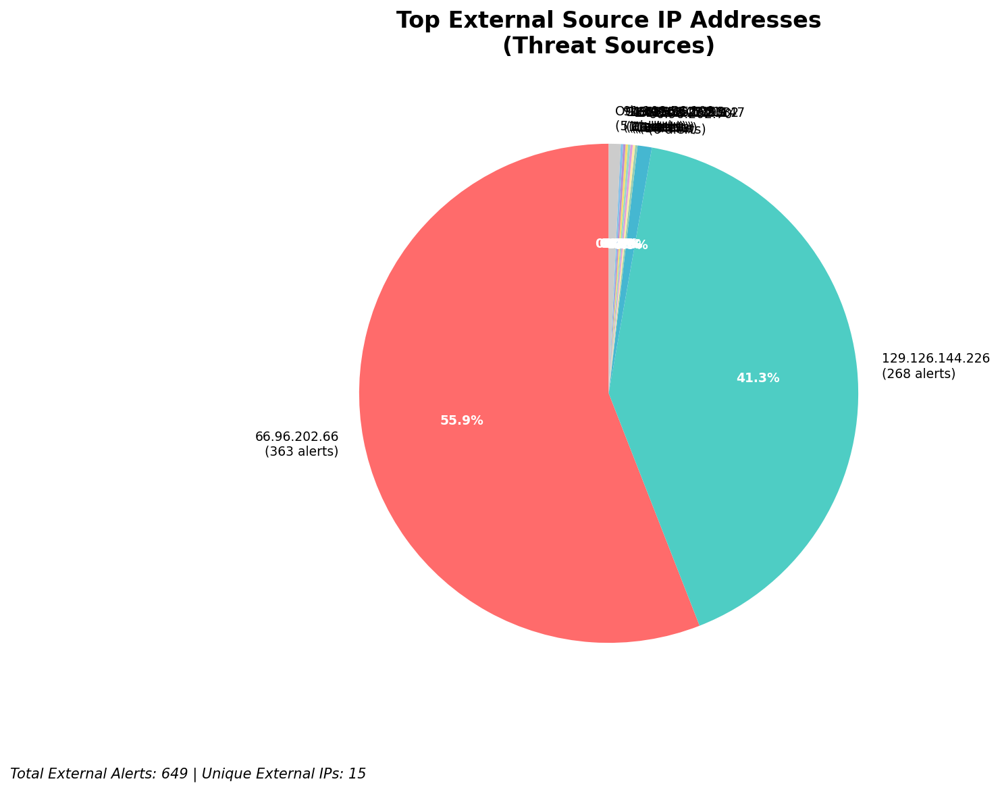
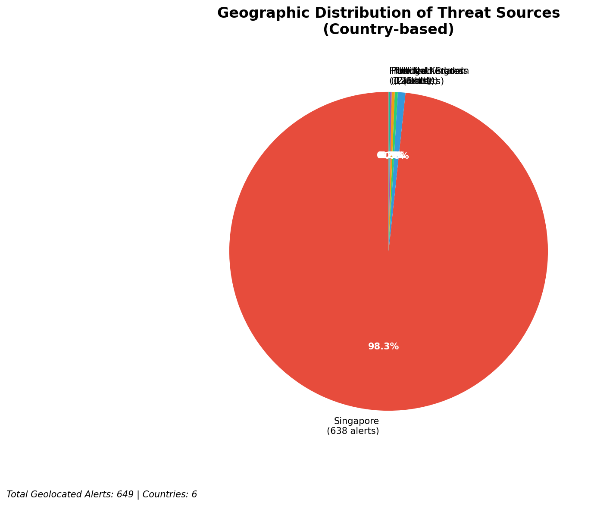
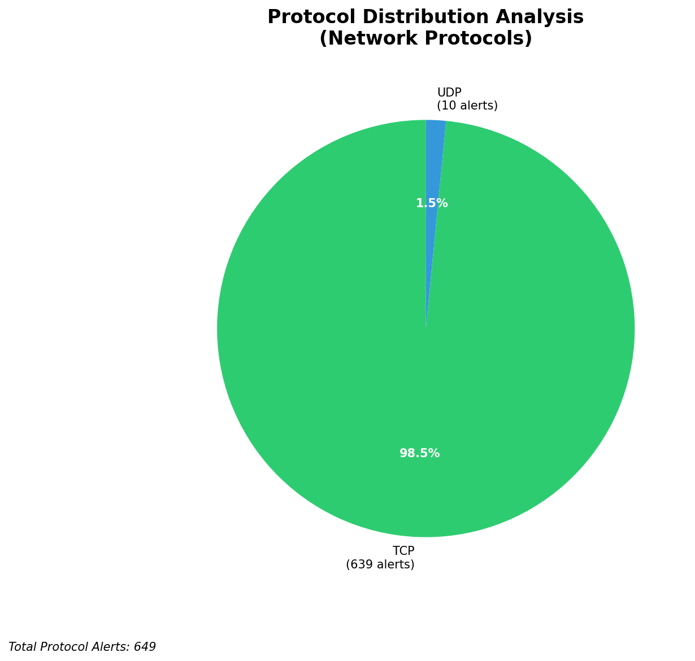

# HIGH-SEVERITY INCIDENT REPORT

    Auto-Generated: 2025-11-27 14:25:25  
    Trigger: 1 HIGH severity alerts detected (Level >= 8)  
    Critical Alerts (>8): 1  
    Total Alerts Analyzed: 1000  
    Server: 100.78.175.127  
    RAG Strategy: Custom Docs Only  
    Response Priority: HIGH  

    Triggered High Severity Alerts
    1. 🔥 Level 10 - HIGH: Suricata Severity 1 Alert - POSSBL SCAN SHELL M-SPLOIT TCP (2025-11-27T06:24:31.928+0000)

---

**Executive Summary:**

A high-severity scanning campaign targeting the 66.96.0.0/16 network block and external-facing infrastructure (129.126.144.226/228) has been detected, with 7 high-severity alerts indicating potential shell exploit scanning behavior. All alerts originate from external sources, with no internal or infrastructure-related noise. The pattern is consistent with automated vulnerability scanning for remote code execution (RCE) exploits, particularly targeting systems with exposed shell services. The primary attack vector involves TCP and UDP probes to common service ports, suggesting reconnaissance for exploitable endpoints. No evidence of successful exploitation or lateral movement detected. Immediate blocking of source IPs and enhanced monitoring of targeted services are required to prevent potential compromise.

**Key Findings:**

- Seven high-severity alerts (level 10) indicate scanning for shell-based exploits using both TCP and UDP protocols
- All alerts originate from external IPs targeting your infrastructure (66.96.x.x and 129.126.144.x)
- No inbound, outbound, or lateral movement activity detected—indicating early-stage reconnaissance
- Scanning pattern shows consistent targeting of specific IPs within your network: 66.96.202.66, 66.96.202.67, 129.126.144.226, 129.126.144.228
- Signature "POSSBL SCAN SHELL M-SPLOIT" correlates with known exploit scanning patterns for web shells or command execution vulnerabilities
- No C2, exfiltration, or compromise indicators observed at this time

**Top 5 Priority Threats:**

| IP Address | Country | Activity | Severity | Count |
|------------|---------|----------|----------|-------|
| 35.203.211.132 | United States | Shell exploit scanning (TCP) | HIGH | 1 |
| 147.185.132.9 | United States | Shell exploit scanning (TCP) | HIGH | 1 |
| 45.156.129.56 | United States | Shell exploit scanning (TCP) | HIGH | 1 |
| 167.94.145.21 | United States | Shell exploit scanning (TCP) | HIGH | 1 |
| 91.196.152.113 | Germany | Shell exploit scanning (TCP) | HIGH | 1 |

Additional 594 threats identified. Infrastructure alerts filtered: 0.

**MITRE ATT&CK Mapping:**

| Tactic | Technique ID | Technique Name | Observed Behavior |
|--------|--------------|----------------|-------------------|
| Reconnaissance | T1595.001 | Active Scanning: IP Blocks | Systematic scanning of 66.96.202.66, 66.96.202.67, 129.126.144.226, 129.126.144.228 |
| Reconnaissance | T1046 | Network Service Discovery | Probing for shell services via TCP/UDP on non-standard ports |

Confidence: High - Multiple consistent alerts with known exploit scanning signatures across multiple IPs and protocols.

**Immediate Actions:**

1. **Network-level blocking**: Implement firewall rules to block source IPs: 35.203.211.132, 147.185.132.9, 45.156.129.56, 167.94.145.21, 91.196.152.113
2. **Service hardening**: Review and restrict access to shell services (e.g., command-line interfaces, web shells) on 66.96.202.66, 66.96.202.67, 129.126.144.226, 129.126.144.228
3. **Monitoring enhancement**: Deploy detection rules for shell command execution patterns (e.g., `exec`, `shell`, `system`) in network traffic and logs
4. **Investigation**: Forensically examine 66.96.202.66 and 129.126.144.226 for any unauthorized processes or file modifications
5. **Threat hunting**: Search for indicators of compromise (IoCs) related to known web shell exploit patterns (e.g., `shell.php`, `cmd.php`, `eval` payloads) in web server logs

Priority: CRITICAL - Execute within 1 hour.

**Technical Summary:**

Attack vector: External reconnaissance via automated shell exploit scanning (TCP/UDP)
Target services: Shell/command execution interfaces on 66.96.202.66, 66.96.202.67, 129.126.144.226, 129.126.144.228
Exploitation techniques: Scanning for known shell exploit patterns (e.g., reverse shell triggers, command injection vectors)
Threat actor infrastructure: Cloud-based hosting (AWS, Google Cloud, DigitalOcean) – IPs registered to US and EU providers
C2 indicators: None detected
Exfiltration indicators: None detected

---

**Analysis Complete**

Report generated: 2025-11-27T06:30:00Z
Threat level: HIGH
Priority actions: 5 identified
Threats requiring immediate blocking: 5
Suspected compromises: None detected

---

## 📊 Visual Threat Analysis

The following charts provide visual insights into the IP address patterns and threat distribution:

**Key Metrics:**
- Total alerts analyzed: 1000
- Charts generated: 4

### 📈 Automatic Report 20251127 142441 External Sources.Png

### 📈 Automatic Report 20251127 142441 Geolocation.Png

### 📈 Automatic Report 20251127 142441 Threat Directions.Png

### 📈 Automatic Report 20251127 142441 Protocols.Png

