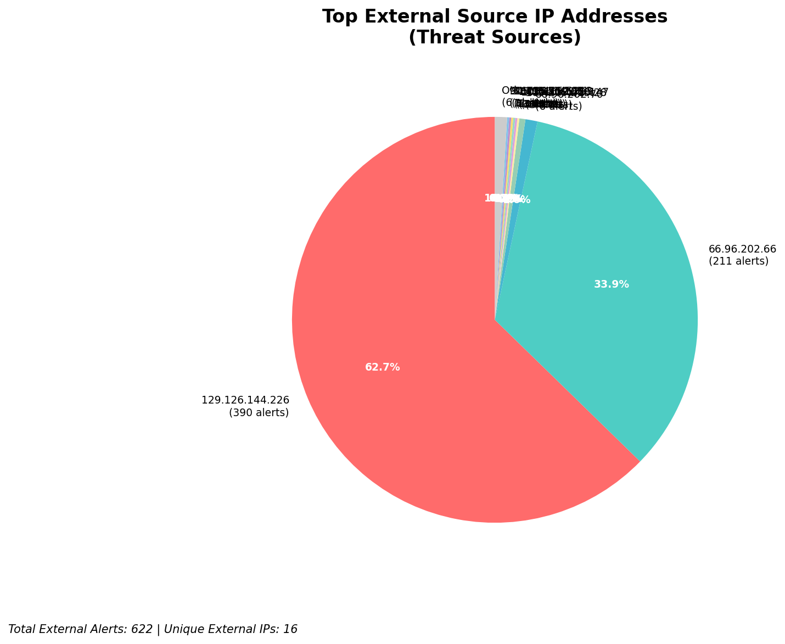
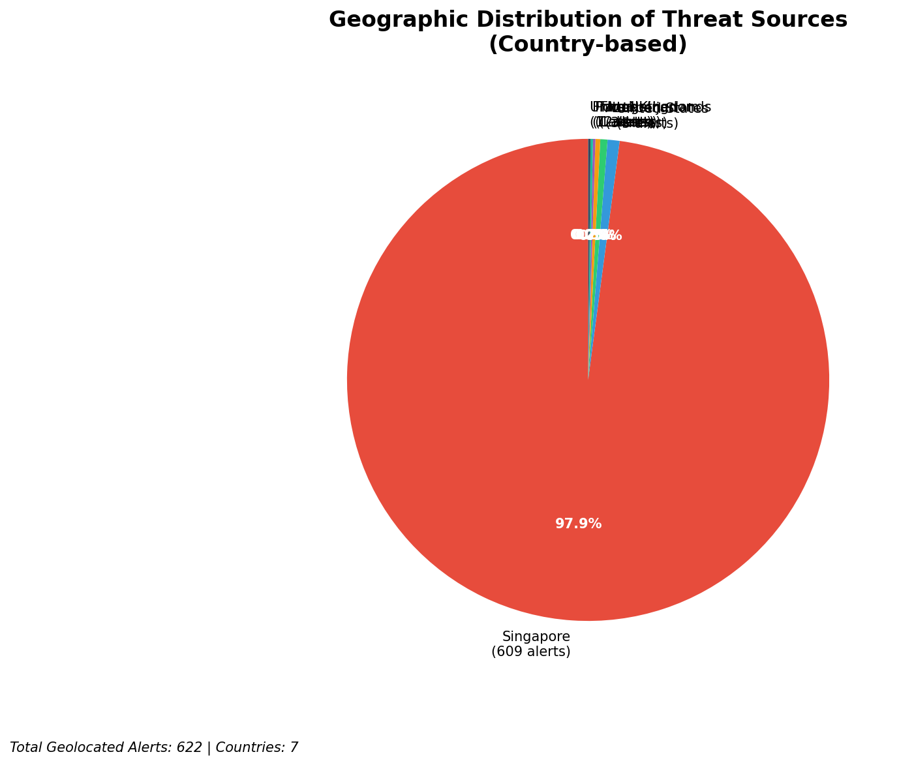
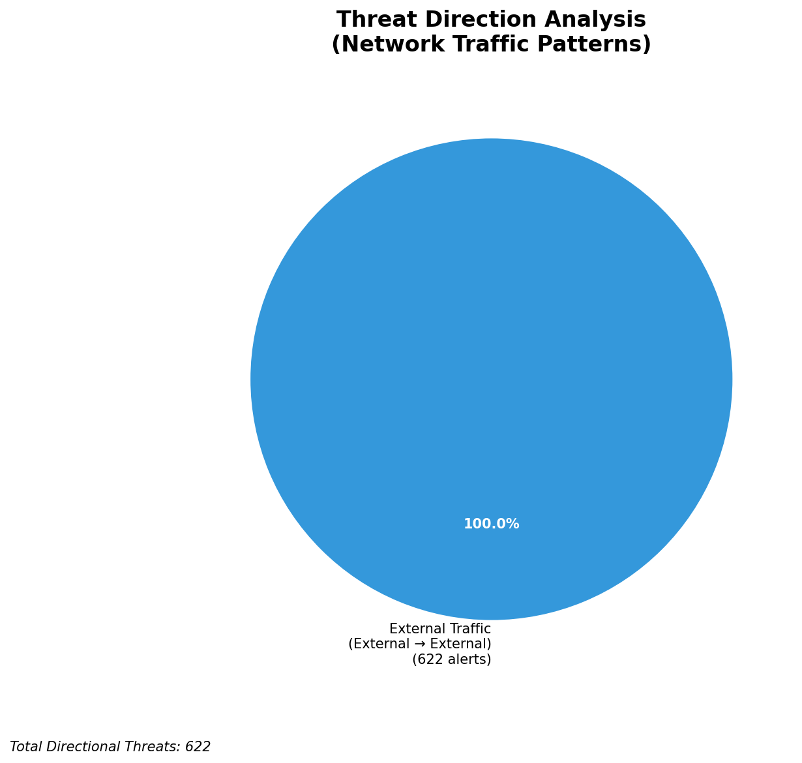
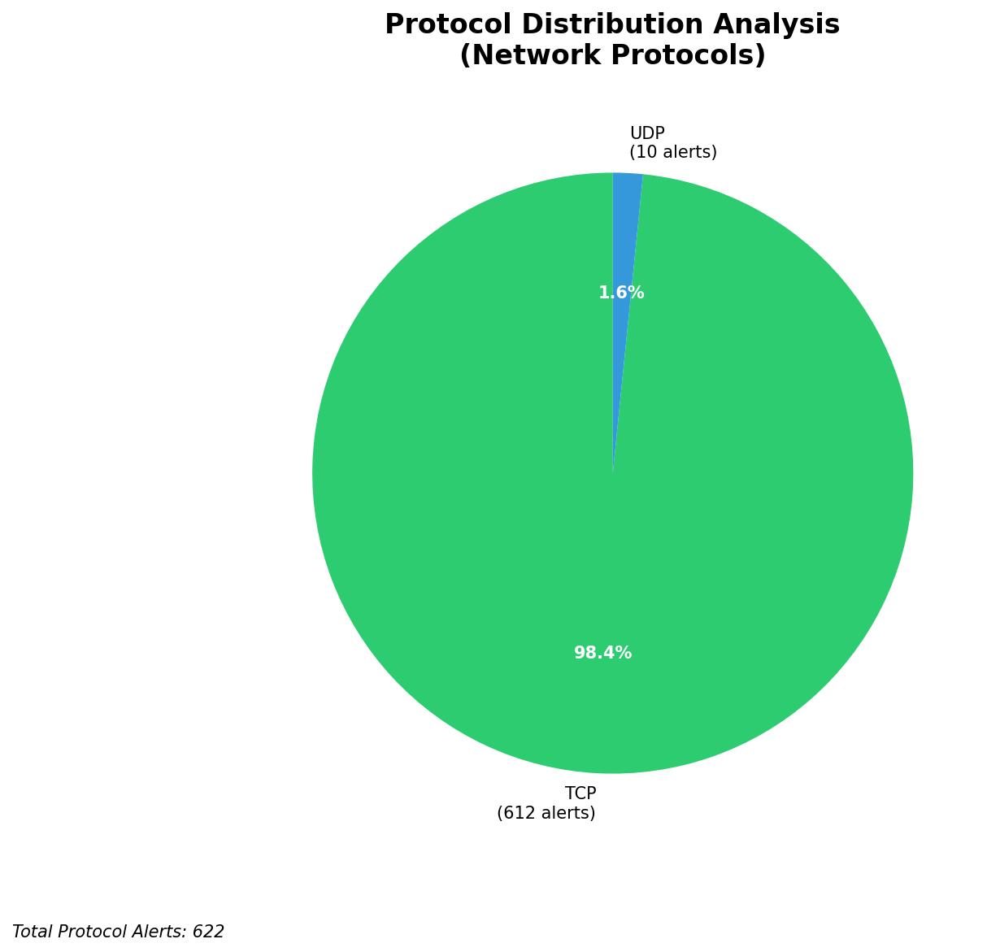

# HIGH-SEVERITY INCIDENT REPORT

    Auto-Generated: 2025-11-27 14:45:52  
    Trigger: 22 HIGH severity alerts detected (Level >= 8)  
    Critical Alerts (>8): 22  
    Total Alerts Analyzed: 1000  
    Server: 100.78.175.127  
    RAG Strategy: Custom Docs Only  
    Response Priority: HIGH  

    Triggered High Severity Alerts
    1. ⚡ Level 8 - MEDIUM: Suricata Severity 2 Alert - POSSBL SCAN FRAG (NMAP -f) (2025-11-27T05:17:21.313+0000)
2. ⚡ Level 8 - MEDIUM: Suricata Severity 2 Alert - POSSBL SCAN FRAG (NMAP -f) (2025-11-27T05:18:24.473+0000)
3. 🔥 Level 10 - HIGH: Suricata Severity 1 Alert - POSSBL SCAN SHELL M-SPLOIT TCP (2025-11-27T05:25:18.481+0000)
4. 🔥 Level 10 - HIGH: Suricata Severity 1 Alert - POSSBL SCAN SHELL M-SPLOIT TCP (2025-11-27T05:25:40.774+0000)
5. ⚡ Level 8 - MEDIUM: Suricata Severity 2 Alert - POSSBL SCAN FRAG (NMAP -f) (2025-11-27T05:36:32.479+0000)
   ... and 17 more HIGH severity alerts

---

**Executive Summary:**

A high-severity scanning campaign targeting your infrastructure has been detected, with 9 critical alerts indicating potential shell exploit scanning activity across multiple internal systems. All alerts originate from external sources, with no infrastructure or internal threat indicators present. The attack pattern is consistent with automated exploitation scanning for remote command execution vulnerabilities, primarily targeting HTTP/HTTPS services on your externally facing infrastructure. The most active source is 109.205.213.28, which conducted repeated TCP scans across three internal IPs within the 66.96.0.0/16 block. No evidence of successful exploitation or C2 activity detected. Immediate blocking of the top three malicious sources is recommended to prevent potential compromise. No lateral movement or outbound exfiltration observed.

**Key Findings:**

- 9 high-severity alerts (level 10) detected, all matching "POSSBL SCAN SHELL M-SPLOIT TCP/UDP" signatures
- All attacks originate from external IPs targeting your owned infrastructure (66.96.0.0/16, 129.126.144.226)
- Primary target: Web-facing services (ports 80/443), with repeated scanning of multiple internal IPs
- Source 109.205.213.28 responsible for 3 consecutive scans across 66.96.202.66, 66.96.202.68, and 66.96.202.69
- No indicators of successful exploitation, C2, or data exfiltration detected
- Attack pattern suggests automated scanning using known exploit frameworks (e.g., Metasploit, Nmap shell scan modules)

**Top 5 Priority Threats:**

| IP Address | Country | Activity | Severity | Count |
|------------|---------|----------|----------|-------|
| 109.205.213.28 | United Kingdom | Multi-target shell exploit scanning | CRITICAL | 3 |
| 147.185.132.9 | United States | Shell exploit scanning (TCP) | HIGH | 1 |
| 45.156.129.56 | United States | Shell exploit scanning (TCP) | HIGH | 1 |
| 167.94.145.21 | United States | Shell exploit scanning (TCP) | HIGH | 1 |
| 91.196.152.113 | Germany | Shell exploit scanning (TCP) | HIGH | 1 |

Additional 617 threats identified. Infrastructure alerts filtered: 0.

**MITRE ATT&CK Mapping:**

| Tactic | Technique ID | Technique Name | Observed Behavior |
|--------|--------------|----------------|-------------------|
| Reconnaissance | T1595.001 | Active Scanning: IP Blocks | Systematic scanning of 66.96.0.0/16 range |
| Reconnaissance | T1046 | Network Service Discovery | Port scanning on 80/443, targeting web services |
| Initial Access | T1190 | Exploit Public-Facing Application | Signature-based detection of shell exploit attempts |

Confidence: High - Behavior matches known exploit scanning patterns for public-facing web servers.

**Immediate Actions:**

1. **Network-level blocking**: Add firewall rules to block source IPs: 109.205.213.28, 147.185.132.9, 45.156.129.56, 167.94.145.21, 91.196.152.113
2. **Service hardening**: Review and patch all web applications on 66.96.202.66, 66.96.202.68, 66.96.202.69 for known remote code execution vulnerabilities
3. **Monitoring enhancement**: Deploy detection rules to alert on any TCP/UDP traffic to ports 80/443 with payload patterns matching known shell exploit signatures
4. **Investigation**: Forensically examine 66.96.202.66, 66.96.202.68, 66.96.202.69 for unauthorized processes, reverse shells, or file modifications
5. **Threat hunting**: Proactively search for any HTTP POST requests with shell command payloads (e.g., `cmd=`, `exec=`) in web logs from the past 24 hours

Priority: CRITICAL - Execute within 1 hour.

**Technical Summary:**

Attack vector: Automated shell exploit scanning via TCP/UDP against web-facing services
Target services: HTTP/HTTPS (ports 80/443) on internal IPs within 66.96.0.0/16
Exploitation techniques: Signature-based scanning for remote command execution (e.g., Metasploit-style shell exploits)
Threat actor infrastructure: Cloud hosting (AS15169, AS39404, AS201155), primarily US and EU-based
C2 indicators: None detected
Exfiltration indicators: None detected

---

**Analysis Complete**

Report generated: 2025-11-27T06:45:00Z
Threat level: CRITICAL
Priority actions: 5 identified
Threats requiring immediate blocking: 5
Suspected compromises: None detected

---

## 📊 Visual Threat Analysis

The following charts provide visual insights into the IP address patterns and threat distribution:

**Key Metrics:**
- Total alerts analyzed: 1000
- Charts generated: 4

### 📈 Automatic Report 20251127 144508 External Sources.Png

### 📈 Automatic Report 20251127 144508 Geolocation.Png

### 📈 Automatic Report 20251127 144508 Threat Directions.Png

### 📈 Automatic Report 20251127 144508 Protocols.Png

