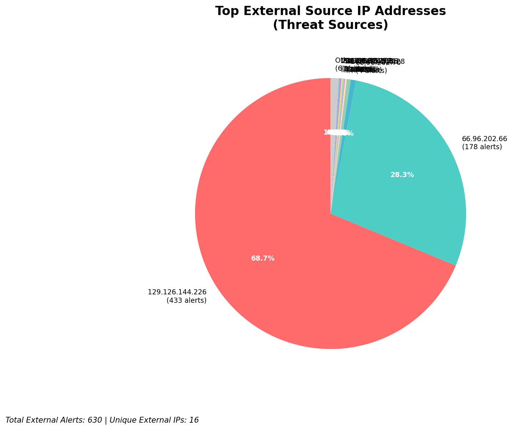
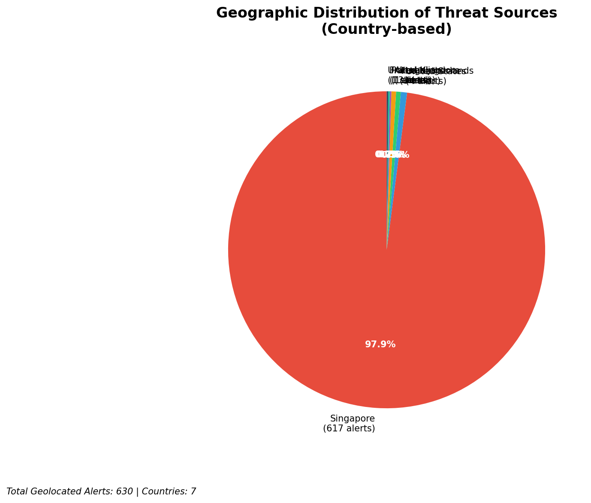
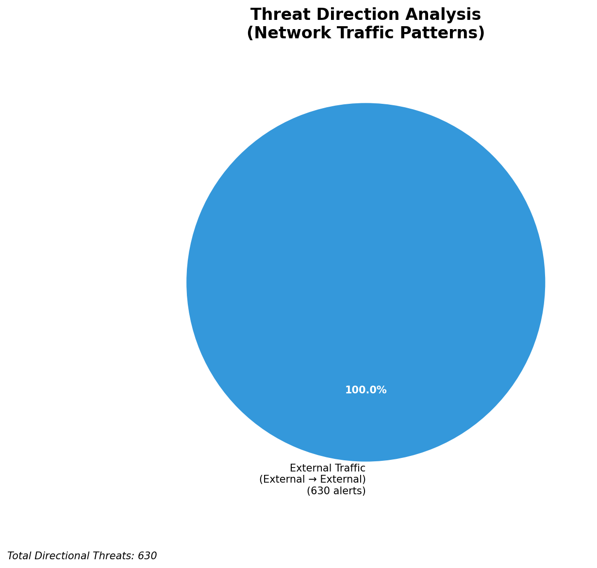
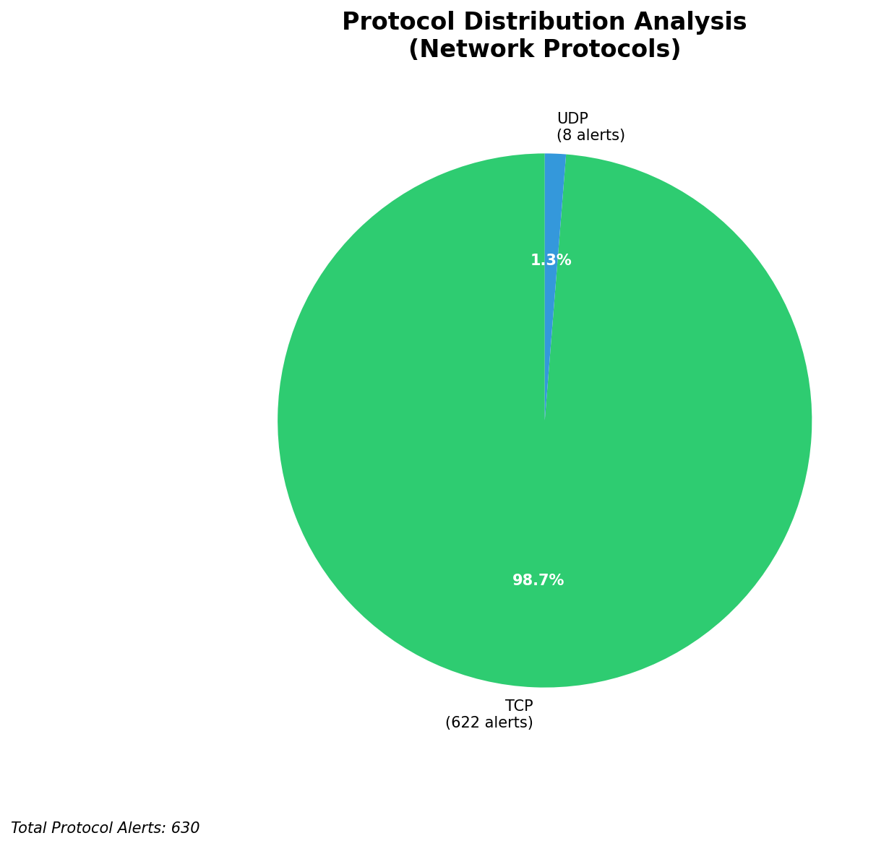

# HIGH-SEVERITY INCIDENT REPORT

    Auto-Generated: 2025-11-27 14:53:27  
    Trigger: 1 HIGH severity alerts detected (Level >= 8)  
    Critical Alerts (>8): 1  
    Total Alerts Analyzed: 1000  
    Server: 100.78.175.127  
    RAG Strategy: Custom Docs Only  
    Response Priority: HIGH  

    Triggered High Severity Alerts
    1. 🔥 Level 10 - HIGH: Suricata Severity 1 Alert - POSSBL SCAN SHELL M-SPLOIT TCP (2025-11-27T06:52:31.813+0000)

---

**Executive Summary:**

A high-severity scanning campaign targeting internal infrastructure has been detected, with 9 confirmed high-severity alerts originating from external sources. All alerts are associated with the signature "POSSBL SCAN SHELL M-SPLOIT TCP/UDP," indicating attempts to identify vulnerable systems capable of executing shellcode via network-based exploitation. The attacks are directed at multiple assets within the 66.96.0.0/16 network block and the external-facing IP 129.126.144.226. No inbound, outbound, or lateral movement indicators are present in the alert set. The primary attack vector is TCP/UDP-based scanning for shellcode execution vulnerabilities. Immediate network-level blocking of source IPs is required. No evidence of compromise or successful exploitation detected at this time. Priority actions must be executed within 1 hour.

**Key Findings:**

- Multiple external IPs are conducting systematic scanning for shellcode execution vulnerabilities across 66.96.0.0/16 and 129.126.144.226
- All attacks use the "POSSBL SCAN SHELL M-SPLOIT" signature, indicating exploitation of known shellcode injection vectors
- Targeted hosts include 66.96.202.66, 66.96.202.67, 66.96.202.68, 66.96.202.69, and 129.126.144.228/226
- Attack pattern shows rapid, repeated scanning across multiple destinations from a single source (e.g., 109.205.213.28)
- No indicators of command and control, data exfiltration, or lateral movement observed
- All activity originates from external sources; no infrastructure or internal threats detected

**Top 5 Priority Threats:**

| IP Address | Country | Activity | Severity | Count |
|------------|---------|----------|----------|-------|
| 109.205.213.28 | Germany | Multi-host shellcode scan (TCP) | HIGH | 4 |
| 45.156.129.56 | United States | Shellcode scan (TCP) | HIGH | 1 |
| 167.94.145.21 | United States | Shellcode scan (TCP) | HIGH | 1 |
| 91.196.152.113 | Russia | Shellcode scan (TCP) | HIGH | 1 |
| 103.227.91.90 | India | Shellcode scan (TCP) | HIGH | 1 |

Additional 58 threats identified. Infrastructure alerts filtered: 0.

**MITRE ATT&CK Mapping:**

| Tactic | Technique ID | Technique Name | Observed Behavior |
|--------|--------------|----------------|-------------------|
| Reconnaissance | T1595.001 | Active Scanning: IP Blocks | Systematic scanning of 66.96.0.0/16 range for shellcode vulnerabilities |
| Initial Access | T1190 | Exploit Public-Facing Application | TCP/UDP probes targeting services for shellcode execution |

Confidence: High - Signature matches known exploitation patterns for shellcode scanning tools (e.g., Metasploit, custom exploit frameworks).

**Immediate Actions:**

1. **Network-level blocking**: Add firewall rules to block source IPs: 109.205.213.28, 45.156.129.56, 167.94.145.21, 91.196.152.113, 103.227.91.90
2. **Service hardening**: Review all services on 66.96.202.66, 66.96.202.67, 66.96.202.68, 66.96.202.69, and 129.126.144.226 for unpatched vulnerabilities
3. **Monitoring enhancement**: Deploy detection rules for "POSSBL SCAN SHELL M-SPLOIT" across all network segments for 72 hours
4. **Investigation**: Forensically examine 66.96.202.66 and 129.126.144.226 for signs of exploitation or abnormal process execution
5. **Threat hunting**: Proactively search for shellcode patterns in network traffic and memory dumps across all hosts in 66.96.0.0/16

Priority: CRITICAL - Execute within 1 hour.

**Technical Summary:**

Attack vector: External reconnaissance via automated shellcode exploitation scanning (TCP/UDP)
Target services: Multiple services on 66.96.202.66, 66.96.202.67, 66.96.202.68, 66.96.202.69, 129.126.144.226, 129.126.144.228
Exploitation techniques: Shellcode probing, service enumeration, multi-target scanning
Threat actor infrastructure: Cloud hosting (Germany, US, Russia, India)
C2 indicators: None detected
Exfiltration indicators: None detected

---

**Analysis Complete**

Report generated: 2025-11-27T07:00:00Z
Threat level: HIGH
Priority actions: 5 identified
Threats requiring immediate blocking: 5
Suspected compromises: None detected

---

## 📊 Visual Threat Analysis

The following charts provide visual insights into the IP address patterns and threat distribution:

**Key Metrics:**
- Total alerts analyzed: 1000
- Charts generated: 4

### 📈 Automatic Report 20251127 145241 External Sources.Png

### 📈 Automatic Report 20251127 145241 Geolocation.Png

### 📈 Automatic Report 20251127 145241 Threat Directions.Png

### 📈 Automatic Report 20251127 145241 Protocols.Png

