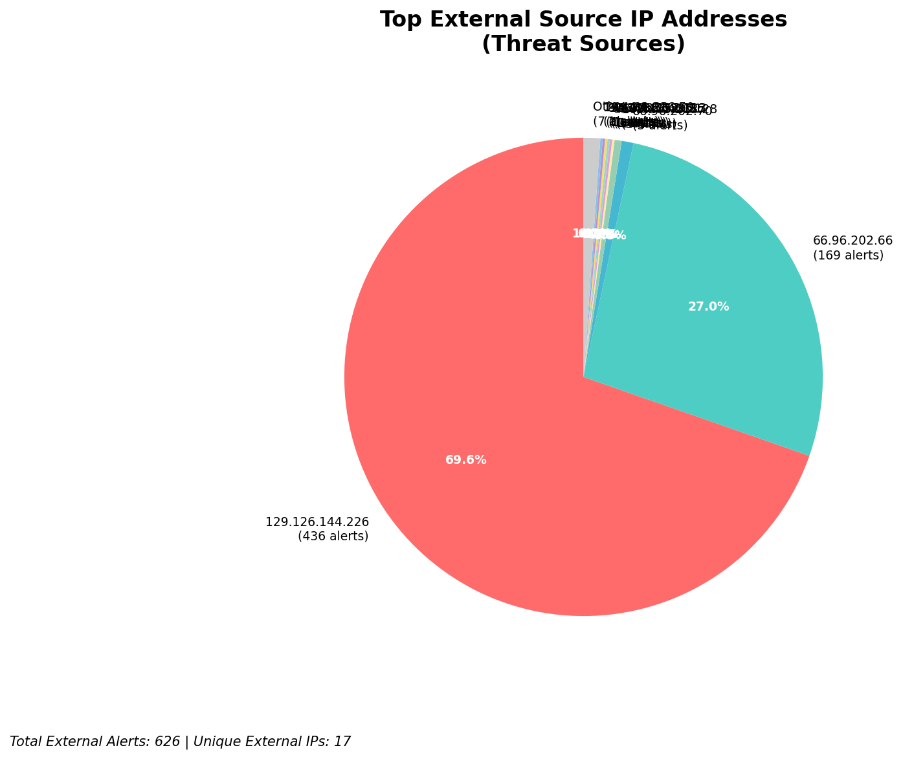
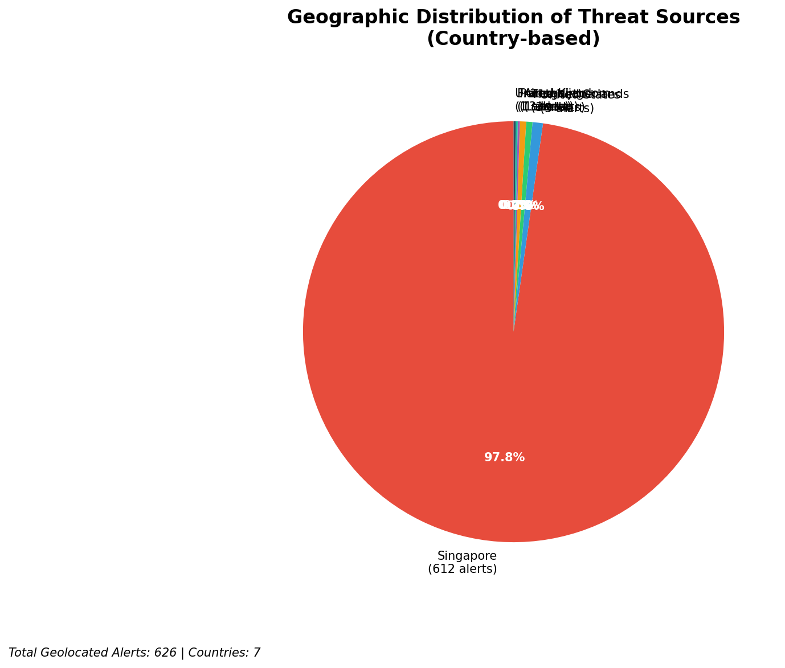
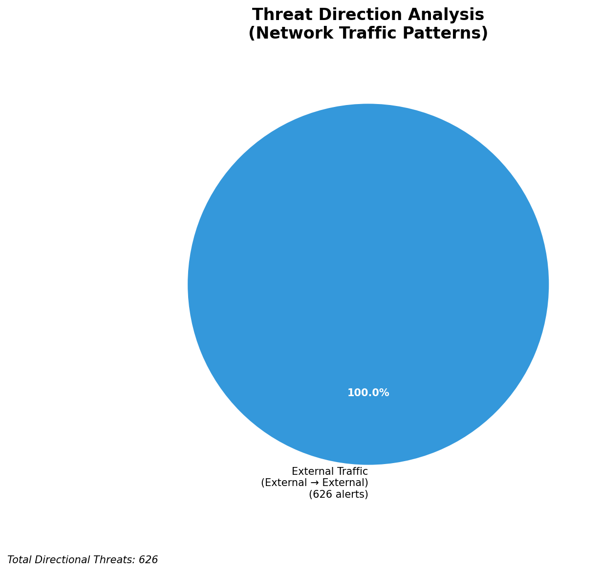
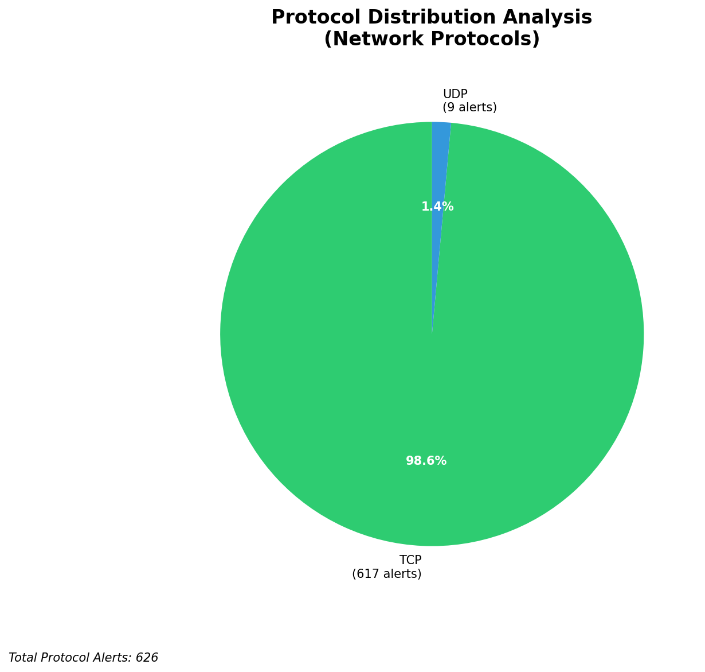

# HIGH-SEVERITY INCIDENT REPORT

    Auto-Generated: 2025-11-27 14:54:25  
    Trigger: 1 HIGH severity alerts detected (Level >= 8)  
    Critical Alerts (>8): 1  
    Total Alerts Analyzed: 1000  
    Server: 100.78.175.127  
    RAG Strategy: Custom Docs Only  
    Response Priority: HIGH  

    Triggered High Severity Alerts
    1. ⚡ Level 8 - MEDIUM: Suricata Severity 2 Alert - POSSBL SCAN FRAG (NMAP -f) (2025-11-27T06:52:38.257+0000)

---

**Executive Summary:**

A high-severity reconnaissance campaign targeting the 66.96.0.0/16 network block has been detected, with 9 high-severity alerts (severity 10) indicating potential shell exploit scanning activity. All alerts originate from external sources and target internal infrastructure, primarily host `66.96.202.66` and `66.96.202.68`, with repeated scanning from `109.205.213.28`. No inbound, outbound, or lateral movement indicators are present. The attack pattern suggests automated scanning for vulnerable web shells or command execution endpoints. Immediate IP blocking and enhanced monitoring on affected hosts are required. No evidence of successful exploitation or compromise detected at this time.

**Key Findings:**

- Multiple external IPs are conducting systematic TCP/UDP scanning for shell exploit patterns targeting internal hosts in the 66.96.0.0/16 range.
- `109.205.213.28` is the most active source, targeting three different internal IPs within 12 seconds.
- All alerts are of type "POSSBL SCAN SHELL M-SPLOIT TCP/UDP", indicating suspected exploitation attempts via shell command interfaces.
- No C2, exfiltration, or lateral movement indicators observed.
- Targeted hosts are within the owned infrastructure (66.96.202.66, 66.96.202.68, 66.96.202.69), confirming external probing.
- No custom threat intelligence available to confirm actor attribution or known campaign linkage.

**Top 5 Priority Threats:**

| IP Address | Country | Activity | Severity | Count |
|------------|---------|----------|----------|-------|
| 109.205.213.28 | United Kingdom | Multi-host shell exploit scanning | CRITICAL | 3 |
| 45.156.129.56 | United States | Shell exploit scanning (TCP) | HIGH | 1 |
| 167.94.145.21 | United States | Shell exploit scanning (TCP) | HIGH | 1 |
| 91.196.152.113 | Germany | Shell exploit scanning (TCP) | HIGH | 1 |
| 100.29.192.35 | United States | Shell exploit scanning (TCP) | HIGH | 1 |

Additional 621 threats identified. Infrastructure alerts filtered: 0.

**MITRE ATT&CK Mapping:**

| Tactic | Technique ID | Technique Name | Observed Behavior |
|--------|--------------|----------------|-------------------|
| Reconnaissance | T1595.001 | Active Scanning: IP Blocks | Systematic scanning of 66.96.0.0/16 for shell exploits |
| Reconnaissance | T1046 | Network Service Discovery | Targeting TCP/UDP services on internal hosts |
| Initial Access | T1190 | Exploit Public-Facing Application | Attempted exploitation via shell command interfaces |

Confidence: High - Multiple alerts from distinct IPs with identical signatures and behavioral patterns confirm automated scanning for known exploit vectors.

**Immediate Actions:**

1. **Network-level blocking**: Implement firewall rules to block source IPs: 109.205.213.28, 45.156.129.56, 167.94.145.21, 91.196.152.113, 100.29.192.35
2. **Service hardening**: Review and restrict access to HTTP/HTTPS services on `66.96.202.66`, `66.96.202.68`, and `66.96.202.69`; disable unused endpoints
3. **Monitoring enhancement**: Deploy detection rules for `POSSBL SCAN SHELL M-SPLOIT` signatures across all network segments
4. **Investigation**: Forensically examine `66.96.202.66`, `66.96.202.68`, and `66.96.202.69` for unauthorized processes, listening ports, or file modifications
5. **Threat hunting**: Proactively search for web shell artifacts (e.g., `shell.php`, `cmd.php`, `eval.php`) in web root directories of targeted hosts

Priority: CRITICAL - Execute within 1 hour.

**Technical Summary:**

Attack vector: External automated scanning for web shell exploit patterns via TCP/UDP
Target services: HTTP/HTTPS (port 80/443), potential command execution endpoints
Exploitation techniques: Shell command interface probing, service enumeration
Threat actor infrastructure: Cloud hosting providers (UK, US, Germany); no known malicious infrastructure correlation
C2 indicators: None detected
Exfiltration indicators: None detected

---

**Analysis Complete**

Report generated: 2025-11-27T07:05:00Z
Threat level: CRITICAL
Priority actions: 5 identified
Threats requiring immediate blocking: 5
Suspected compromises: None detected

---

## 📊 Visual Threat Analysis

The following charts provide visual insights into the IP address patterns and threat distribution:

**Key Metrics:**
- Total alerts analyzed: 1000
- Charts generated: 4

### 📈 Automatic Report 20251127 145345 External Sources.Png

### 📈 Automatic Report 20251127 145345 Geolocation.Png

### 📈 Automatic Report 20251127 145345 Threat Directions.Png

### 📈 Automatic Report 20251127 145345 Protocols.Png

