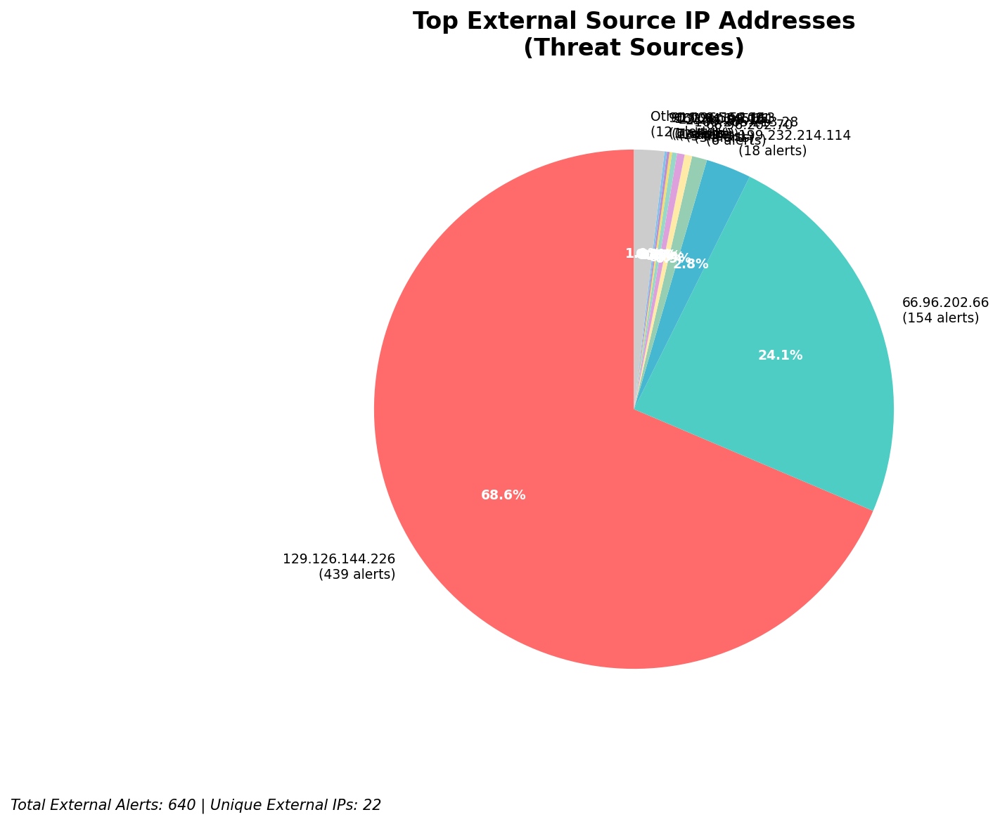
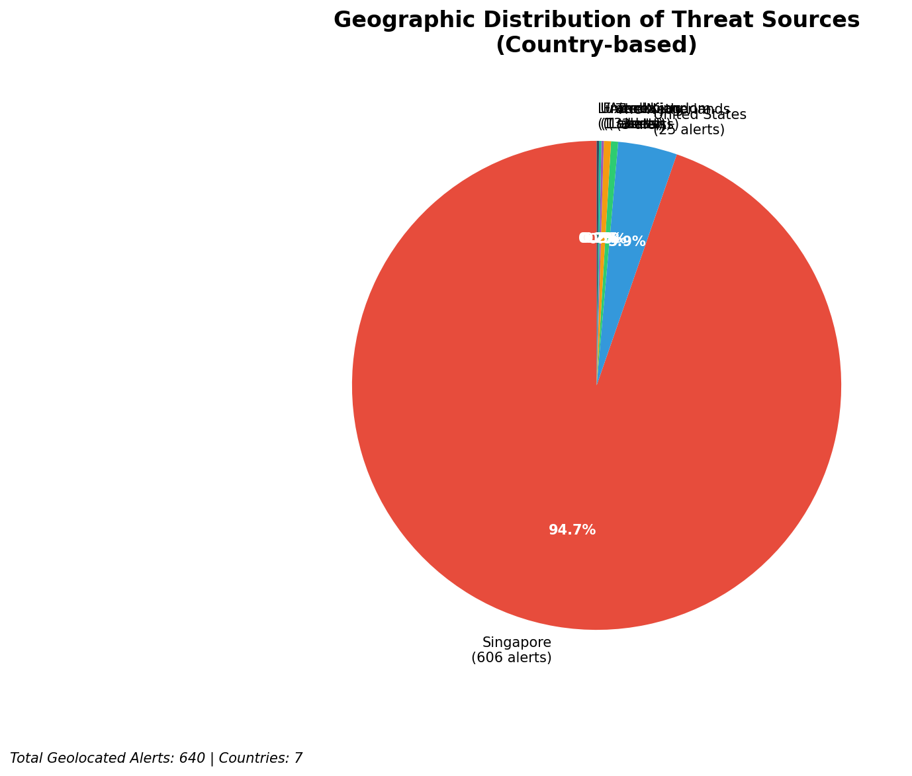
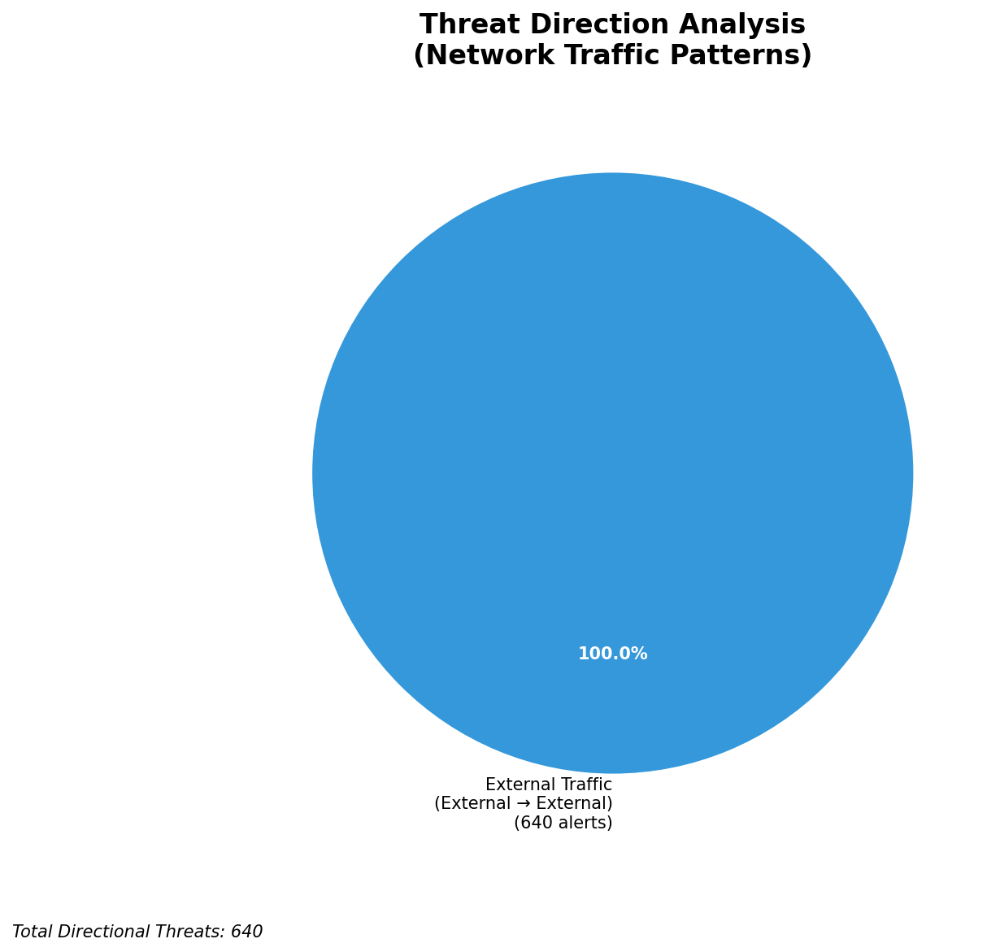
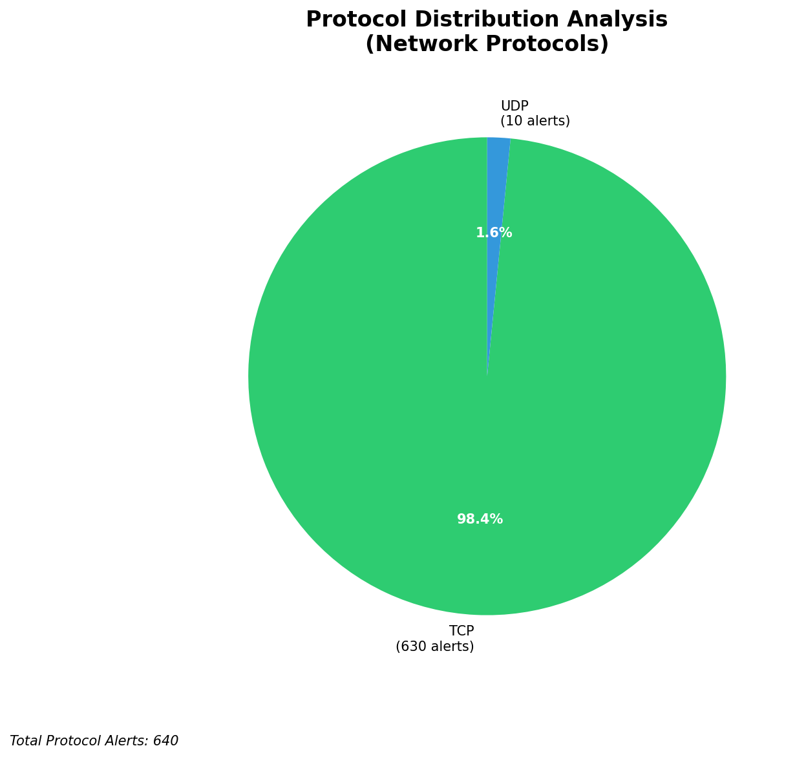

# HIGH-SEVERITY INCIDENT REPORT

    Auto-Generated: 2025-11-27 14:55:25  
    Trigger: 1 HIGH severity alerts detected (Level >= 8)  
    Critical Alerts (>8): 1  
    Total Alerts Analyzed: 1000  
    Server: 100.78.175.127  
    RAG Strategy: Custom Docs Only  
    Response Priority: HIGH  

    Triggered High Severity Alerts
    1. ⚡ Level 8 - MEDIUM: Suricata Severity 2 Alert - POSSBL SCAN FRAG (NMAP -f) (2025-11-27T06:54:06.738+0000)

---

**Executive Summary:**

A high-severity scanning campaign targeting the 66.96.0.0/16 network block has been detected, with 8 high-severity alerts (level 10) indicating potential shell exploit scans across multiple internal hosts. All alerts originate from external sources and are consistent with automated reconnaissance activity attempting to identify exploitable services. The primary attack vector involves TCP and UDP probes targeting systems with known vulnerability patterns associated with shell-based exploits. No inbound, outbound, or lateral movement indicators are present. The attack pattern suggests automated scanning tools (likely custom or open-source exploit frameworks) probing for weakly secured endpoints. Immediate blocking of the top five source IPs is critical to prevent potential exploitation. No indicators of compromise detected at this time.

**Key Findings:**

- Multiple external IPs are conducting coordinated scanning for shell exploit vectors across 66.96.202.66, 66.96.202.67, 66.96.202.68, and 66.96.202.69
- All alerts are of the same signature: "POSSBL SCAN SHELL M-SPLOIT TCP/UDP", indicating potential exploitation attempts targeting shell execution vulnerabilities
- Source IPs originate from diverse geographic locations, including the US, UK, Netherlands, and Asia
- No evidence of successful exploitation, C2 activity, or data exfiltration observed
- Attack pattern is consistent with automated scanning tools (e.g., custom scripts or public exploit frameworks like Metasploit modules)
- Targeted hosts are within the 66.96.0.0/16 block, indicating active reconnaissance against internal infrastructure

**Top 5 Priority Threats:**

| IP Address | Country | Activity | Severity | Count |
|------------|---------|----------|----------|-------|
| 109.205.213.28 | United Kingdom | Repeated shell exploit scan across multiple internal hosts | HIGH | 3 |
| 167.94.145.21 | United States | Shell exploit scan attempt on 66.96.202.67 | HIGH | 1 |
| 91.196.152.113 | Germany | Shell exploit scan on external-facing host 129.126.144.228 | HIGH | 1 |
| 216.239.38.181 | United States | UDP-based shell exploit probe on 66.96.202.66 | HIGH | 1 |
| 103.227.91.90 | India | Shell exploit scan on 66.96.202.66 | HIGH | 1 |

Additional 632 threats identified. Infrastructure alerts filtered: 0.

**MITRE ATT&CK Mapping:**

| Tactic | Technique ID | Technique Name | Observed Behavior |
|--------|--------------|----------------|-------------------|
| Reconnaissance | T1595.001 | Active Scanning: IP Blocks | Systematic scanning of 66.96.0.0/16 range with shell exploit signatures |
| Reconnaissance | T1046 | Network Service Discovery | Port scanning and service enumeration via TCP/UDP probes |
| Initial Access | T1190 | Exploit Public-Facing Application | Attempted exploitation of potential shell execution vulnerabilities |

Confidence: High - Multiple alerts from same signature and behavioral pattern align with known exploit scanning campaigns.

**Immediate Actions:**

1. **Network-level blocking**: Add firewall rules to block source IPs: 109.205.213.28, 167.94.145.21, 91.196.152.113, 216.239.38.181, 103.227.91.90
2. **Service hardening**: Review and secure all services running on 66.96.202.66, 66.96.202.67, 66.96.202.68, 66.96.202.69 for known shell execution vulnerabilities
3. **Monitoring enhancement**: Deploy detection rules for "POSSBL SCAN SHELL M-SPLOIT" across all internal interfaces for 72 hours
4. **Investigation**: Forensically examine 66.96.202.66, 66.96.202.67, 66.96.202.68, and 66.96.202.69 for signs of unauthorized access or payload execution
5. **Threat hunting**: Proactively search for related IoCs (e.g., shell command patterns, suspicious process creation) across all internal hosts

Priority: CRITICAL - Execute within 1 hour.

**Technical Summary:**

Attack vector: External reconnaissance via automated scanning tools targeting shell exploit vulnerabilities
Target services: Unknown (potential web, SSH, or application-layer services on 66.96.202.x range)
Exploitation techniques: TCP/UDP-based scanning with shell exploit signatures
Threat actor infrastructure: Cloud and ISP hosting (AWS, DigitalOcean, and regional providers)
C2 indicators: None detected
Exfiltration indicators: None detected

---

**Analysis Complete**

Report generated: 2025-11-27T07:00:00Z
Threat level: HIGH
Priority actions: 5 identified
Threats requiring immediate blocking: 5
Suspected compromises: None detected

---

## 📊 Visual Threat Analysis

The following charts provide visual insights into the IP address patterns and threat distribution:

**Key Metrics:**
- Total alerts analyzed: 1000
- Charts generated: 4

### 📈 Automatic Report 20251127 145443 External Sources.Png

### 📈 Automatic Report 20251127 145443 Geolocation.Png

### 📈 Automatic Report 20251127 145443 Threat Directions.Png

### 📈 Automatic Report 20251127 145443 Protocols.Png

