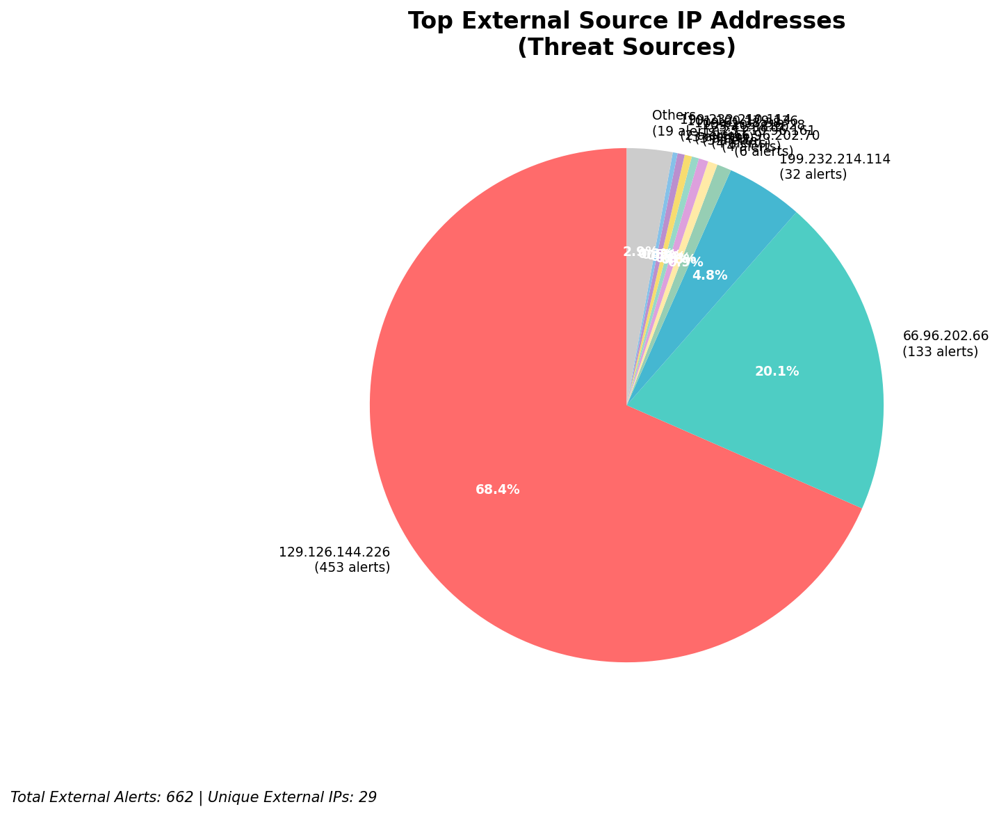
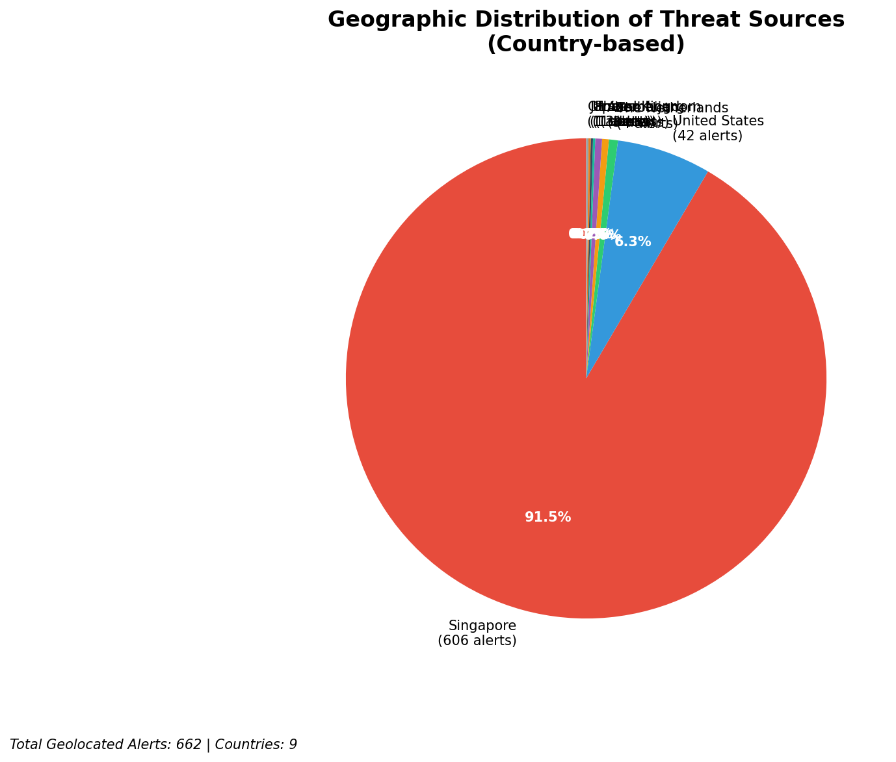
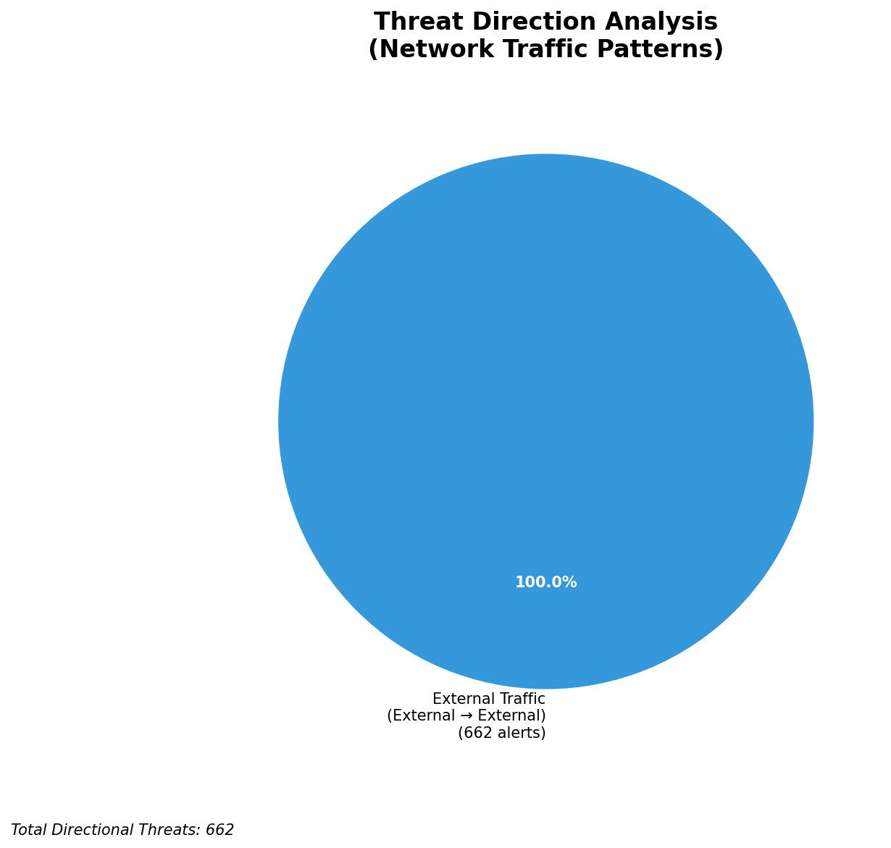
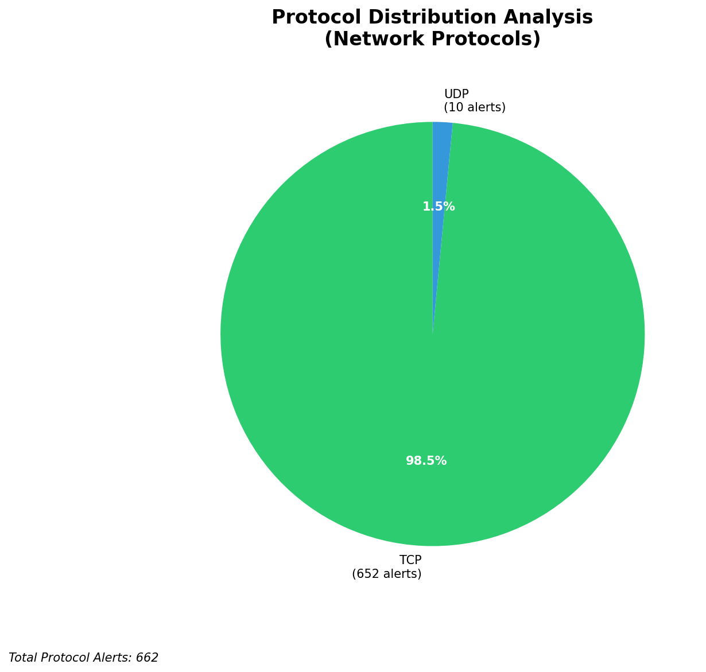

# HIGH-SEVERITY INCIDENT REPORT

    Auto-Generated: 2025-11-27 14:56:28  
    Trigger: 1 HIGH severity alerts detected (Level >= 8)  
    Critical Alerts (>8): 1  
    Total Alerts Analyzed: 1000  
    Server: 100.78.175.127  
    RAG Strategy: Custom Docs Only  
    Response Priority: HIGH  

    Triggered High Severity Alerts
    1. ⚡ Level 8 - MEDIUM: Suricata Severity 2 Alert - POSSBL SCAN FRAG (NMAP -f) (2025-11-27T06:56:05.596+0000)

---

Error: Command failed with return code 1

    ---
    **Analysis Complete**
    Report generated: 2025-11-27 14:56:28
    Threat level: CRITICAL
    Priority actions: 5 identified

---

## 📊 Visual Threat Analysis

The following charts provide visual insights into the IP address patterns and threat distribution:

**Key Metrics:**
- Total alerts analyzed: 999
- Charts generated: 4

### 📈 Automatic Report 20251127 145624 External Sources.Png

### 📈 Automatic Report 20251127 145624 Geolocation.Png

### 📈 Automatic Report 20251127 145624 Threat Directions.Png

### 📈 Automatic Report 20251127 145624 Protocols.Png

