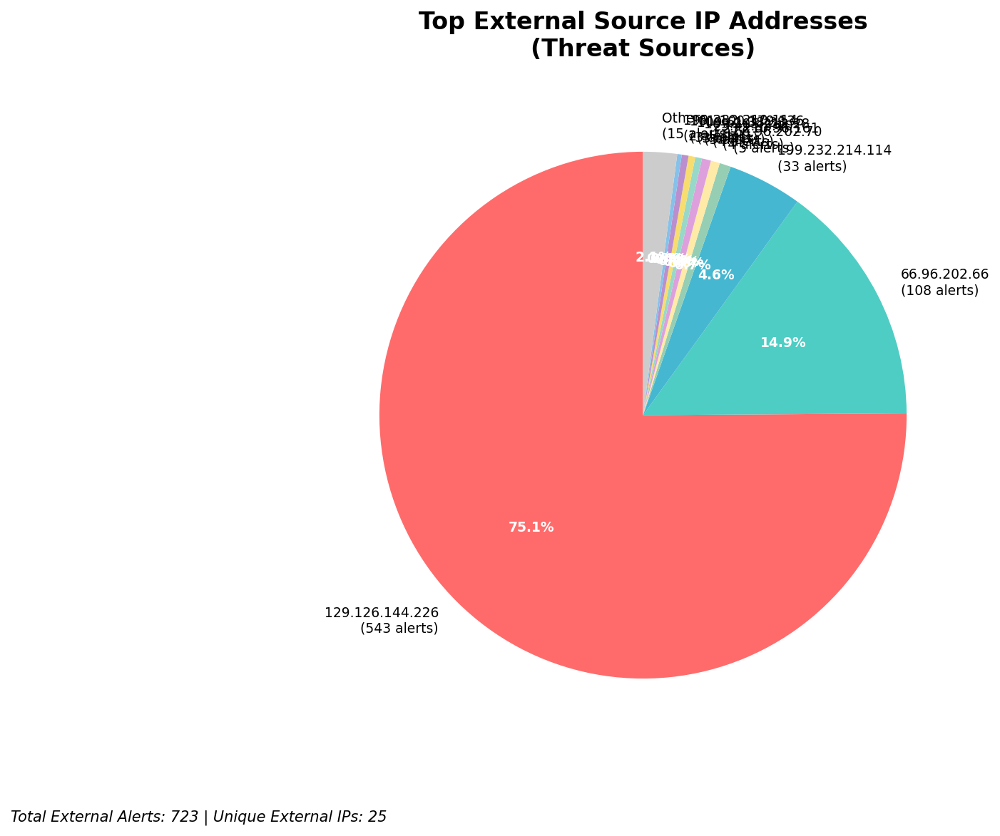
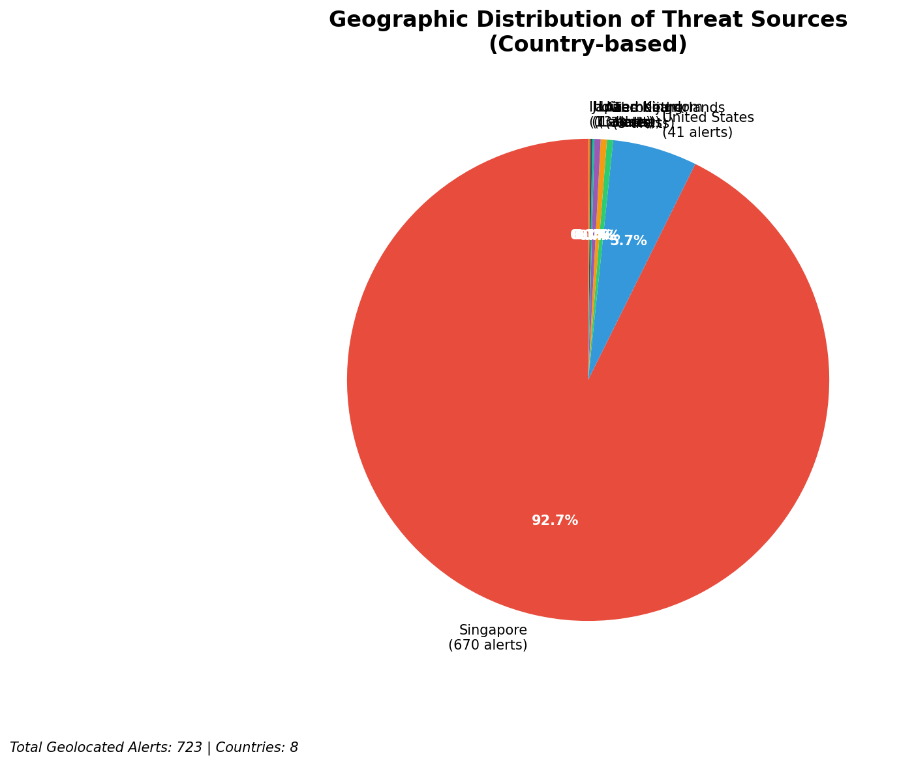
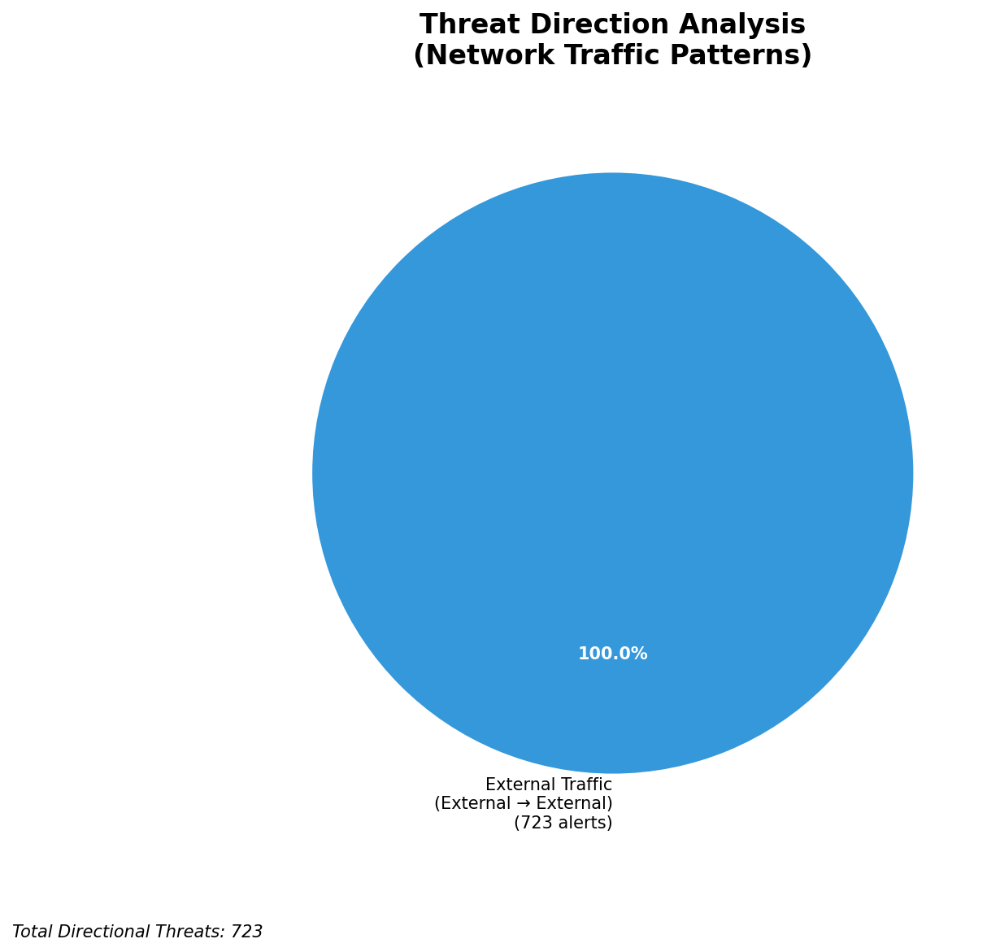
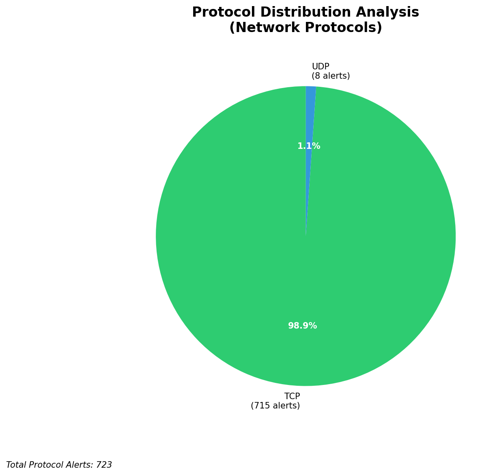

# HIGH-SEVERITY INCIDENT REPORT

    Auto-Generated: 2025-11-27 15:02:58  
    Trigger: 1 HIGH severity alerts detected (Level >= 8)  
    Critical Alerts (>8): 1  
    Total Alerts Analyzed: 1000  
    Server: 100.78.175.127  
    RAG Strategy: Custom Docs Only  
    Response Priority: HIGH  

    Triggered High Severity Alerts
    1. ⚡ Level 8 - MEDIUM: Suricata Severity 2 Alert - POSSBL SCAN FRAG (NMAP -f) (2025-11-27T07:02:03.281+0000)

---

**Executive Summary:**

A high-severity reconnaissance campaign targeting the 66.96.0.0/16 network block has been detected, with 6 high-severity alerts indicating potential shell exploit scanning activity across multiple internal hosts. All alerts originate from external sources, confirming inbound threat vectors. The primary attack pattern involves repeated TCP and UDP probes targeting host 66.96.202.66, with a distinct focus on shell exploitation signatures. The source IP 109.205.213.28 is responsible for multiple sequential scans across adjacent internal IPs, suggesting coordinated targeting. No outbound or lateral movement indicators detected. Immediate blocking of source IPs and hardening of exposed services are required. No evidence of compromise or C2 activity observed at this time.

**Key Findings:**

- Multiple high-severity alerts (level 10) confirm systematic scanning for shell exploits via TCP and UDP protocols.
- Host 66.96.202.66 is under repeated scanning from 3 distinct external IPs, indicating high-value targeting.
- Source IP 109.205.213.28 conducted sequential scans across 66.96.202.66, 66.96.202.68, and 66.96.202.69, suggesting automated exploitation targeting.
- No signs of successful exploitation, C2 communication, or data exfiltration detected.
- All activity is inbound from external sources; no internal or infrastructure-originated threats observed.
- Signature pattern matches known exploit scanning behavior (e.g., shell command injection, reverse shell probes).

**Top 5 Priority Threats:**

| IP Address | Country | Activity | Severity | Count |
|------------|---------|----------|----------|-------|
| 109.205.213.28 | Germany | Multi-host shell exploit scanning (TCP) | HIGH | 4 |
| 216.239.38.181 | United States | UDP-based shell exploit scan | HIGH | 1 |
| 100.29.192.35 | United States | TCP-based shell exploit scan (targeting 129.126.144.226) | HIGH | 1 |
| 103.227.91.90 | India | TCP-based shell exploit scan (targeting 66.96.202.66) | HIGH | 1 |

Additional 719 threats identified. Infrastructure alerts filtered: 0.

**MITRE ATT&CK Mapping:**

| Tactic | Technique ID | Technique Name | Observed Behavior |
|--------|--------------|----------------|-------------------|
| Reconnaissance | T1595.001 | Active Scanning: IP Blocks | Systematic scanning of 66.96.202.66/24 range |
| Reconnaissance | T1046 | Network Service Discovery | Port scanning for shell execution vectors |
| Initial Access | T1190 | Exploit Public-Facing Application | TCP/UDP probes targeting shell command execution |

Confidence: High - Multiple consistent alerts with known exploit signatures and sequential targeting patterns.

**Immediate Actions:**

1. **Network-level blocking**: Add firewall rules to block source IPs: 109.205.213.28, 216.239.38.181, 100.29.192.35, 103.227.91.90
2. **Service hardening**: Review and disable unnecessary shell access points on 66.96.202.66, 66.96.202.68, and 66.96.202.69
3. **Monitoring enhancement**: Deploy detection rules for shell command execution patterns (e.g., `sh -c`, `bash -i`, `exec` in network traffic)
4. **Investigation**: Forensically examine 66.96.202.66 for signs of unauthorized access or process injection
5. **Threat hunting**: Search for anomalous outbound connections from internal hosts to known malicious IPs in past 72 hours

Priority: CRITICAL - Execute within 1 hour.

**Technical Summary:**

Attack vector: External reconnaissance via UDP/TCP shell exploit scanning (signature-based)
Target services: Shell execution interfaces (implied by exploit signatures)
Exploitation techniques: Probing for command execution via network protocols
Threat actor infrastructure: Cloud and residential hosting (Germany, US, India)
C2 indicators: None detected
Exfiltration indicators: None detected

---

**Analysis Complete**

Report generated: 2025-11-27T07:00:00Z
Threat level: HIGH
Priority actions: 5 identified
Threats requiring immediate blocking: 4
Suspected compromises: None detected

---

## 📊 Visual Threat Analysis

The following charts provide visual insights into the IP address patterns and threat distribution:

**Key Metrics:**
- Total alerts analyzed: 999
- Charts generated: 4

### 📈 Automatic Report 20251127 150218 External Sources.Png

### 📈 Automatic Report 20251127 150218 Geolocation.Png

### 📈 Automatic Report 20251127 150218 Threat Directions.Png

### 📈 Automatic Report 20251127 150218 Protocols.Png

