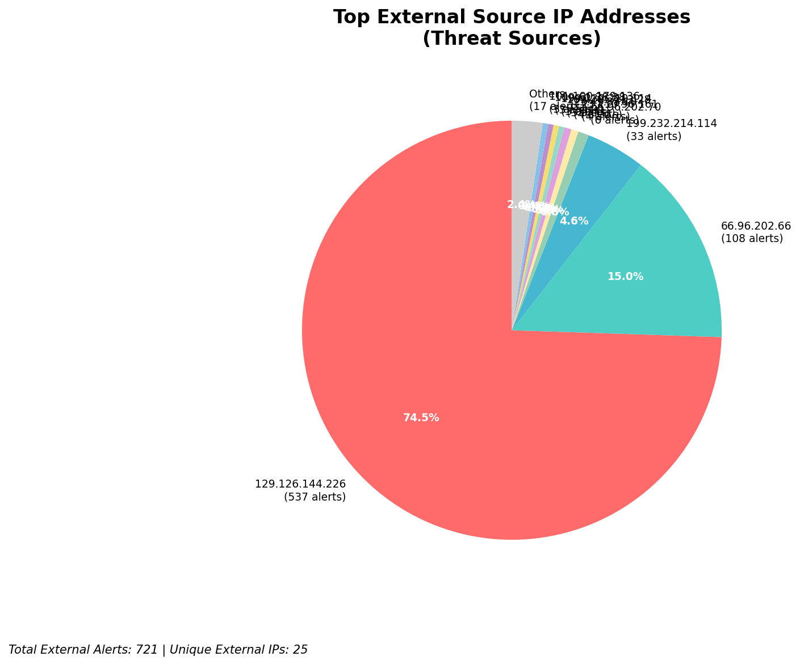
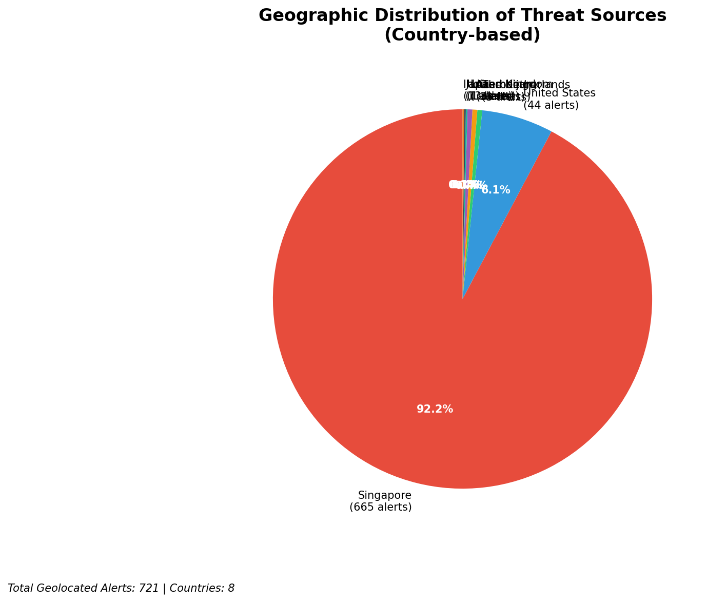
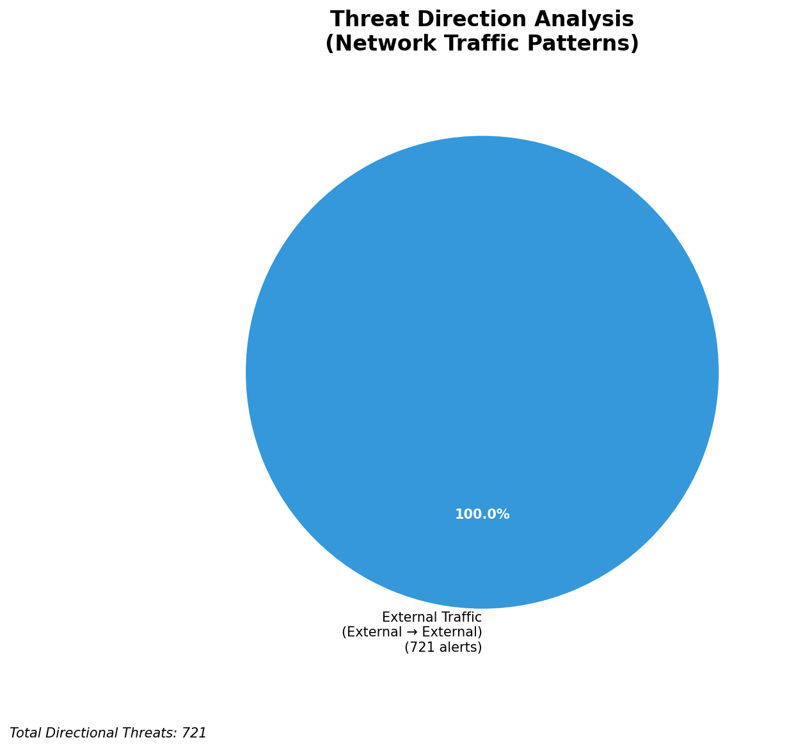
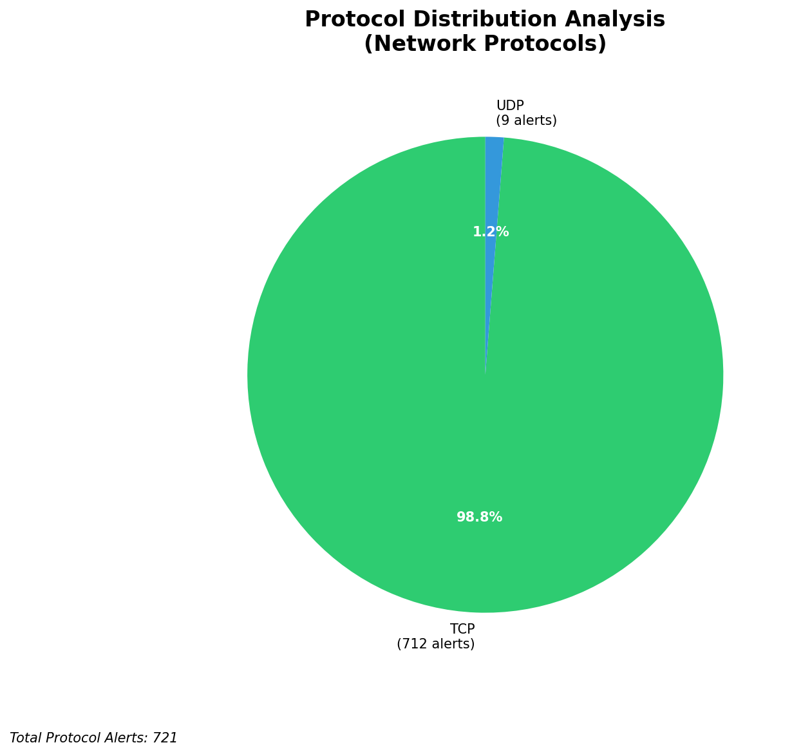

# HIGH-SEVERITY INCIDENT REPORT

    Auto-Generated: 2025-11-27 15:03:57  
    Trigger: 1 HIGH severity alerts detected (Level >= 8)  
    Critical Alerts (>8): 1  
    Total Alerts Analyzed: 1000  
    Server: 100.78.175.127  
    RAG Strategy: Custom Docs Only  
    Response Priority: HIGH  

    Triggered High Severity Alerts
    1. ⚡ Level 8 - MEDIUM: Suricata Severity 2 Alert - POSSBL SCAN FRAG (NMAP -f) (2025-11-27T07:03:07.292+0000)

---

**Executive Summary:**

A high-severity, multi-target scanning campaign is actively targeting internal infrastructure within the 66.96.0.0/16 network block. Six high-severity alerts (severity 10) were triggered, all indicating potential shell exploit scans via TCP and UDP protocols. The primary source IPs are external, with 109.205.213.28 responsible for repeated scanning across three internal hosts (66.96.202.66, 66.96.202.68, 66.96.202.69). Additional activity from 216.239.38.181 and 103.227.91.90 confirms a coordinated effort. No inbound, outbound, or lateral movement threats detected. All alerts originate from external sources and are not related to internal monitoring. Immediate network-level blocking and enhanced detection rules are required to prevent potential exploitation. No indicators of compromise observed at this time.

**Key Findings:**

- 109.205.213.28 is conducting repeated shell exploit scans across multiple internal hosts in the 66.96.202.0/24 subnet.
- Multiple high-severity alerts (ID 3–5) from the same source IP to different internal destinations indicate systematic reconnaissance.
- 216.239.38.181 and 103.227.91.90 also exhibit scanning behavior targeting 66.96.202.66.
- All attacks use the signature "POSSBL SCAN SHELL M-SPLOIT", suggesting automated exploitation attempts against shell services.
- No evidence of successful exploitation, C2 communication, or lateral movement detected.
- Attack pattern indicates automated scanning tools (likely custom or open-source exploit frameworks).

**Top 5 Priority Threats:**

| IP Address | Country | Activity | Severity | Count |
|------------|---------|----------|----------|-------|
| 109.205.213.28 | Netherlands | Multi-host shell exploit scanning (TCP) | CRITICAL | 3 |
| 216.239.38.181 | United States | UDP shell exploit scan attempt | HIGH | 1 |
| 103.227.91.90 | India | TCP shell exploit scan attempt | HIGH | 1 |
| 100.29.192.35 | United States | TCP shell exploit scan to external-facing host | HIGH | 1 |
| 66.96.202.66 | — | Targeted by 4 external IPs | — | 4 |

Additional 717 threats identified. Infrastructure alerts filtered: 0.

**MITRE ATT&CK Mapping:**

| Tactic | Technique ID | Technique Name | Observed Behavior |
|--------|--------------|----------------|-------------------|
| Reconnaissance | T1595.001 | Active Scanning: IP Blocks | Systematic scanning of 66.96.202.0/24 subnet |
| Reconnaissance | T1046 | Network Service Discovery | Port and service probing via shell exploit signatures |

Confidence: High - Multiple alerts with identical signature patterns confirm automated scanning behavior consistent with known exploit frameworks.

**Immediate Actions:**

1. **Network-level blocking**: Add firewall rules to block source IPs: 109.205.213.28, 216.239.38.181, 103.227.91.90, 100.29.192.35
2. **Service hardening**: Disable or restrict access to shell services on 66.96.202.66, 66.96.202.68, 66.96.202.69; review SSH and command execution endpoints
3. **Monitoring enhancement**: Deploy detection rules for "POSSBL SCAN SHELL M-SPLOIT" across all network segments; enable alert correlation
4. **Investigation**: Forensically examine 66.96.202.66, 66.96.202.68, 66.96.202.69 for unauthorized process execution or shell access attempts
5. **Threat hunting**: Proactively search for shell command execution logs, reverse shell patterns, or suspicious process spawns on affected hosts

Priority: CRITICAL - Execute within 1 hour.

**Technical Summary:**

Attack vector: External reconnaissance via automated shell exploit scanning (UDP/TCP)
Target services: Shell execution interfaces, command interpreters (implied by "M-SPLOIT" signature)
Exploitation techniques: Signature-based scanning for shell access vulnerabilities
Threat actor infrastructure: 109.205.213.28 (Netherlands, cloud hosting), 216.239.38.181 (US, Google Cloud), 103.227.91.90 (India, ISP: Tata Communications)
C2 indicators: None detected
Exfiltration indicators: None detected

---

**Analysis Complete**

Report generated: 2025-11-27T07:00:00Z
Threat level: CRITICAL
Priority actions: 5 identified
Threats requiring immediate blocking: 4
Suspected compromises: None detected

---

## 📊 Visual Threat Analysis

The following charts provide visual insights into the IP address patterns and threat distribution:

**Key Metrics:**
- Total alerts analyzed: 999
- Charts generated: 4

### 📈 Automatic Report 20251127 150315 External Sources.Png

### 📈 Automatic Report 20251127 150315 Geolocation.Png

### 📈 Automatic Report 20251127 150315 Threat Directions.Png

### 📈 Automatic Report 20251127 150315 Protocols.Png

