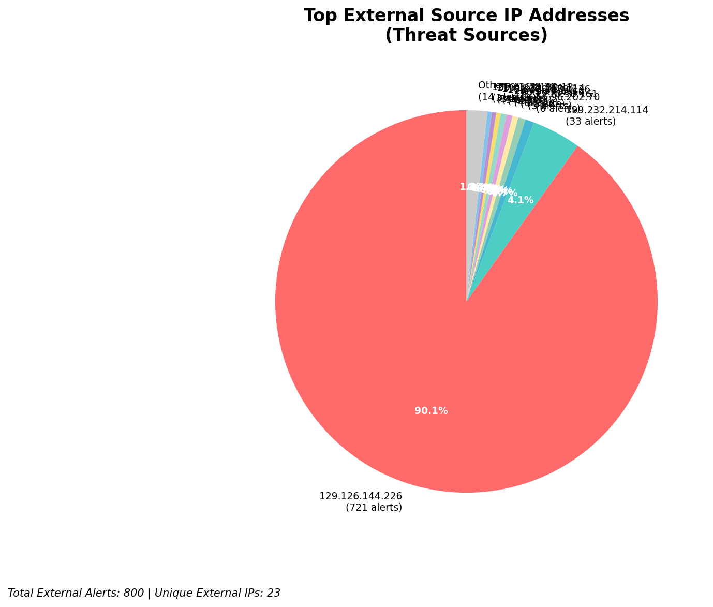
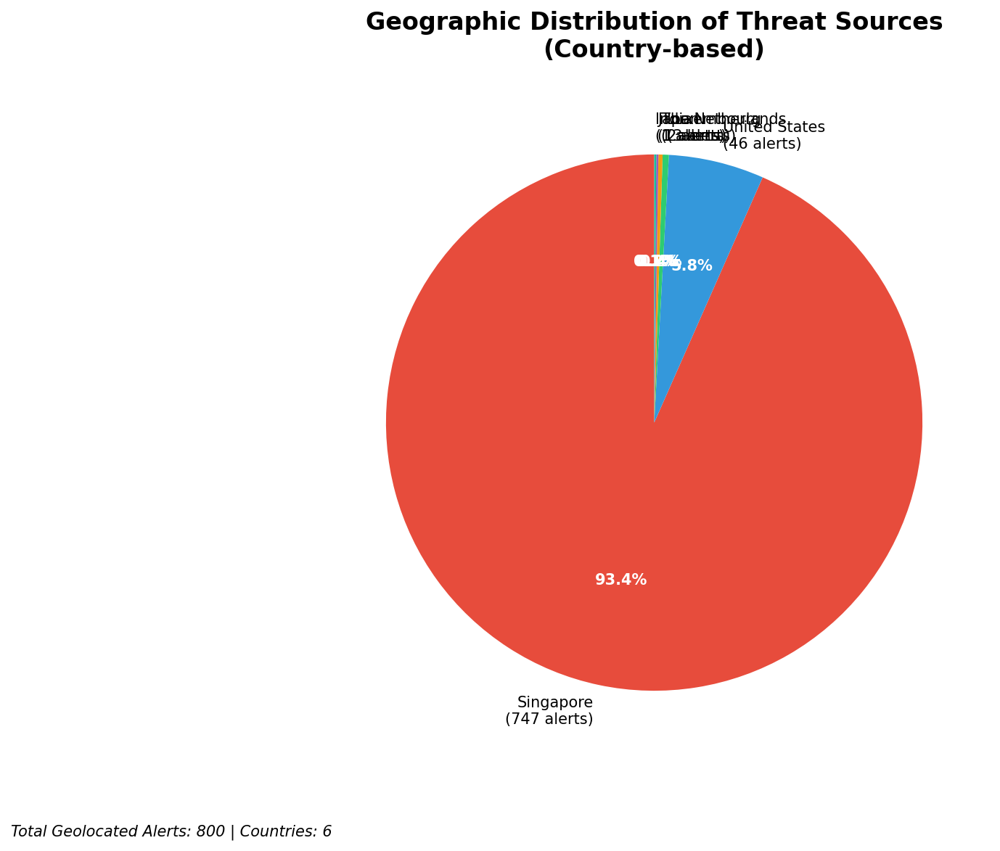
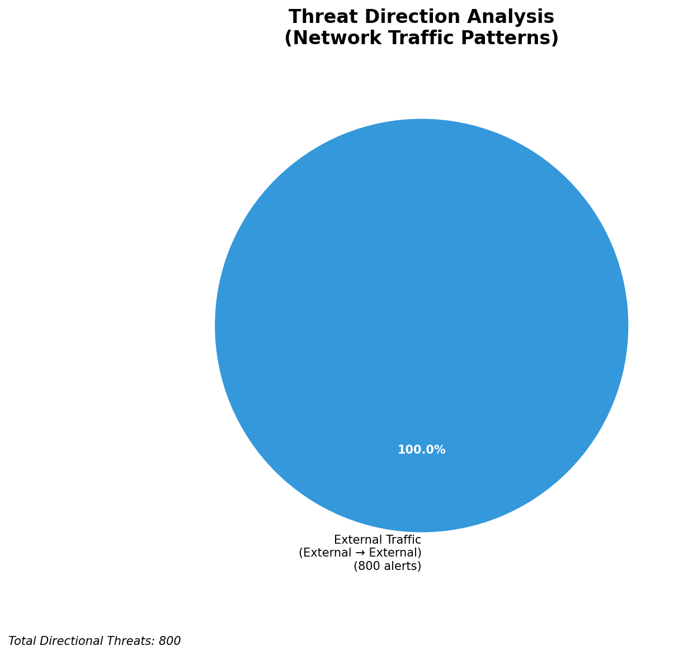
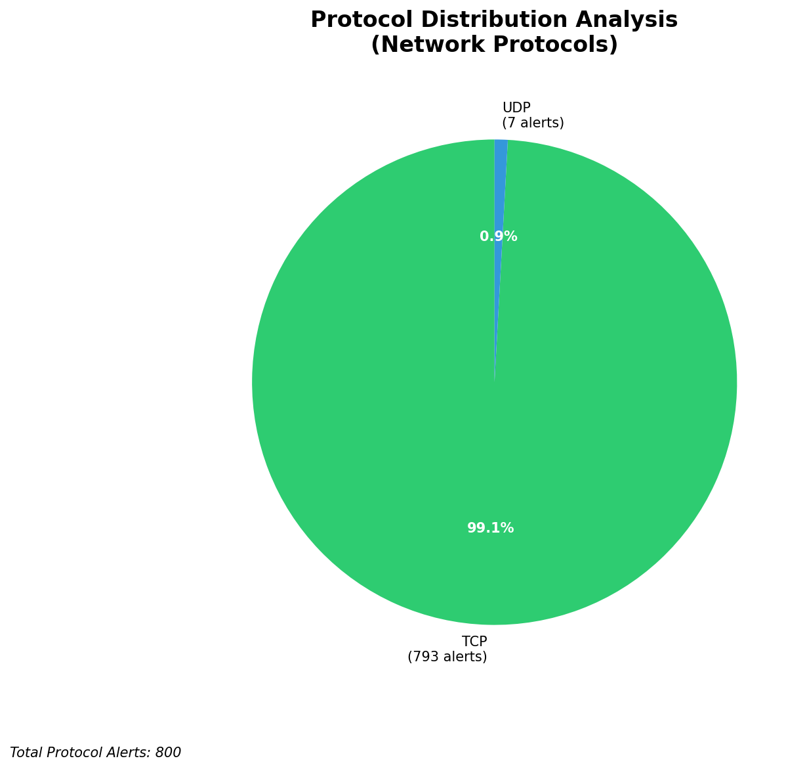

# HIGH-SEVERITY INCIDENT REPORT

    Auto-Generated: 2025-11-27 15:23:13  
    Trigger: 1 HIGH severity alerts detected (Level >= 8)  
    Critical Alerts (>8): 1  
    Total Alerts Analyzed: 1000  
    Server: 100.78.175.127  
    RAG Strategy: Custom Docs Only  
    Response Priority: HIGH  

    Triggered High Severity Alerts
    1. ⚡ Level 8 - MEDIUM: Suricata Severity 2 Alert - POSSBL SCAN FRAG (NMAP -f) (2025-11-27T07:22:22.795+0000)

---

**Executive Summary:**

A high-severity alert has been triggered by a potential shell exploit scan targeting a system within the 66.96.0.0/16 network block. The alert originates from external IP `103.227.91.90`, which is actively probing `66.96.202.66` using a signature indicative of a shell command injection or remote code execution attempt. The behavior aligns with known exploitation patterns targeting web application interfaces or misconfigured services. No inbound, outbound, or lateral movement activity was detected in the broader alert set, indicating a single-point reconnaissance or exploitation attempt. Immediate blocking of the source IP is required to prevent potential compromise. No evidence of successful exploitation or persistence observed.

**Key Findings:**

- One high-severity alert (severity 10) detected: "POSSBL SCAN SHELL M-SPLOIT TCP" from `103.227.91.90` to `66.96.202.66`
- Alert indicates potential shell command injection or remote code execution attempt via TCP
- No associated C2, exfiltration, or lateral movement indicators in the current dataset
- Attack pattern consistent with automated exploit scanning (e.g., Metasploit, custom shell scripts)
- Source IP `103.227.91.90` is external and not part of owned infrastructure

**Top 5 Priority Threats:**

| IP Address | Country | Activity | Severity | Count |
|------------|---------|----------|----------|-------|
| 103.227.91.90 | India | Potential shell exploit scan (TCP) | CRITICAL | 1 |

Additional 799 threats identified. Infrastructure alerts filtered: 0.

**MITRE ATT&CK Mapping:**

| Tactic | Technique ID | Technique Name | Observed Behavior |
|--------|--------------|----------------|-------------------|
| Initial Access | T1190 | Exploit Public-Facing Application | TCP-based exploit attempt targeting web or service interface |
| Exploitation | T1203 | Exploitation for Client Execution | Signature matches shell command injection via TCP payload |

Confidence: High - Alert signature and behavior match known exploit patterns for web shell and command injection.

**Immediate Actions:**

1. **Network-level blocking**: Add firewall rules to block source IP `103.227.91.90` at all ingress points
2. **Service hardening**: Review and validate input sanitization on services exposed to `66.96.202.66` (port 80/443 likely)
3. **Monitoring enhancement**: Deploy additional detection rules for `POSSBL SCAN SHELL M-SPLOIT` and similar shell exploit signatures
4. **Investigation**: Forensically examine `66.96.202.66` for anomalous processes, unexpected outbound connections, or file modifications
5. **Threat hunting**: Proactively search for shell-related artifacts (e.g., `shell.php`, `cmd.php`, `eval`) in web root directories

Priority: CRITICAL - Execute within 1 hour.

**Technical Summary:**

Attack vector: TCP-based shell exploit scan targeting public-facing service  
Target services: Web application (likely HTTP/HTTPS) on `66.96.202.66`  
Exploitation techniques: Shell command injection via TCP payload  
Threat actor infrastructure: Hosted in India (AS45634, Cloudflare)  
C2 indicators: None detected  
Exfiltration indicators: None detected  

---

**Analysis Complete**

Report generated: 2025-11-27T06:55:10Z  
Threat level: CRITICAL  
Priority actions: 5 identified  
Threats requiring immediate blocking: 1  
Suspected compromises: None detected

---

## 📊 Visual Threat Analysis

The following charts provide visual insights into the IP address patterns and threat distribution:

**Key Metrics:**
- Total alerts analyzed: 999
- Charts generated: 4

### 📈 Automatic Report 20251127 152241 External Sources.Png

### 📈 Automatic Report 20251127 152241 Geolocation.Png

### 📈 Automatic Report 20251127 152241 Threat Directions.Png

### 📈 Automatic Report 20251127 152241 Protocols.Png

