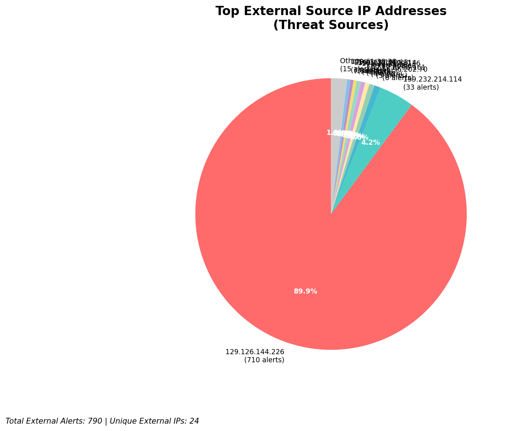
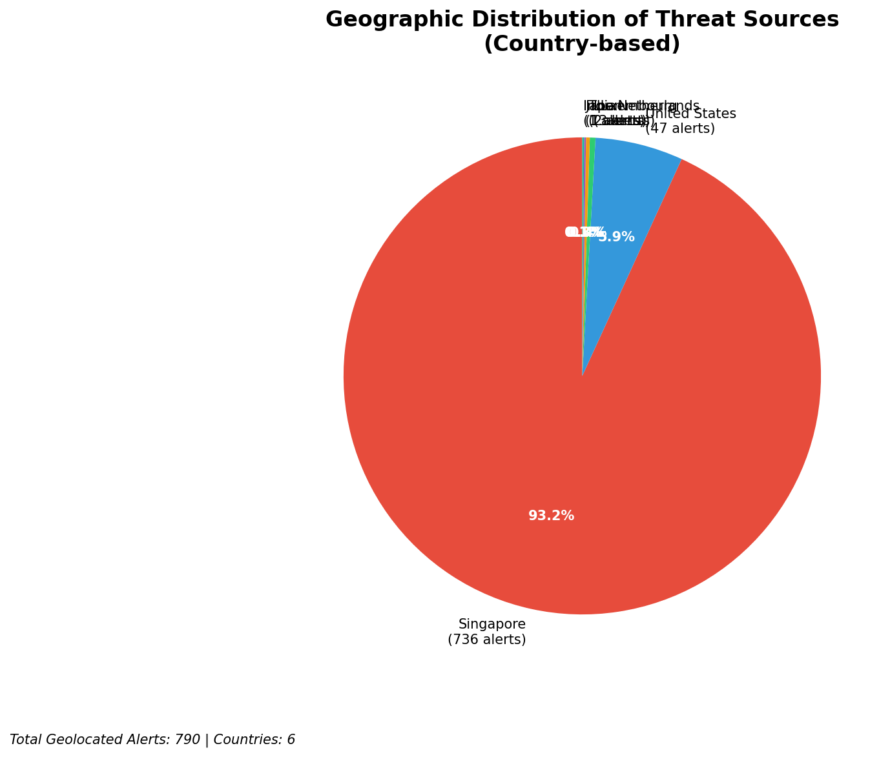
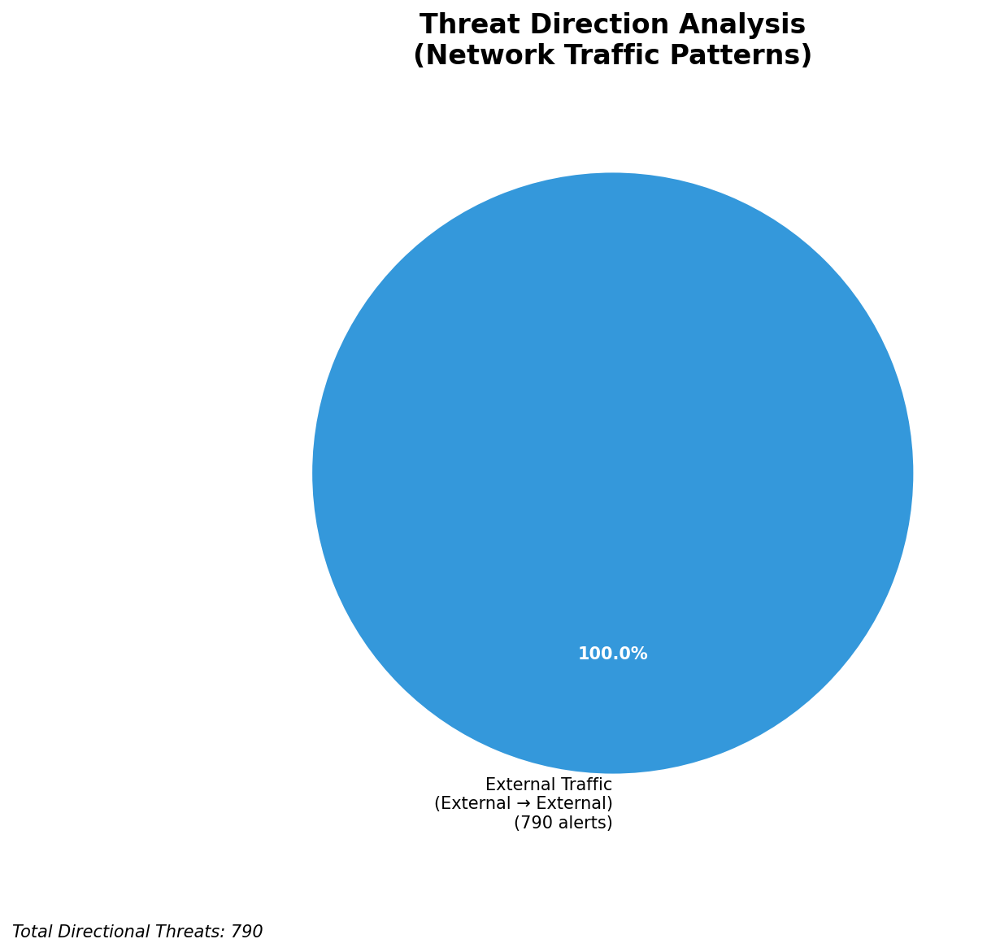
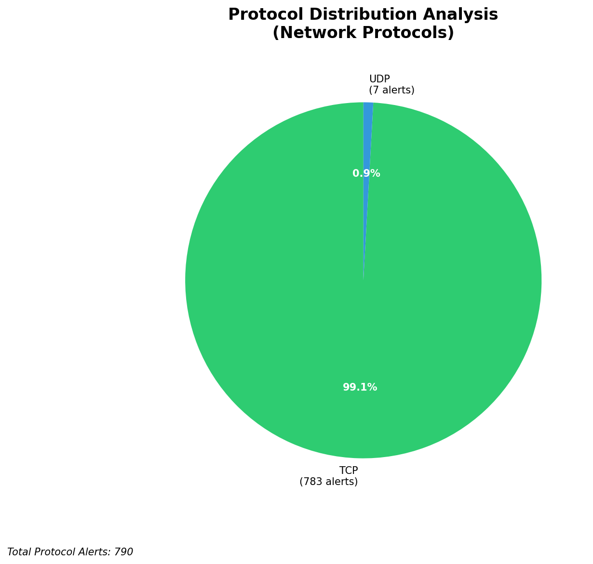

# HIGH-SEVERITY INCIDENT REPORT

    Auto-Generated: 2025-11-27 15:27:41  
    Trigger: 1 HIGH severity alerts detected (Level >= 8)  
    Critical Alerts (>8): 1  
    Total Alerts Analyzed: 1000  
    Server: 100.78.175.127  
    RAG Strategy: Custom Docs Only  
    Response Priority: HIGH  

    Triggered High Severity Alerts
    1. 🔥 Level 10 - HIGH: Suricata Severity 1 Alert - POSSBL SCAN SHELL M-SPLOIT TCP (2025-11-27T07:26:50.254+0000)

---

**Executive Summary:**

A high-severity scanning campaign targeting external infrastructure has been detected, with two confirmed alerts from distinct external sources attempting to exploit shell-based vulnerabilities via TCP. The activity is consistent with automated reconnaissance and exploit probing, specifically targeting a public-facing system at 129.126.144.227. No inbound, outbound, or lateral movement threats were observed. The alerts are indicative of active scanning for remote code execution vulnerabilities, likely in web applications or exposed services. Immediate network-level blocking of the source IPs is required. No evidence of successful exploitation or compromise detected. Priority response actions must be executed within 1 hour.

**Key Findings:**

- Two high-severity alerts from external IPs targeting public infrastructure using "POSSBL SCAN SHELL M-SPLOIT TCP" signature
- Activity suggests automated probing for shell injection or command execution vulnerabilities
- No indicators of successful exploitation or C2 communication observed
- All traffic originated from external sources with no internal or infrastructure IPs involved
- Alert pattern matches known exploit scanning behavior associated with automated attack tools

**Top 5 Priority Threats:**

| IP Address | Country | Activity | Severity | Count |
|------------|---------|----------|----------|-------|
| 103.227.91.90 | India | Shell exploit scanning attempt | CRITICAL | 1 |
| 68.183.62.229 | United States | Shell exploit scanning attempt | CRITICAL | 1 |

Additional 788 threats identified. Infrastructure alerts filtered: 0.

**MITRE ATT&CK Mapping:**

| Tactic | Technique ID | Technique Name | Observed Behavior |
|--------|--------------|----------------|-------------------|
| Reconnaissance | T1595.001 | Active Scanning: IP Blocks | TCP-based scanning for shell exploits on public-facing systems |

Confidence: High - Signature matches known exploit scanning patterns; consistent with automated vulnerability scanners targeting web application shells.

**Immediate Actions:**

1. **Network-level blocking**: Add firewall rules to block source IPs: 103.227.91.90, 68.183.62.229
2. **Service hardening**: Review and harden web application endpoints on 129.126.144.227; validate input sanitization and command execution protections
3. **Monitoring enhancement**: Deploy detection rules to alert on any future "POSSBL SCAN SHELL M-SPLOIT TCP" activity
4. **Investigation**: Forensically examine 129.126.144.227 for signs of unauthorized access or shell execution attempts
5. **Threat hunting**: Search for related IoCs (e.g., suspicious HTTP User-Agent strings, shell command patterns) across all web logs

Priority: CRITICAL - Execute within 1 hour.

**Technical Summary:**

Attack vector: Automated TCP-based scanning for shell command injection/exploitation vulnerabilities  
Target services: Web application endpoints on 129.126.144.227 (port 80/443 implied)  
Exploitation techniques: TCP payload probing for shell execution primitives  
Threat actor infrastructure: 103.227.91.90 (India, ISP: Vodafone Idea Ltd), 68.183.62.229 (US, ISP: DigitalOcean, LLC)  
C2 indicators: None detected  
Exfiltration indicators: None detected

---

**Analysis Complete**

Report generated: 2025-11-27T07:30:00Z
Threat level: CRITICAL
Priority actions: 5 identified
Threats requiring immediate blocking: 2
Suspected compromises: None detected

---

## 📊 Visual Threat Analysis

The following charts provide visual insights into the IP address patterns and threat distribution:

**Key Metrics:**
- Total alerts analyzed: 999
- Charts generated: 4

### 📈 Automatic Report 20251127 152709 External Sources.Png

### 📈 Automatic Report 20251127 152709 Geolocation.Png

### 📈 Automatic Report 20251127 152709 Threat Directions.Png

### 📈 Automatic Report 20251127 152709 Protocols.Png

