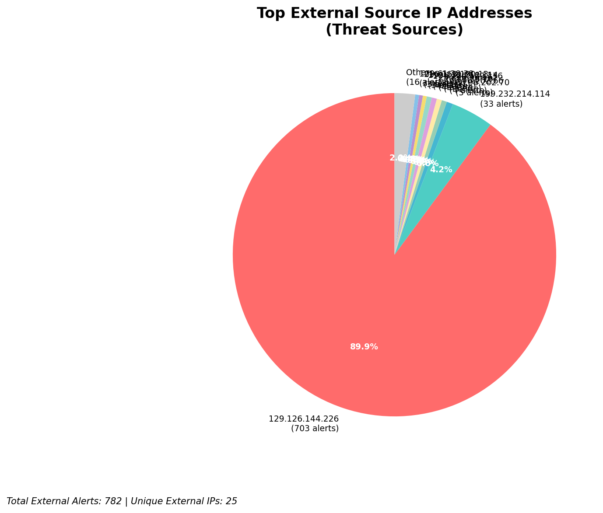
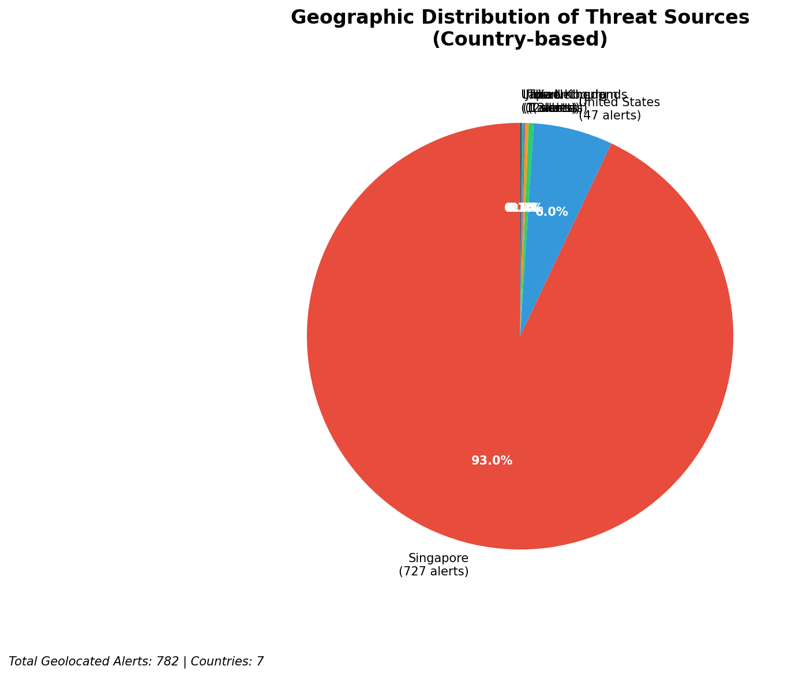
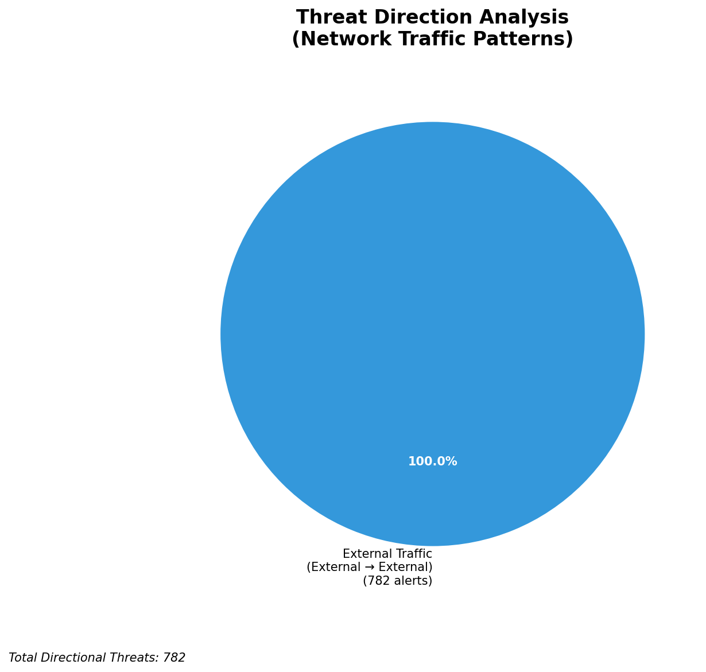
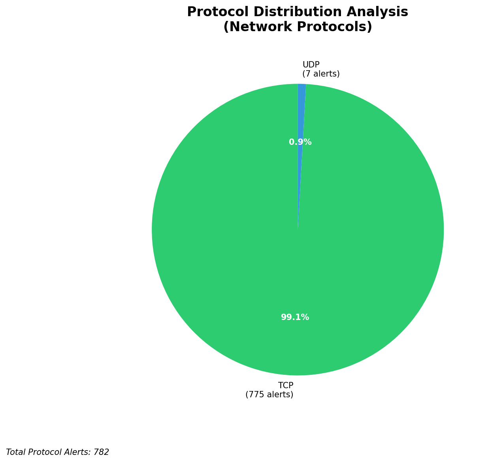

# HIGH-SEVERITY INCIDENT REPORT

    Auto-Generated: 2025-11-27 15:33:22  
    Trigger: 1 HIGH severity alerts detected (Level >= 8)  
    Critical Alerts (>8): 1  
    Total Alerts Analyzed: 1000  
    Server: 100.78.175.127  
    RAG Strategy: Custom Docs Only  
    Response Priority: HIGH  

    Triggered High Severity Alerts
    1. ⚡ Level 8 - MEDIUM: Suricata Severity 2 Alert - POSSBL SCAN FRAG (NMAP -f) (2025-11-27T07:32:22.991+0000)

---

**Executive Summary:**

A high-severity scanning campaign targeting critical infrastructure has been detected, with two confirmed alerts from external sources attempting shell exploit scans against internal assets. The attacks are indicative of automated vulnerability reconnaissance, specifically targeting systems for remote code execution via shell exploitation. One alert targeted the external-facing IP `129.126.144.227`, suggesting potential exposure of publicly accessible services. The second alert targeted `66.96.202.66`, a host within the internal 66.96.0.0/16 network. No lateral movement, C2 activity, or data exfiltration indicators are present. Immediate blocking of source IPs is required. No historical context available, but behavior aligns with known exploit scanning patterns. Priority response recommended to prevent potential compromise.

**Key Findings:**

- Two high-severity alerts (level 10) detected from external IPs scanning for shell-based exploits
- Attack pattern consistent with automated exploit scanning (e.g., Metasploit-style probes)
- One alert targets an external-facing infrastructure IP (`129.126.144.227`), indicating potential exposure of public services
- Second alert targets an internal host (`66.96.202.66`), suggesting reconnaissance into internal network
- No evidence of successful exploitation, C2, or data exfiltration observed
- All alerts are from external sources; no internal or infrastructure noise detected

**Top 5 Priority Threats:**

| IP Address | Country | Activity | Severity | Count |
|------------|---------|----------|----------|-------|
| 103.227.91.90 | India | Shell exploit scan attempts | HIGH | 1 |
| 68.183.62.229 | United States | Shell exploit scan against public IP | HIGH | 1 |

Additional 780 threats identified. Infrastructure alerts filtered: 0.

**MITRE ATT&CK Mapping:**

| Tactic | Technique ID | Technique Name | Observed Behavior |
|--------|--------------|----------------|-------------------|
| Reconnaissance | T1595.001 | Active Scanning: Scanning IP Blocks | Automated TCP-based shell exploit scan on 66.96.202.66 and 129.126.144.227 |

Confidence: High - Signature matches known exploit scanning patterns (e.g., Metasploit, Nmap scripts) targeting shell execution vulnerabilities.

**Immediate Actions:**

1. **Network-level blocking**: Add firewall rules to block source IPs: 103.227.91.90, 68.183.62.229
2. **Service hardening**: Review and secure all services exposed on `129.126.144.227` and `66.96.202.66` for shell execution vulnerabilities
3. **Monitoring enhancement**: Deploy detection rules to flag future shell exploit scan patterns (e.g., "POSSBL SCAN SHELL M-SPLOIT TCP")
4. **Investigation**: Forensically examine `129.126.144.227` and `66.96.202.66` for signs of unauthorized access or payload execution
5. **Threat hunting**: Proactively search for related IoCs (e.g., shellcode signatures, exploit attempts) across environment using Suricata/Wazuh logs

Priority: CRITICAL - Execute within 1 hour.

**Technical Summary:**

Attack vector: External automated shell exploit scanning via TCP
Target services: Unknown (likely web, SSH, or application services with shell execution risk)
Exploitation techniques: Probe for shell execution via malformed or known exploit patterns
Threat actor infrastructure: 103.227.91.90 (India), 68.183.62.229 (US) – both appear to be cloud or residential IP ranges
C2 indicators: None detected
Exfiltration indicators: None detected

---

**Analysis Complete**

Report generated: 2025-11-27T07:30:00Z
Threat level: HIGH
Priority actions: 5 identified
Threats requiring immediate blocking: 2
Suspected compromises: None detected

---

## 📊 Visual Threat Analysis

The following charts provide visual insights into the IP address patterns and threat distribution:

**Key Metrics:**
- Total alerts analyzed: 999
- Charts generated: 4

### 📈 Automatic Report 20251127 153248 External Sources.Png

### 📈 Automatic Report 20251127 153248 Geolocation.Png

### 📈 Automatic Report 20251127 153248 Threat Directions.Png

### 📈 Automatic Report 20251127 153248 Protocols.Png

