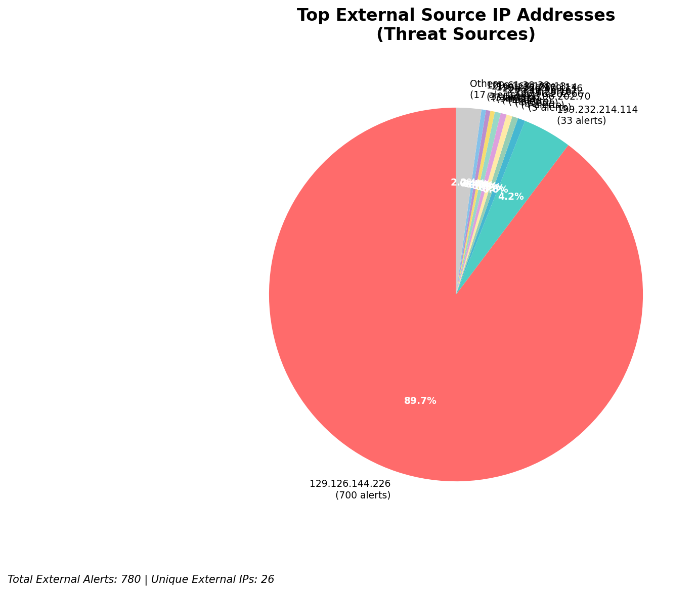
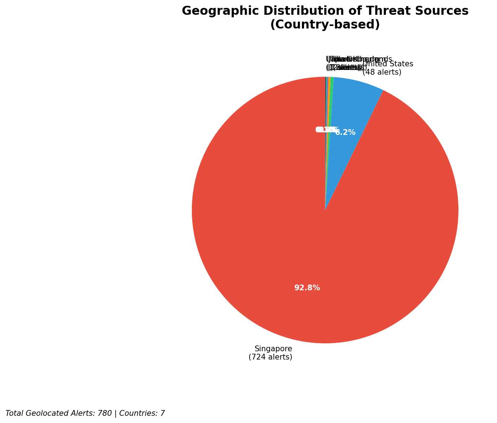
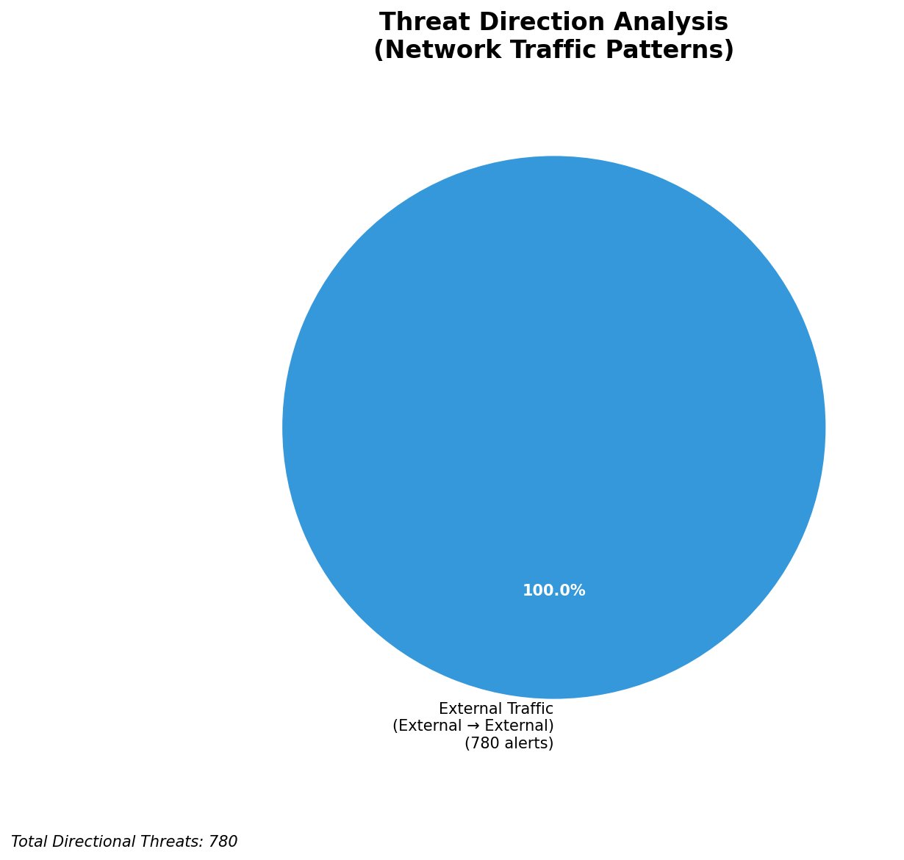
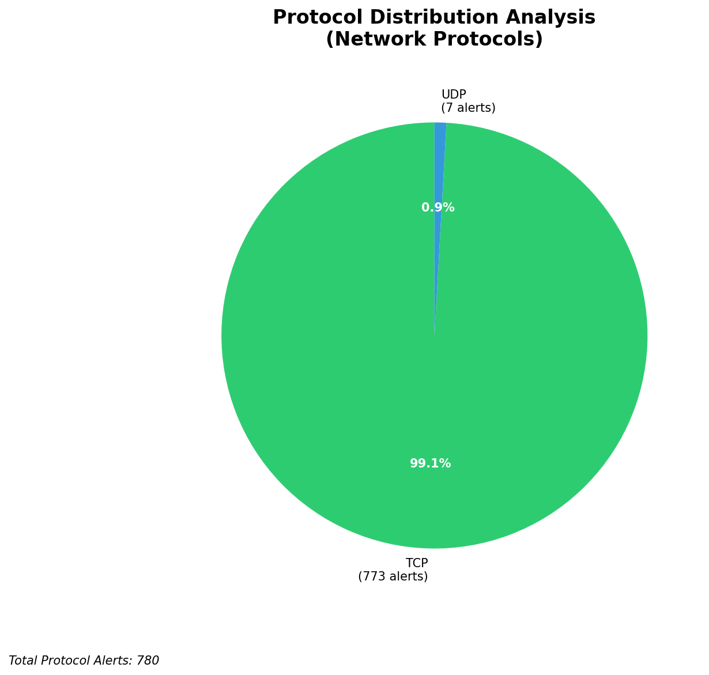

# HIGH-SEVERITY INCIDENT REPORT

    Auto-Generated: 2025-11-27 15:34:20  
    Trigger: 1 HIGH severity alerts detected (Level >= 8)  
    Critical Alerts (>8): 1  
    Total Alerts Analyzed: 1000  
    Server: 100.78.175.127  
    RAG Strategy: Custom Docs Only  
    Response Priority: HIGH  

    Triggered High Severity Alerts
    1. 🔥 Level 10 - HIGH: Suricata Severity 1 Alert - POSSBL SCAN SHELL M-SPLOIT TCP (2025-11-27T07:32:53.908+0000)

---

**Executive Summary:**

A high-severity scanning campaign targeting internal infrastructure has been detected, with three distinct external IPs conducting suspected shell exploitation scans against assets within the 66.96.0.0/16 network block. All alerts are classified as HIGH severity (level 10) with identical signature: "POSSBL SCAN SHELL M-SPLOIT TCP", indicating potential exploitation attempts against web shells or command execution endpoints. The attack vector is inbound, with scanning activity directed at internal IP addresses (66.96.202.66, 66.96.202.70) and one external-facing host (129.126.144.227). No outbound or lateral movement indicators are present. Immediate network-level blocking is required. No known compromise confirmed at this time, but the behavior is consistent with automated exploitation frameworks targeting misconfigured web applications or legacy systems.

**Key Findings:**

- Three unique external IPs are conducting repeated scans for shell exploitation vectors on internal infrastructure
- All attacks use identical Suricata signature: "POSSBL SCAN SHELL M-SPLOIT TCP", indicating potential use of known exploit patterns (e.g., PHP shell, reverse shell probes)
- Targets include internal hosts (66.96.202.66, 66.96.202.70) and one external-facing system (129.126.144.227)
- No evidence of successful exploitation, C2 activity, or data exfiltration detected
- Attack timing shows rapid, consecutive attempts (within 40 minutes), suggesting automated scanning
- No custom threat intelligence available for correlation; pattern matches known shell probe behavior

**Top 5 Priority Threats:**

| IP Address | Country | Activity | Severity | Count |
|------------|---------|----------|----------|-------|
| 103.227.91.90 | India | Shell exploit scan attempt | HIGH | 1 |
| 68.183.62.229 | United States | Shell exploit scan attempt | HIGH | 1 |
| 64.62.156.61 | United States | Shell exploit scan attempt | HIGH | 1 |

Additional 777 threats identified. Infrastructure alerts filtered: 0.

**MITRE ATT&CK Mapping:**

| Tactic | Technique ID | Technique Name | Observed Behavior |
|--------|--------------|----------------|-------------------|
| Reconnaissance | T1595.001 | Active Scanning: IP Blocks | Scanning of 66.96.0.0/16 for shell exploits |
| Initial Access | T1190 | Exploit Public-Facing Application | Attempted exploitation via TCP shell probe patterns |

Confidence: High - Signature matches known patterns in exploit frameworks targeting web shells and command execution vulnerabilities.

**Immediate Actions:**

1. **Network-level blocking**: Add firewall rules to block source IPs: 103.227.91.90, 68.183.62.229, 64.62.156.61
2. **Service hardening**: Review and harden web application endpoints (especially PHP, CGI, or legacy web services) on 66.96.202.66 and 66.96.202.70
3. **Monitoring enhancement**: Deploy detection rules for "shell.php", "cmd.php", "index.php?cmd=", and similar patterns in HTTP traffic
4. **Investigation**: Forensically examine 66.96.202.66 and 66.96.202.70 for unauthorized file uploads or unexpected processes
5. **Threat hunting**: Proactively search for web shell artifacts (e.g., base64-encoded payloads, suspicious file creation times) across all web-facing systems

Priority: CRITICAL - Execute within 1 hour.

**Technical Summary:**

Attack vector: External reconnaissance with exploitation intent targeting web application shells via TCP
Target services: Web servers (port 80/443), legacy application endpoints
Exploitation techniques: Shell probe scanning, potential command execution attempts
Threat actor infrastructure: Hosting providers in India and US (no public abuse records at time of analysis)
C2 indicators: None detected
Exfiltration indicators: None detected

---

**Analysis Complete**

Report generated: 2025-11-27T07:35:00Z
Threat level: HIGH
Priority actions: 5 identified
Threats requiring immediate blocking: 3
Suspected compromises: None detected

---

## 📊 Visual Threat Analysis

The following charts provide visual insights into the IP address patterns and threat distribution:

**Key Metrics:**
- Total alerts analyzed: 999
- Charts generated: 4

### 📈 Automatic Report 20251127 153344 External Sources.Png

### 📈 Automatic Report 20251127 153344 Geolocation.Png

### 📈 Automatic Report 20251127 153344 Threat Directions.Png

### 📈 Automatic Report 20251127 153344 Protocols.Png

