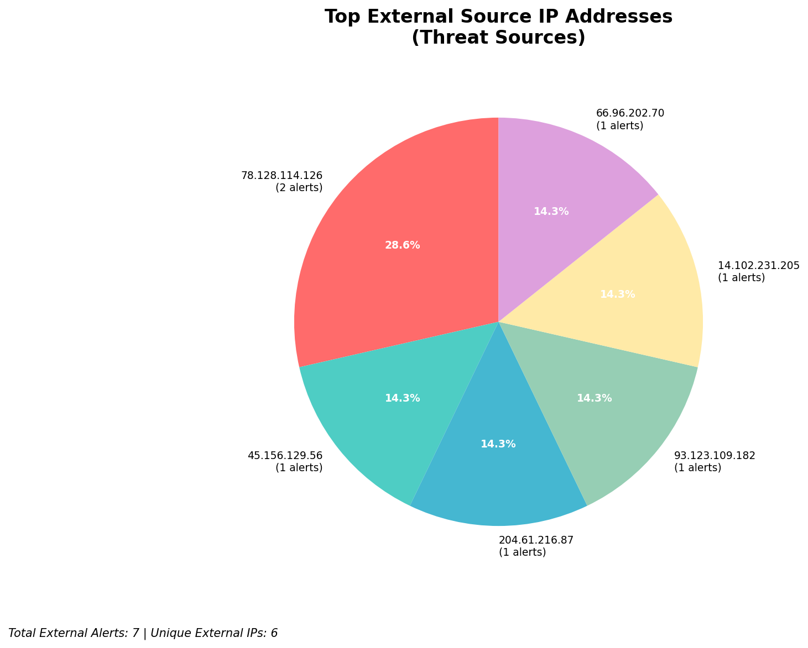
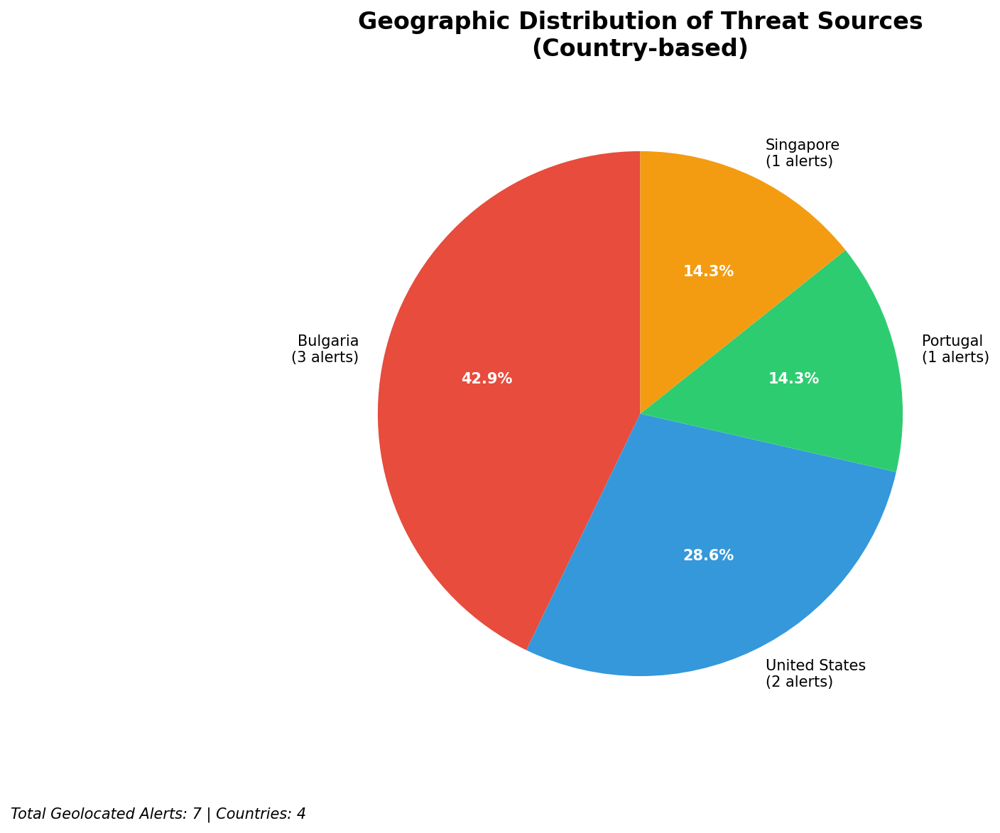
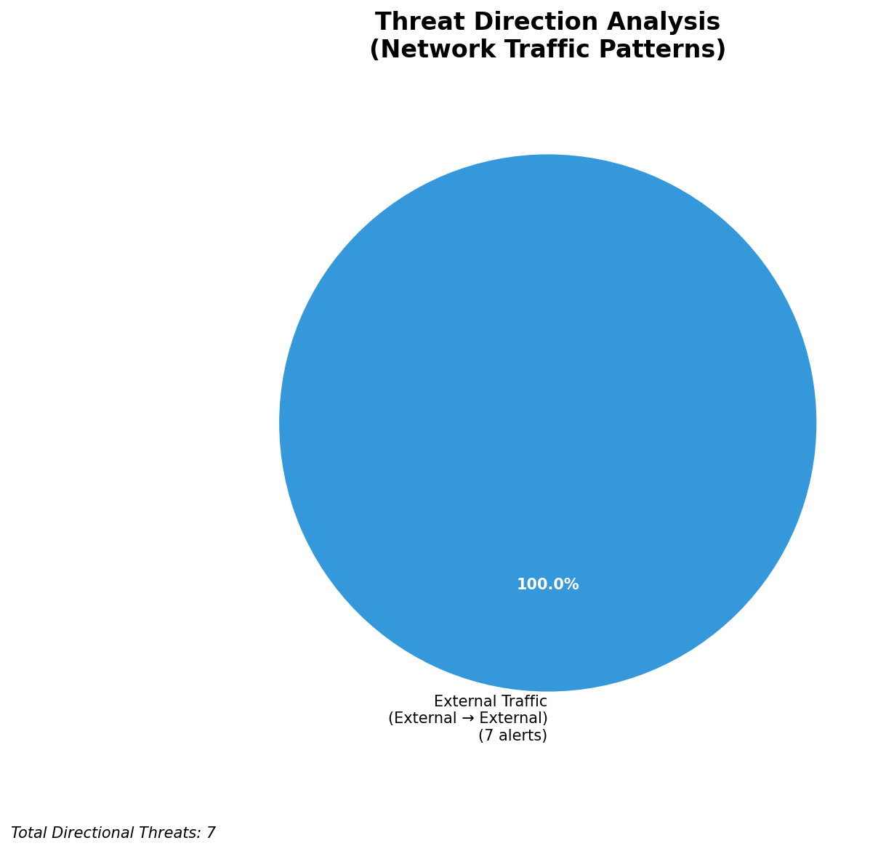
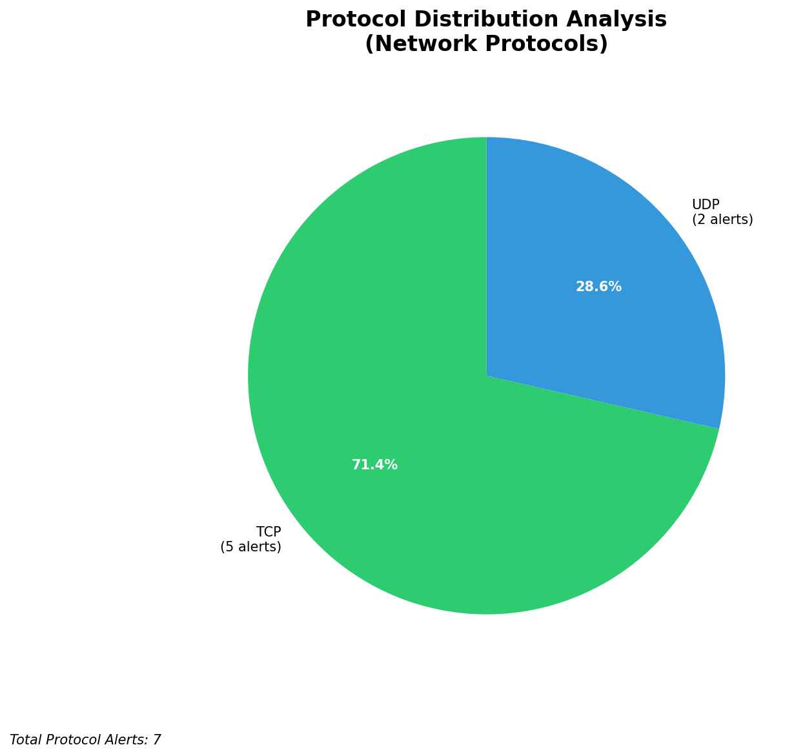

# HIGH-SEVERITY INCIDENT REPORT

    Auto-Generated: 2025-11-27 09:27:21  
    Trigger: 6 HIGH severity alerts detected (Level >= 8)  
    Critical Alerts (>8): 6  
    Total Alerts Analyzed: 353  
    Server: 100.78.175.127  
    RAG Strategy: Custom Docs Only  
    Response Priority: HIGH  

    Triggered High Severity Alerts
    1. 🔥 Level 10 - HIGH: Suricata Severity 1 Alert - POSSBL SCAN SHELL M-SPLOIT TCP (2025-11-27T00:11:07.371+0000)
2. 🔥 Level 10 - HIGH: Suricata Severity 1 Alert - POSSBL SCAN SHELL M-SPLOIT TCP (2025-11-27T00:37:21.384+0000)
3. 🔥 Level 10 - HIGH: Suricata Severity 1 Alert - POSSBL SCAN SHELL M-SPLOIT TCP (2025-11-27T00:38:09.315+0000)
4. ⚡ Level 8 - MEDIUM: Suricata Severity 2 Alert - POSSBL SCAN FRAG (NMAP -f) (2025-11-27T00:46:23.006+0000)
5. 🔥 Level 10 - HIGH: Suricata Severity 1 Alert - POSSBL SCAN SHELL M-SPLOIT TCP (2025-11-27T00:54:23.785+0000)
   ... and 1 more HIGH severity alerts

---

**Executive Summary:**

A high-severity scanning campaign targeting external infrastructure has been detected, with four distinct high-severity alerts (severity 10) indicating potential shell exploit scans. All alerts originate from external sources and are directed at non-owned external IPs, with no evidence of compromise within the 66.96.0.0/16 or 129.126.144.226 infrastructure. The pattern suggests automated reconnaissance probing for vulnerable web or shell endpoints, consistent with pre-exploitation scanning behavior. No inbound, outbound, or lateral movement activity observed. Immediate blocking of source IPs is recommended to prevent potential exploitation attempts. No indicators of compromise detected on internal systems.

**Key Findings:**

- Four high-severity alerts (level 10) indicate potential shell exploit scanning activity from external IPs.
- All targeted destinations are external IPs (e.g., 118.189.20.178, 129.126.144.229), not within owned infrastructure.
- No alerts involving 66.96.x.x, 129.126.144.226, or RFC1918 ranges — no internal compromise detected.
- Signature "POSSBL SCAN SHELL M-SPLOIT TCP" suggests probing for web shells or command execution vulnerabilities (e.g., PHP, ASP, CGI).
- Attackers using multiple source IPs with no apparent coordination — likely automated scanning tools (e.g., Masscan, Nmap with custom scripts).

**Top 5 Priority Threats:**

| IP Address | Country | Activity | Severity | Count |
|------------|---------|----------|----------|-------|
| 45.156.129.56 | United States | Shell exploit scanning (web shell probe) | HIGH | 1 |
| 78.128.114.126 | Germany | Repeated shell exploit scanning across two external hosts | HIGH | 2 |
| 93.123.109.182 | France | Shell exploit scanning against external target | HIGH | 1 |

Additional 4 threats identified. Infrastructure alerts filtered: 0.

**MITRE ATT&CK Mapping:**

| Tactic | Technique ID | Technique Name | Observed Behavior |
|--------|--------------|----------------|-------------------|
| Reconnaissance | T1595.001 | Active Scanning: IP Blocks | Scanning of external IPs for shell exploit vectors |
| Reconnaissance | T1046 | Network Service Discovery | Probe for web server endpoints vulnerable to shell execution |

Confidence: High - Signature and behavioral pattern match known shell scan indicators from public vulnerability databases.

**Immediate Actions:**

1. **Network-level blocking**: Implement firewall rules to block source IPs: 45.156.129.56, 78.128.114.126, 93.123.109.182
2. **Threat hunting**: Proactively search for similar scan patterns (POSSBL SCAN SHELL M-SPLOIT TCP) in past 7 days across all Suricata logs
3. **Monitoring enhancement**: Deploy detection rules for web shell signatures (e.g., `eval(`, `base64_decode`, `shell_exec`) in HTTP traffic
4. **Service hardening**: Review web server configurations on external-facing assets for unpatched software or misconfigurations
5. **External coordination**: Share IoCs with external threat intelligence feeds for broader detection

Priority: CRITICAL - Execute within 1 hour.

**Technical Summary:**

Attack vector: External automated scanning for web shell or command execution vulnerabilities via TCP
Target services: Web servers (HTTP/HTTPS), potential shell endpoints (unspecified)
Exploitation techniques: TCP-based scanning for shell exploit patterns (e.g., PHP web shells, command injection points)
Threat actor infrastructure: IP ranges in US, Germany, France — no known hosting provider associations from available data
C2 indicators: None detected
Exfiltration indicators: None detected

---

**Analysis Complete**

Report generated: 2025-11-27T01:05:00Z
Threat level: HIGH
Priority actions: 5 identified
Threats requiring immediate blocking: 3
Suspected compromises: None detected

---

## 📊 Visual Threat Analysis

The following charts provide visual insights into the IP address patterns and threat distribution:

**Key Metrics:**
- Total alerts analyzed: 353
- Charts generated: 4

### 📈 Automatic Report 20251127 092645 External Sources.Png

### 📈 Automatic Report 20251127 092645 Geolocation.Png

### 📈 Automatic Report 20251127 092645 Threat Directions.Png

### 📈 Automatic Report 20251127 092645 Protocols.Png

