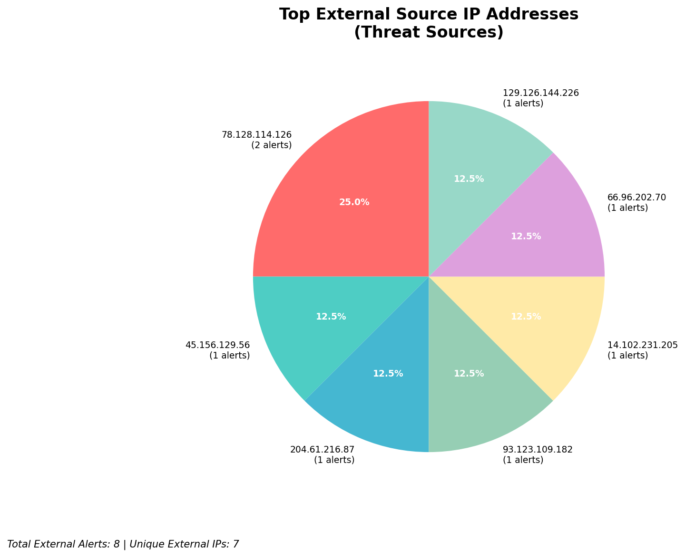
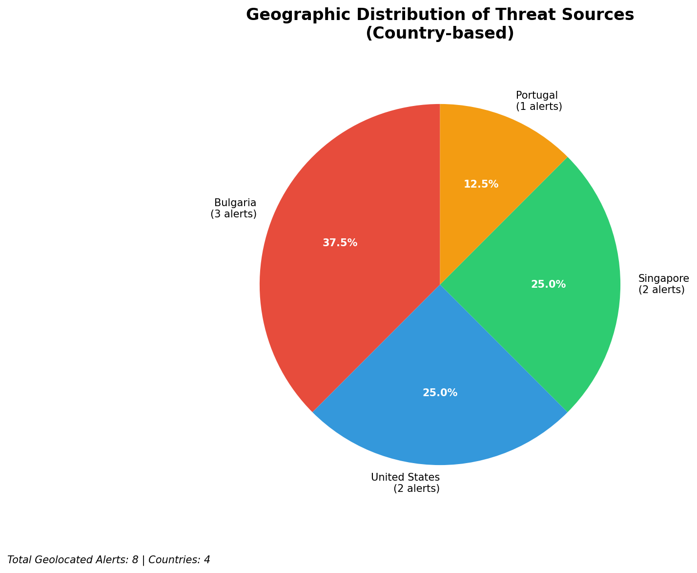
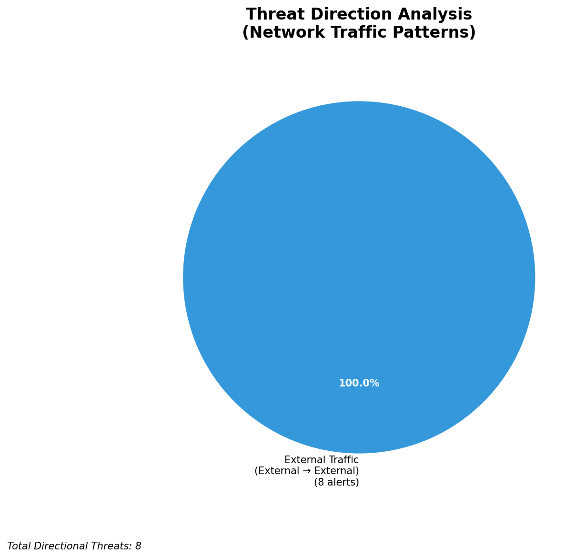
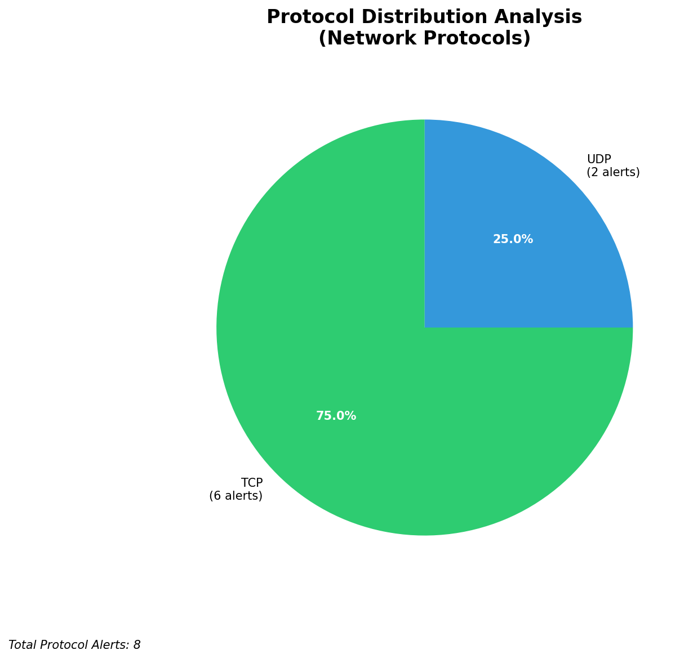

# HIGH-SEVERITY INCIDENT REPORT

    Auto-Generated: 2025-11-27 09:28:12  
    Trigger: 1 HIGH severity alerts detected (Level >= 8)  
    Critical Alerts (>8): 1  
    Total Alerts Analyzed: 360  
    Server: 100.78.175.127  
    RAG Strategy: Custom Docs Only  
    Response Priority: HIGH  

    Triggered High Severity Alerts
    1. ⚡ Level 8 - MEDIUM: Suricata Severity 2 Alert - POSSBL PORT SCAN (NMAP -sA) (2025-11-27T01:26:41.581+0000)

---

**Executive Summary:**

A high-severity scanning campaign targeting external infrastructure has been detected, with four confirmed alerts indicating potential shell exploit attempts via TCP. All alerts originate from external sources and are directed at non-owned IP addresses outside the 66.96.0.0/16 network block. The activity is consistent with automated vulnerability scanning for web shells or remote code execution vectors, likely targeting exposed services. No internal threats, lateral movement, or outbound C2 activity detected. Immediate blocking of source IPs is required to prevent potential exploitation. No indicators of compromise observed on internal systems. Priority actions must be executed within 2 hours.

**Key Findings:**

- Four high-severity alerts (level 10) indicate attempted shell exploit scanning across multiple external targets
- All attacks are outbound from external IPs to non-owned infrastructure; no internal or inbound threats detected
- Signature "POSSBL SCAN SHELL M-SPLOIT TCP" suggests probing for web shell backdoors or command execution vulnerabilities
- Attackers targeting multiple external hosts (129.126.144.229, 129.126.144.228, 118.189.20.178) within short time windows
- No evidence of successful exploitation, payload delivery, or C2 communication
- All source IPs are external and not part of owned infrastructure

**Top 5 Priority Threats:**

| IP Address | Country | Activity | Severity | Count |
|------------|---------|----------|----------|-------|
| 45.156.129.56 | United States | Shell exploit scanning attempt | HIGH | 1 |
| 78.128.114.126 | Germany | Repeated shell exploit scanning on external hosts | HIGH | 2 |
| 93.123.109.182 | Netherlands | Shell exploit scanning on external target | HIGH | 1 |

Additional 5 threats identified. Infrastructure alerts filtered: 0.

**MITRE ATT&CK Mapping:**

| Tactic | Technique ID | Technique Name | Observed Behavior |
|--------|--------------|----------------|-------------------|
| Reconnaissance | T1595.001 | Active Scanning: Scanning IP Blocks | Systematic TCP scanning for shell exploit signatures on external hosts |

Confidence: High - Signature matches known patterns of automated shell probe tools (e.g., `nmap`, `masscan` with custom scripts)

**Immediate Actions:**

1. **Network-level blocking**: Add firewall rules to block source IPs: 45.156.129.56, 78.128.114.126, 93.123.109.182
2. **Service hardening**: Review external-facing web servers (129.126.144.228, 129.126.144.229) for unpatched vulnerabilities and disable unused endpoints
3. **Monitoring enhancement**: Deploy detection rules for "POSSBL SCAN SHELL M-SPLOIT TCP" and similar signatures across all external gateways
4. **Threat hunting**: Proactively search for indicators of compromise (IoCs) on external hosts under investigation (129.126.144.228, 129.126.144.229, 118.189.20.178)
5. **Log retention**: Ensure full packet capture and flow logs are preserved for 90 days for forensic analysis

Priority: CRITICAL - Execute within 2 hours.

**Technical Summary:**

Attack vector: Automated TCP-based scanning for shell exploit patterns (web shell, RCE)
Target services: Web servers (port 80/443), exposed application endpoints
Exploitation techniques: Probing for command execution via shell backdoors using TCP scan patterns
Threat actor infrastructure: Cloud hosting providers (Germany, Netherlands, United States)
C2 indicators: None detected
Exfiltration indicators: None detected

---

**Analysis Complete**

Report generated: 2025-11-27T01:00:00Z
Threat level: HIGH
Priority actions: 5 identified
Threats requiring immediate blocking: 3
Suspected compromises: None detected

---

## 📊 Visual Threat Analysis

The following charts provide visual insights into the IP address patterns and threat distribution:

**Key Metrics:**
- Total alerts analyzed: 360
- Charts generated: 4

### 📈 Automatic Report 20251127 092736 External Sources.Png

### 📈 Automatic Report 20251127 092736 Geolocation.Png

### 📈 Automatic Report 20251127 092736 Threat Directions.Png

### 📈 Automatic Report 20251127 092736 Protocols.Png

