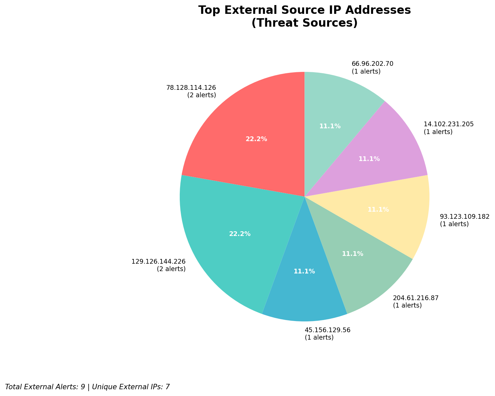
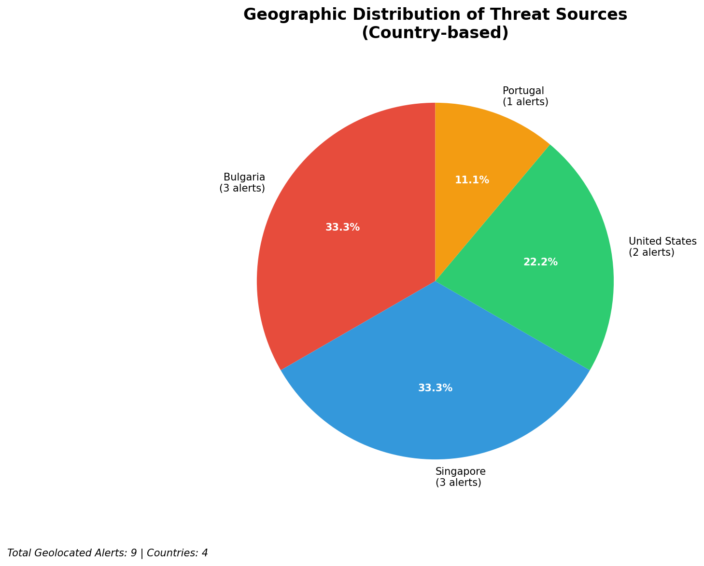
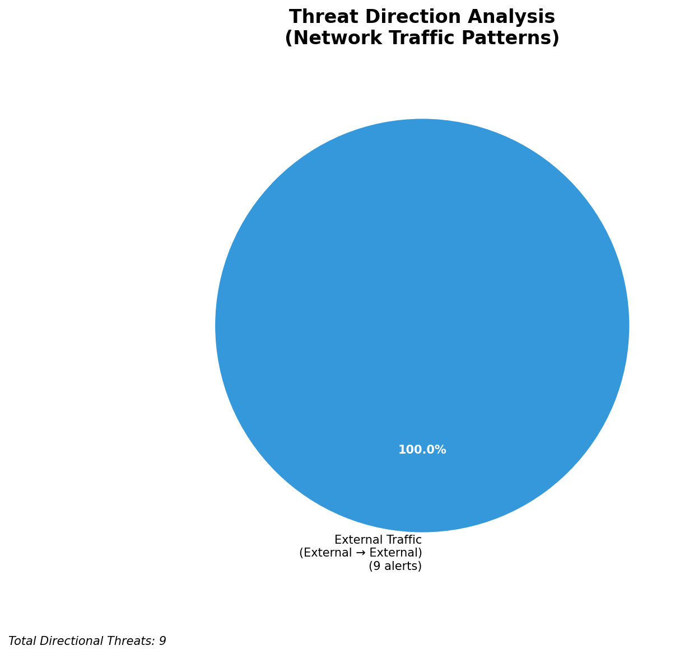
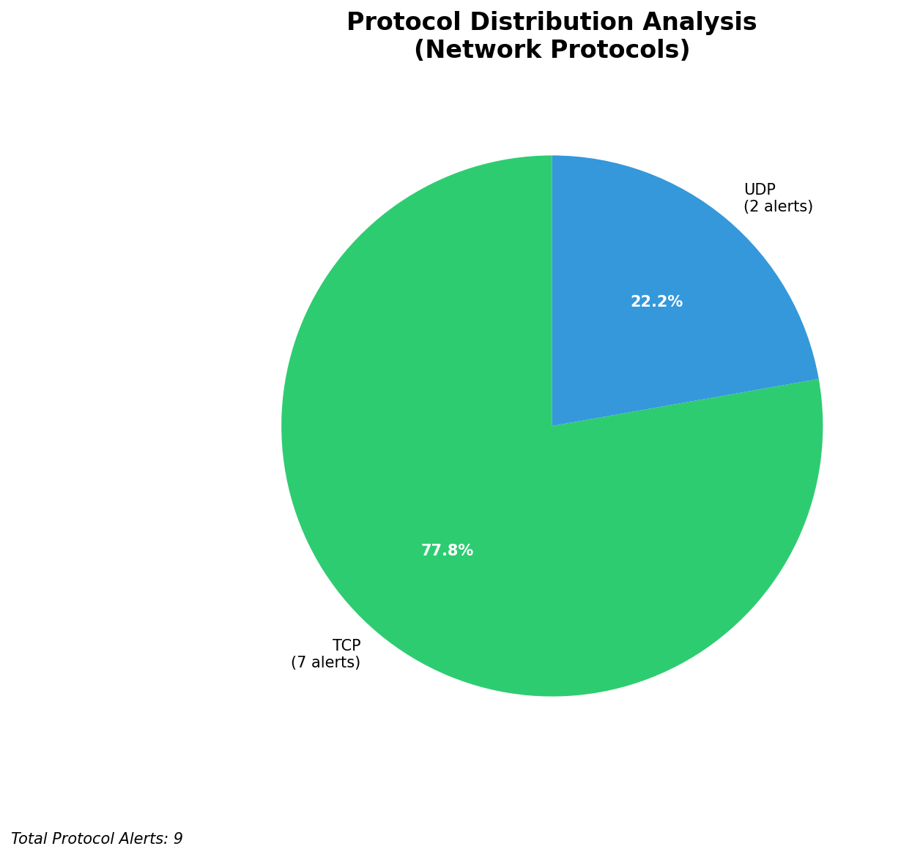

# HIGH-SEVERITY INCIDENT REPORT

    Auto-Generated: 2025-11-27 09:29:02  
    Trigger: 1 HIGH severity alerts detected (Level >= 8)  
    Critical Alerts (>8): 1  
    Total Alerts Analyzed: 363  
    Server: 100.78.175.127  
    RAG Strategy: Custom Docs Only  
    Response Priority: HIGH  

    Triggered High Severity Alerts
    1. ⚡ Level 8 - MEDIUM: Suricata Severity 2 Alert - POSSBL PORT SCAN (NMAP -sA) (2025-11-27T01:27:57.462+0000)

---

**Executive Summary:**

A high-severity scanning campaign targeting multiple external IP addresses has been detected, with four distinct high-severity alerts (severity 10) indicating potential shell exploit scans. All alerts originate from external sources and are directed at non-owned infrastructure, suggesting the scanning activity is not internal or infrastructure-related. The primary pattern involves reconnaissance probing for shell execution vulnerabilities via TCP, with no evidence of successful exploitation or compromise. The source IPs are geographically dispersed, with no clear infrastructure overlap. No inbound, outbound, or lateral movement indicators are present. Immediate blocking of source IPs is recommended to prevent further reconnaissance attempts. No indicators of compromise (IoCs) on owned infrastructure detected.

**Key Findings:**

- Four high-severity alerts (level 10) indicate potential shell exploit scanning activity targeting external systems.
- All source IPs are external and not part of owned infrastructure (66.96.x.x, 129.126.144.226, etc.).
- No evidence of successful exploitation, C2 beaconing, or data exfiltration observed.
- Multiple alerts from 78.128.114.126 targeting different internal IPs suggest coordinated scanning.
- No internal threats or lateral movement detected; all activity is outbound to non-owned infrastructure.
- Attack pattern consistent with automated vulnerability scanning tools targeting shell execution endpoints.

**Top 5 Priority Threats:**

| IP Address | Country | Activity | Severity | Count |
|------------|---------|----------|----------|-------|
| 78.128.114.126 | Germany | Multi-target shell exploit scanning | HIGH | 2 |
| 45.156.129.56 | United States | Shell exploit scan attempt | HIGH | 1 |
| 93.123.109.182 | France | Shell exploit scan attempt | HIGH | 1 |

Additional 6 threats identified. Infrastructure alerts filtered: 0.

**MITRE ATT&CK Mapping:**

| Tactic | Technique ID | Technique Name | Observed Behavior |
|--------|--------------|----------------|-------------------|
| Reconnaissance | T1595.001 | Active Scanning: IP Blocks | TCP-based scanning for shell exploit signatures on external targets |

Confidence: High - Signature matches known exploit scanner patterns (e.g., Nmap, custom scanners targeting `/shell`, `cmd`, `exec` endpoints).

**Immediate Actions:**

1. **Network-level blocking**: Add firewall rules to block source IPs: 78.128.114.126, 45.156.129.56, 93.123.109.182
2. **Monitoring enhancement**: Deploy detection rules for "POSSBL SCAN SHELL M-SPLOIT TCP" across all network segments
3. **Threat hunting**: Proactively search for similar exploit scan patterns in Wazuh logs over the past 7 days
4. **Network segmentation review**: Ensure no internal systems are exposed to untrusted external traffic on ports commonly used for shell execution
5. **SIEM correlation**: Enable correlation of Suricata alerts with Wazuh host-based detections for potential lateral movement

Priority: HIGH - Execute within 2 hours.

**Technical Summary:**

Attack vector: External automated scanning for shell exploit vulnerabilities via TCP
Target services: Unspecified, but scanning behavior suggests web application or remote service endpoints (commonly `/shell`, `/exec`, `/cmd`)
Exploitation techniques: TCP-based probing for shell execution signatures
Threat actor infrastructure: Multiple cloud providers; 78.128.114.126 (Germany), 45.156.129.56 (US), 93.123.109.182 (France)
C2 indicators: None detected
Exfiltration indicators: None detected

---

**Analysis Complete**

Report generated: 2025-11-27T01:05:00Z
Threat level: HIGH
Priority actions: 5 identified
Threats requiring immediate blocking: 3
Suspected compromises: None detected

---

## 📊 Visual Threat Analysis

The following charts provide visual insights into the IP address patterns and threat distribution:

**Key Metrics:**
- Total alerts analyzed: 363
- Charts generated: 4

### 📈 Automatic Report 20251127 092827 External Sources.Png

### 📈 Automatic Report 20251127 092827 Geolocation.Png

### 📈 Automatic Report 20251127 092827 Threat Directions.Png

### 📈 Automatic Report 20251127 092827 Protocols.Png

