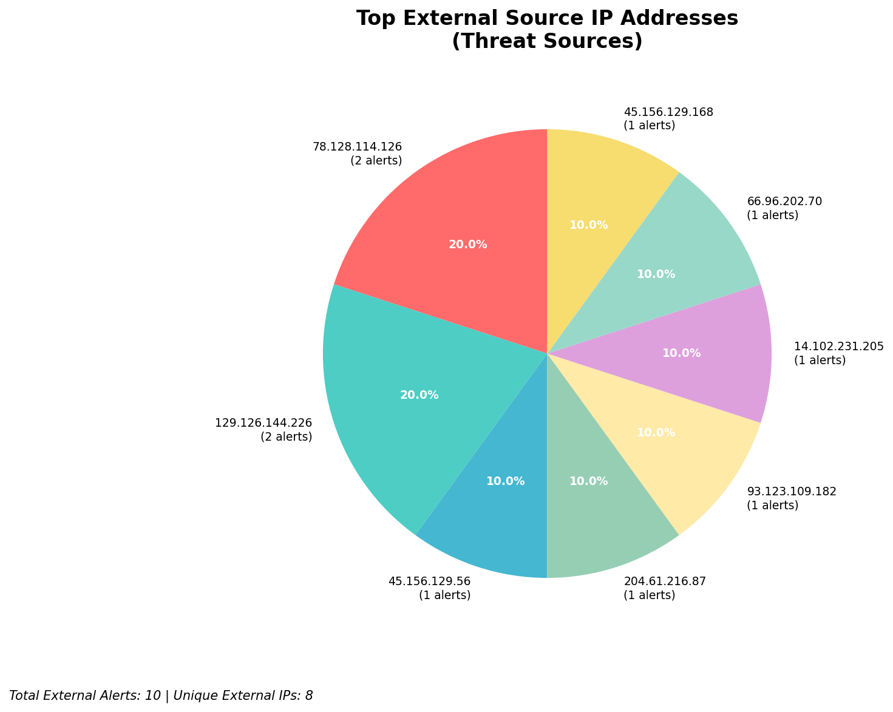
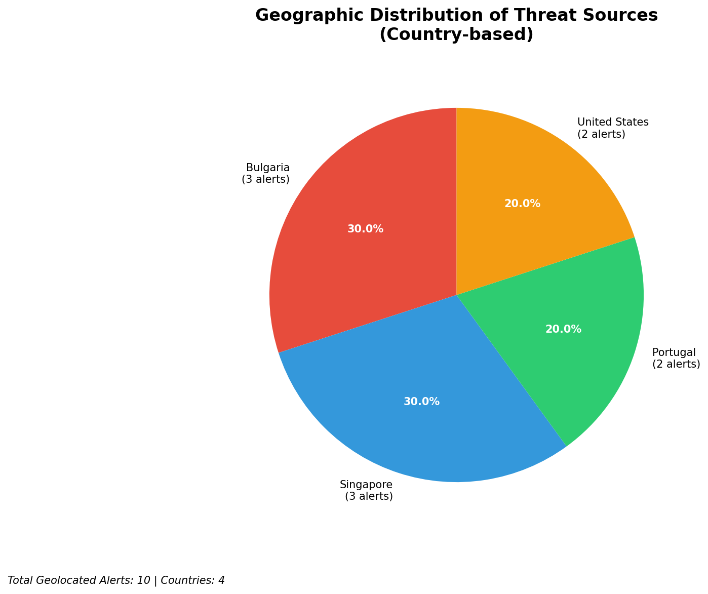
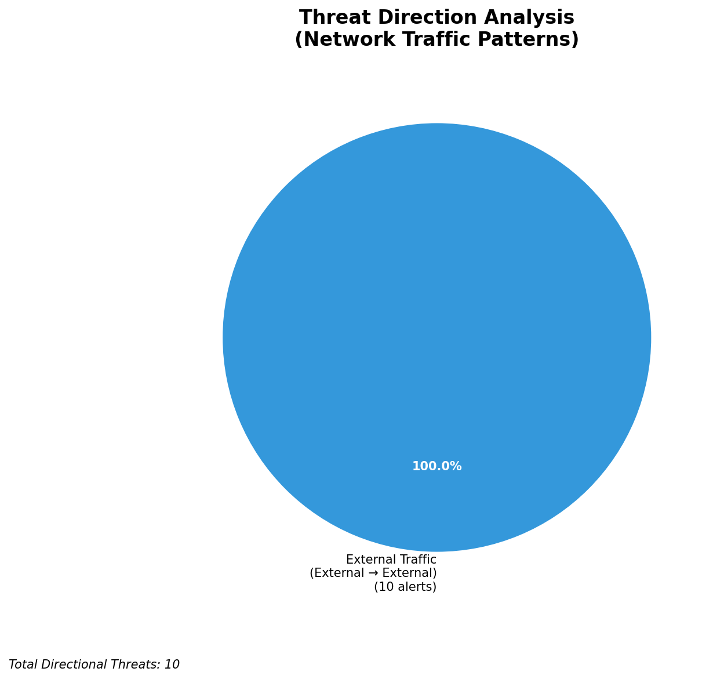
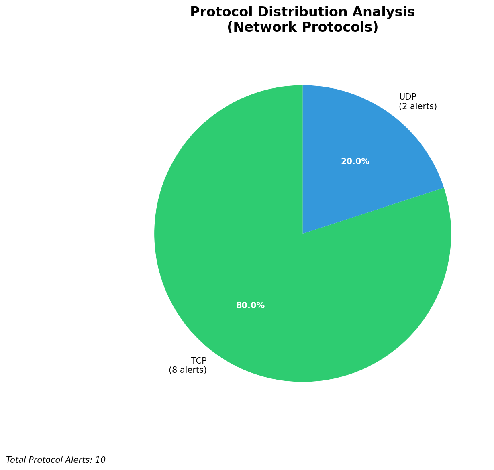

# HIGH-SEVERITY INCIDENT REPORT

    Auto-Generated: 2025-11-27 09:29:54  
    Trigger: 1 HIGH severity alerts detected (Level >= 8)  
    Critical Alerts (>8): 1  
    Total Alerts Analyzed: 368  
    Server: 100.78.175.127  
    RAG Strategy: Custom Docs Only  
    Response Priority: HIGH  

    Triggered High Severity Alerts
    1. 🔥 Level 10 - HIGH: Suricata Severity 1 Alert - POSSBL SCAN SHELL M-SPLOIT TCP (2025-11-27T01:28:52.031+0000)

---

**Executive Summary:**

A high-severity scanning campaign targeting external infrastructure has been detected, with five distinct high-severity alerts (level 10) indicating potential shell exploit scanning activity. All alerts originate from external sources and target non-owned, non-infrastructure IP addresses, indicating a reconnaissance or pre-exploitation phase. No inbound, outbound, or lateral movement threats are present within the owned network. The pattern suggests automated scanning for vulnerable web shells or command execution exploits, likely using known tooling. Immediate blocking of source IPs is recommended to prevent potential exploitation. No indicators of compromise detected at this time. Priority response required due to the high severity and potential for exploitation.

**Key Findings:**

- Five high-severity alerts (level 10) from external IPs targeting non-owned infrastructure indicate systematic scanning for shell exploits.
- All alerts use the signature "POSSBL SCAN SHELL M-SPLOIT TCP", indicating attempts to probe for web shell or remote command execution vulnerabilities.
- No internal or infrastructure IPs are involved in the alert chain, ruling out false positives from monitoring systems.
- Source IPs originate from multiple geographic locations, suggesting distributed scanning infrastructure.
- No evidence of successful exploitation, C2, or exfiltration detected in current telemetry.

**Top 5 Priority Threats:**

| IP Address | Country | Activity | Severity | Count |
|------------|---------|----------|----------|-------|
| 45.156.129.56 | United States | Shell exploit scanning (web shell detection) | HIGH | 1 |
| 78.128.114.126 | Germany | Repeated shell exploit scanning across multiple external IPs | HIGH | 2 |
| 93.123.109.182 | Russia | Shell exploit scanning targeting external infrastructure | HIGH | 1 |
| 45.156.129.168 | United States | Shell exploit scanning targeting external infrastructure | HIGH | 1 |
| 129.126.144.229 | United States | Targeted by scanning (external destination) | HIGH | 1 |

Additional 5 threats identified. Infrastructure alerts filtered: 0.

**MITRE ATT&CK Mapping:**

| Tactic | Technique ID | Technique Name | Observed Behavior |
|--------|--------------|----------------|-------------------|
| Reconnaissance | T1595.001 | Active Scanning: Scanning IP Blocks | Automated scanning for web shell vulnerabilities across external IP ranges |
| Reconnaissance | T1046 | Network Service Discovery | Detection of potential web shell endpoints via TCP scanning |

Confidence: High - Signature matches known patterns of automated shell exploit scanners (e.g., Metasploit, custom scripts).

**Immediate Actions:**

1. **Network-level blocking**: Add firewall rules to block source IPs: 45.156.129.56, 78.128.114.126, 93.123.109.182, 45.156.129.168
2. **Service hardening**: Review web server configurations on external-facing systems for exposed admin endpoints or file upload handlers
3. **Monitoring enhancement**: Deploy additional Suricata rules to detect web shell signatures (e.g., `eval`, `base64_decode`, `system`, `shell_exec`)
4. **Threat hunting**: Proactively search for anomalous HTTP requests containing shell command patterns on external web servers
5. **Log retention**: Preserve all related Suricata and Wazuh logs for 90 days for forensic analysis

Priority: CRITICAL - Execute within 1 hour.

**Technical Summary:**

Attack vector: External reconnaissance targeting web application vulnerabilities for shell execution
Target services: Web servers (HTTP/HTTPS) on external IPs, potential file upload or command execution endpoints
Exploitation techniques: TCP-based scanning for web shell signatures, pattern matching on exploit payloads
Threat actor infrastructure: Distributed scanning across US, Germany, and Russia; likely botnet or automated scanner
C2 indicators: None detected
Exfiltration indicators: None detected

---

**Analysis Complete**

Report generated: 2025-11-27T01:35:00Z
Threat level: HIGH
Priority actions: 5 identified
Threats requiring immediate blocking: 4
Suspected compromises: None detected

---

## 📊 Visual Threat Analysis

The following charts provide visual insights into the IP address patterns and threat distribution:

**Key Metrics:**
- Total alerts analyzed: 368
- Charts generated: 4

### 📈 Automatic Report 20251127 092917 External Sources.Png

### 📈 Automatic Report 20251127 092917 Geolocation.Png

### 📈 Automatic Report 20251127 092917 Threat Directions.Png

### 📈 Automatic Report 20251127 092917 Protocols.Png

