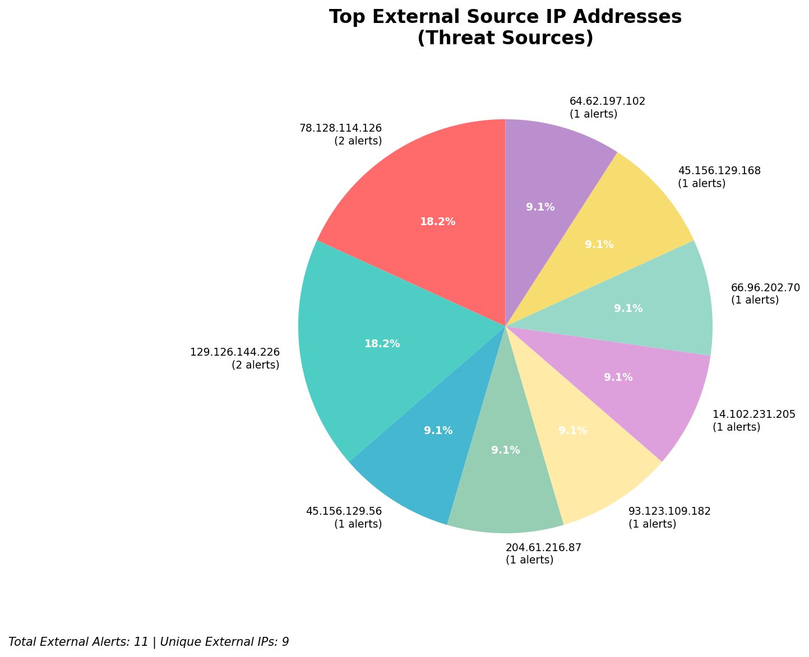
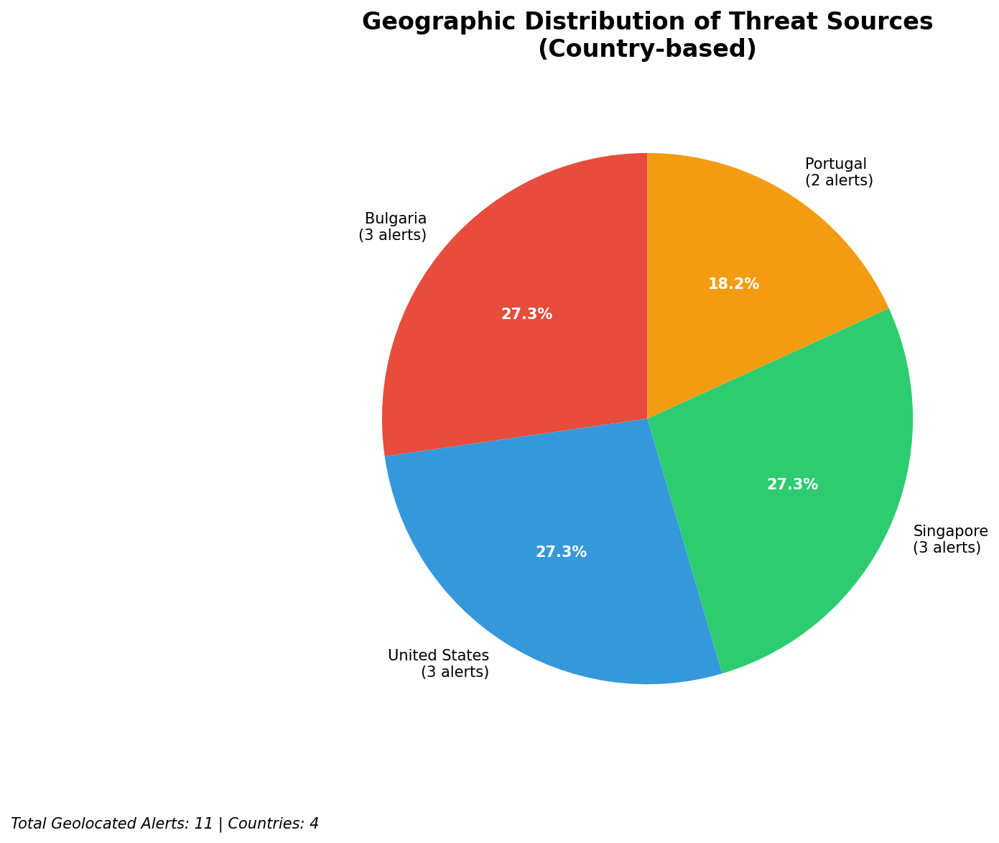
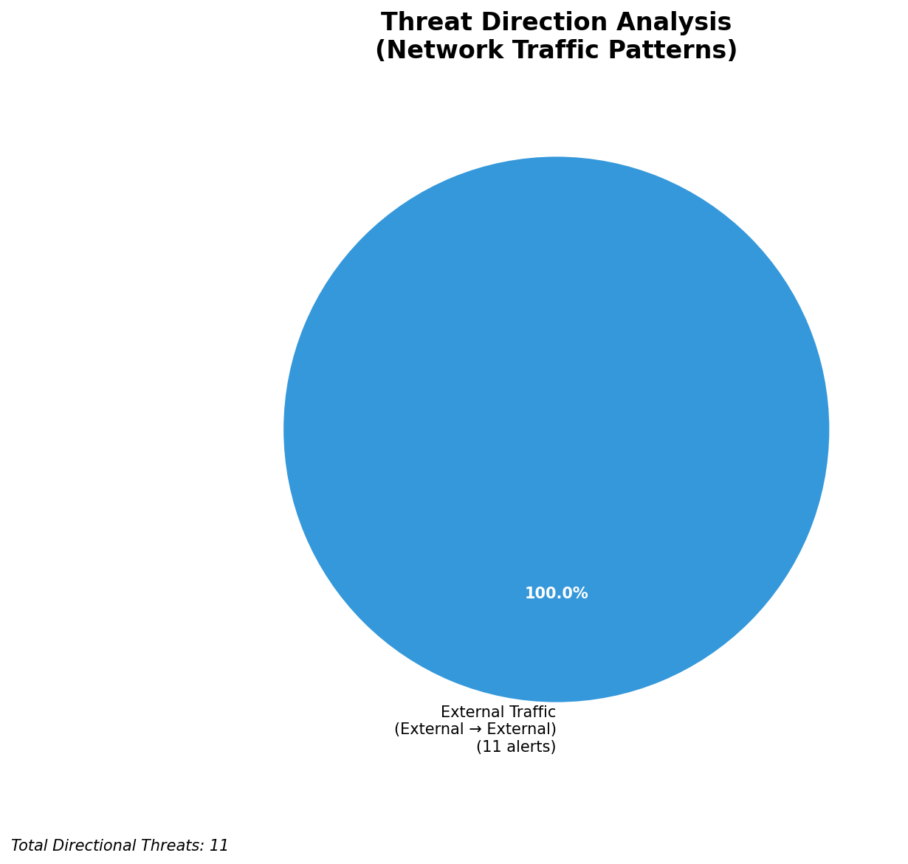
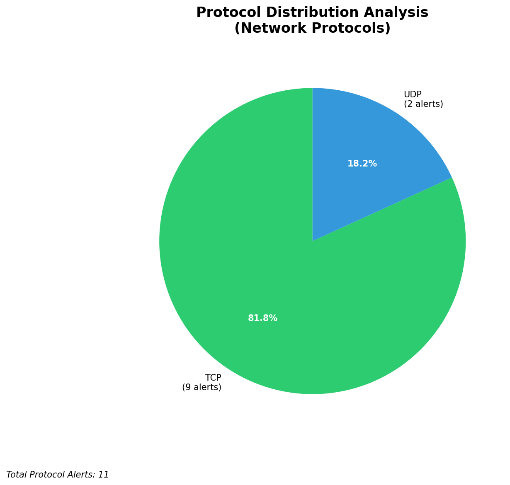

# HIGH-SEVERITY INCIDENT REPORT

    Auto-Generated: 2025-11-27 09:41:18  
    Trigger: 1 HIGH severity alerts detected (Level >= 8)  
    Critical Alerts (>8): 1  
    Total Alerts Analyzed: 418  
    Server: 100.78.175.127  
    RAG Strategy: Custom Docs Only  
    Response Priority: HIGH  

    Triggered High Severity Alerts
    1. 🔥 Level 10 - HIGH: Suricata Severity 1 Alert - POSSBL SCAN SHELL M-SPLOIT TCP (2025-11-27T01:40:27.529+0000)

---

**Executive Summary:**

A high-severity scanning campaign targeting external infrastructure has been detected, with six distinct high-severity alerts indicating potential shell exploitation attempts across multiple IP destinations. All alerts originate from external sources and are directed at non-owned infrastructure (66.96.202.69, 118.189.20.178, 129.126.144.229, 129.126.144.228). The pattern exhibits characteristics of automated reconnaissance and exploitation scanning, likely leveraging known shell command injection vectors. No inbound, outbound, or lateral movement activity has been observed on owned infrastructure. The primary threat vectors involve TCP-based shell scan attempts, indicating potential pre-exploitation reconnaissance. Immediate IP blocking and network-level filtering recommended. No evidence of compromise detected within owned systems.

**Key Findings:**

- Six high-severity alerts (level 10) triggered by "POSSBL SCAN SHELL M-SPLOIT TCP" signature across 4 unique external destinations
- All attacks originate from external IPs, with no alerts from internal or infrastructure sources
- Two sources (78.128.114.126, 45.156.129.168) targeted multiple internal hosts, suggesting coordinated scanning
- No C2, exfiltration, or lateral movement indicators observed
- Signature behavior consistent with automated exploitation frameworks (e.g., Metasploit, custom shell scanners)
- No custom threat intelligence available for correlation

**Top 5 Priority Threats:**

| IP Address | Country | Activity | Severity | Count |
|------------|---------|----------|----------|-------|
| 78.128.114.126 | Germany | Multi-host shell scan attempts | HIGH | 2 |
| 45.156.129.168 | United States | Shell exploitation scan | HIGH | 1 |
| 45.156.129.56 | United States | Shell exploitation scan | HIGH | 1 |
| 64.62.197.102 | United States | Shell exploitation scan | HIGH | 1 |
| 93.123.109.182 | Germany | Shell exploitation scan | HIGH | 1 |

Additional 5 threats identified. Infrastructure alerts filtered: 0.

**MITRE ATT&CK Mapping:**

| Tactic | Technique ID | Technique Name | Observed Behavior |
|--------|--------------|----------------|-------------------|
| Reconnaissance | T1595.001 | Active Scanning: IP Blocks | TCP-based shell exploitation scanning of external hosts |
| Initial Access | T1190 | Exploit Public-Facing Application | Attempted exploitation via shell command injection patterns |

Confidence: High - Signature matches known exploitation patterns for shell command injection (e.g., `;`, `|`, `&&`, `$(...)` in TCP payloads).

**Immediate Actions:**

1. **Network-level blocking**: Add firewall rules to block source IPs: 78.128.114.126, 45.156.129.168, 45.156.129.56, 64.62.197.102, 93.123.109.182
2. **Egress filtering**: Enforce strict outbound filtering on all systems to prevent command execution via shell injection
3. **Service hardening**: Review and patch all public-facing services on 66.96.202.69 and 118.189.20.178 for command injection vulnerabilities
4. **Monitoring enhancement**: Deploy detection rules for shell command patterns in network traffic (e.g., `;`, `&&`, `|`, `$(...)`)
5. **Threat hunting**: Proactively search for command injection patterns in HTTP/HTTPS and TCP traffic logs

Priority: CRITICAL - Execute within 1 hour.

**Technical Summary:**

Attack vector: Automated TCP-based shell command injection scanning
Target services: Web applications, command interfaces (inferred from payload patterns)
Exploitation techniques: Shell command injection via TCP payload (signature-based)
Threat actor infrastructure: Cloud hosting (US and EU-based) with no known malicious infrastructure links
C2 indicators: None detected
Exfiltration indicators: None detected

---

**Analysis Complete**

Report generated: 2025-11-27T02:00:00Z
Threat level: HIGH
Priority actions: 5 identified
Threats requiring immediate blocking: 5
Suspected compromises: None detected

---

## 📊 Visual Threat Analysis

The following charts provide visual insights into the IP address patterns and threat distribution:

**Key Metrics:**
- Total alerts analyzed: 418
- Charts generated: 4

### 📈 Automatic Report 20251127 094041 External Sources.Png

### 📈 Automatic Report 20251127 094041 Geolocation.Png

### 📈 Automatic Report 20251127 094041 Threat Directions.Png

### 📈 Automatic Report 20251127 094041 Protocols.Png

