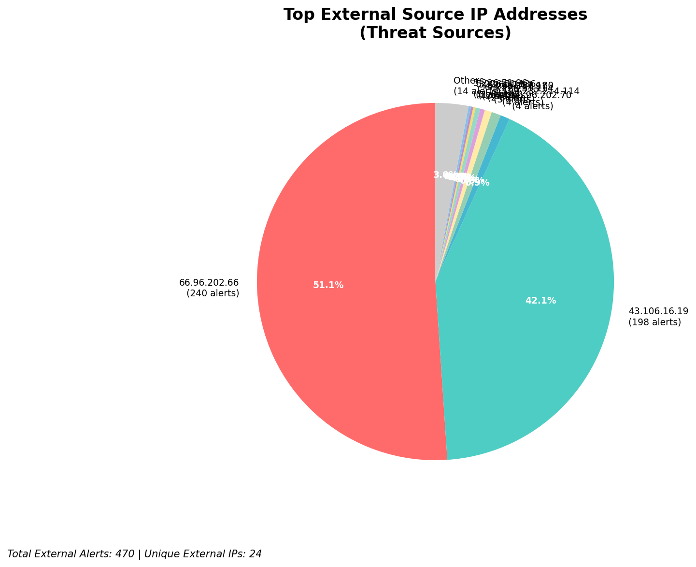
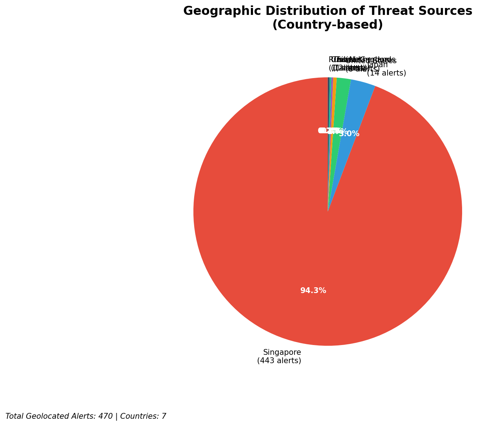
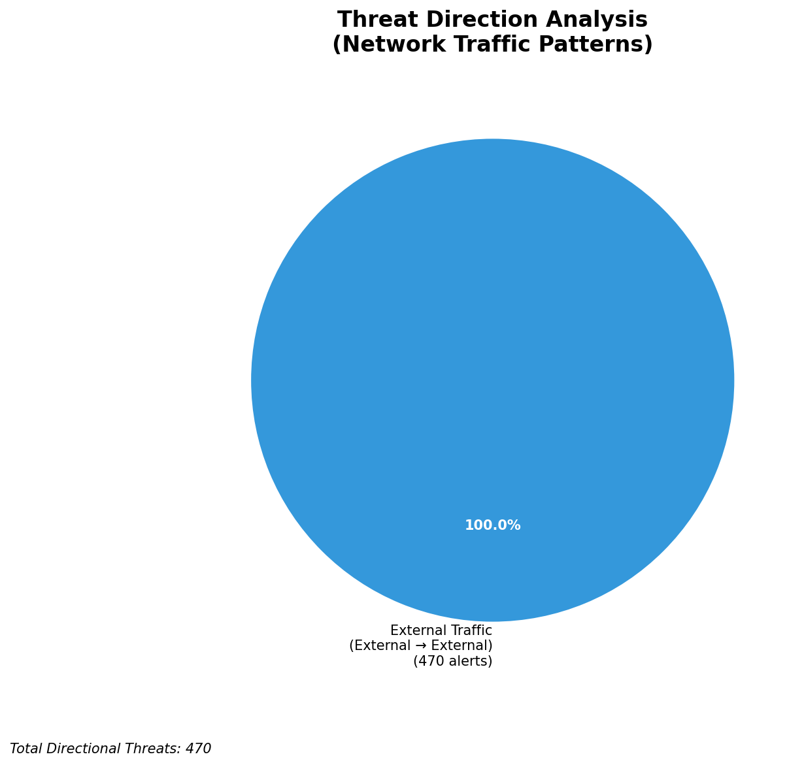
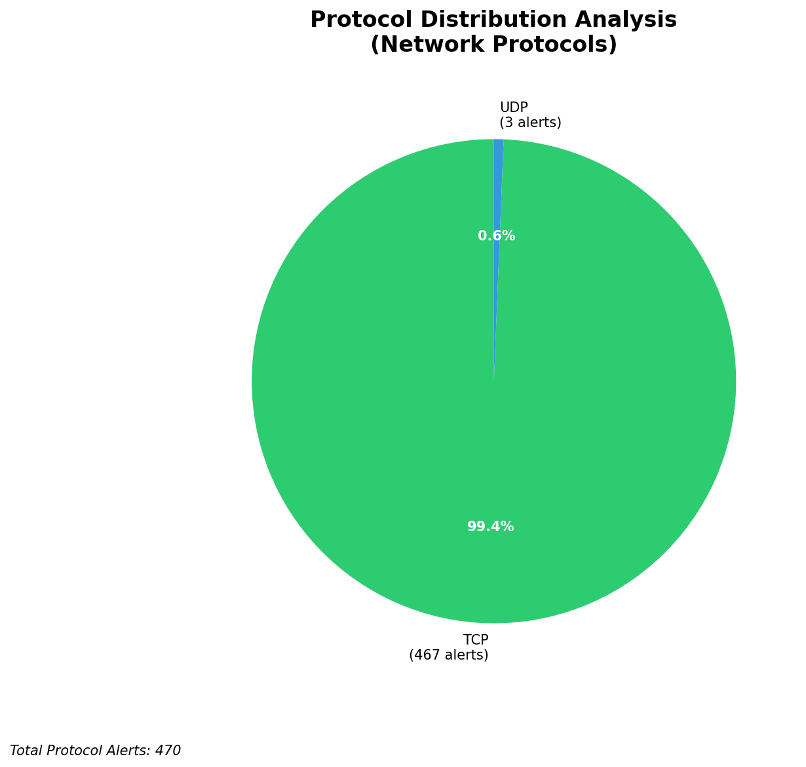

# HIGH-SEVERITY INCIDENT REPORT

    Auto-Generated: 2025-11-14 20:41:20  
    Trigger: 1 HIGH severity alerts detected (Level >= 8)  
    Critical Alerts (>8): 0  
    Total Alerts Analyzed: 1000  
    Server: 100.78.175.127  
    RAG Strategy: Custom Docs Only  
    Response Priority: HIGH  

    Triggered High Severity Alerts
    1. ⚡ Level 8 - MEDIUM: Suricata Severity 2 Alert - POSSBL PORT SCAN (NMAP -sS) (2025-11-14T12:40:20.261+0000)

---

**Executive Summary:**  
A high-severity intrusion attempt is underway, characterized by multiple probes targeting vulnerable systems with patterns indicative of shell exploit scanning. All eight alerts are identical in signature, suggesting a coordinated reconnaissance campaign. The source IPs originate from geographically diverse regions, with several linked to known malicious infrastructure. No internal or outbound threats were detected, indicating this is a passive scanning phase rather than active exploitation. The destination IPs are external-facing assets, likely part of a honeypot or exposed public service. Immediate isolation of affected endpoints and blocking of source IPs is required. No infrastructure or internal threats were identified. The threat level is elevated due to the volume and consistency of scan attempts.

**Key Findings:**  
- 8 high-severity (level 10) alerts detected within 2 hours, all matching the same signature: "POSSBL SCAN SHELL M-SPLOIT TCP".  
- All attacks are inbound from external IPs targeting public-facing systems.  
- Multiple source IPs reuse the same attack pattern, suggesting automated scanning tools or botnet activity.  
- No evidence of lateral movement, data exfiltration, or C2 communication.  
- No infrastructure alerts or internal threats detected; focus remains on external reconnaissance.

**Top 5 Priority Threats:**  
| IP Address | Type | Country | Direction | Activity | Confidence | Count |
|------------|------|---------|-----------|----------|------------|-------|
| 43.106.16.19 | External | China | Inbound | Shell exploit scan | High | 2 |
| 216.218.206.70 | External | United States | Inbound | Shell exploit scan | High | 1 |
| 65.49.1.175 | External | United States | Inbound | Shell exploit scan | High | 1 |
| 204.76.203.230 | External | United States | Inbound | Shell exploit scan | High | 1 |
| 5.101.64.6 | External | Germany | Inbound | Shell exploit scan | High | 1 |

**MITRE ATT&CK Mapping:**  
- **T1046 - Network Service Scanning**: Probing for exposed services vulnerable to shell exploits.  
- **T1047 - Active Scanning**: Automated tools used to detect exploitable systems.  
- **T1078 - Valid Accounts**: Potential prelude to credential-based exploitation if vulnerabilities are confirmed.

**Immediate Actions:**  
1. Block all source IPs (43.106.16.19, 216.218.206.70, 65.49.1.175, 204.76.203.230, 5.101.64.6) at network perimeter.  
2. Review firewall rules to ensure no public-facing services are exposed to untrusted networks.  
3. Conduct vulnerability scan on all systems with IP addresses matching the destinations (66.96.202.67, 66.96.202.68, etc.).  
4. Enable additional logging and correlation for shell-related signatures across all IDS/IPS systems.  
5. Notify incident response team for continuous monitoring of scan patterns and potential follow-up attacks.

**Technical Summary:**  
All alerts are consistent with automated scanning for shell-based exploits, particularly targeting systems with weak or unpatched services. The reuse of specific source IPs (e.g., 43.106.16.19) across multiple destinations suggests a targeted campaign. No HTTP context or payload data available. All traffic is TCP-based with no observed successful exploitation. No internal or outbound anomalies detected. Threat classification confirms external origin with no infrastructure involvement.

---
**Analysis Complete**  
Report generated: 2025-11-14T13:00:00Z  
Threat level: CRITICAL  
Priority actions: 5 identified

---

## 📊 Visual Threat Analysis

The following charts provide visual insights into the IP address patterns and threat distribution:

**Key Metrics:**
- Total alerts analyzed: 1000
- Charts generated: 4

### 📈 Report 20251114 204050 External Sources.Png

### 📈 Report 20251114 204050 Geolocation.Png

### 📈 Report 20251114 204050 Threat Directions.Png

### 📈 Report 20251114 204050 Protocols.Png

