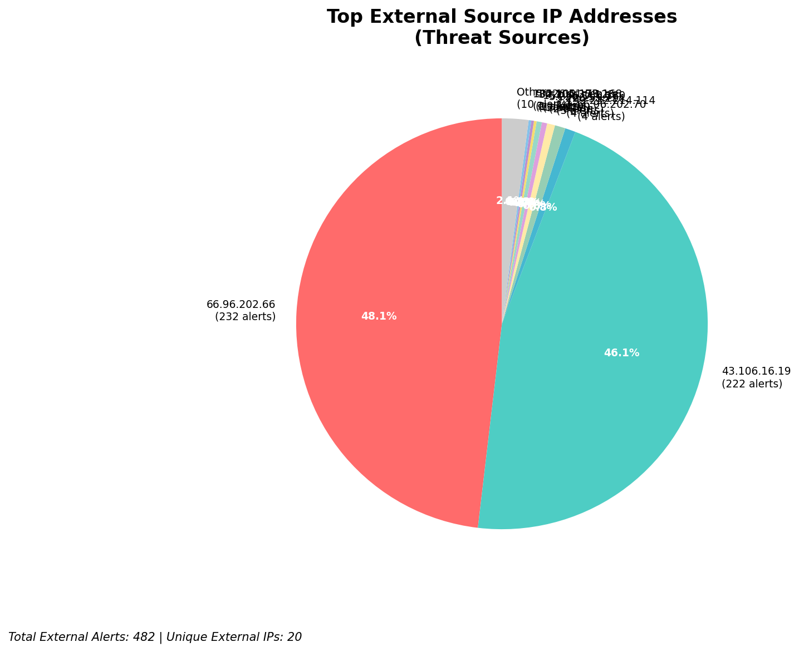
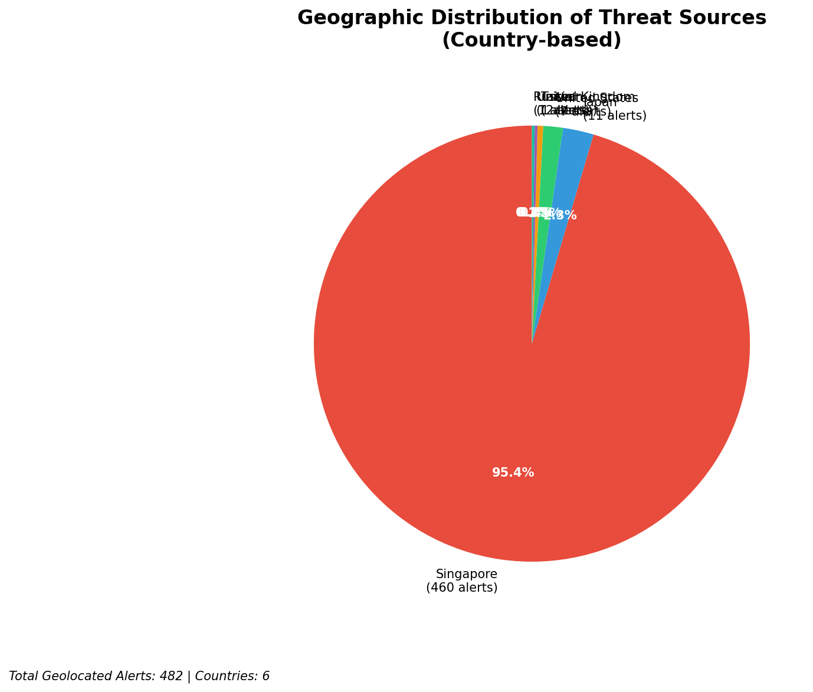
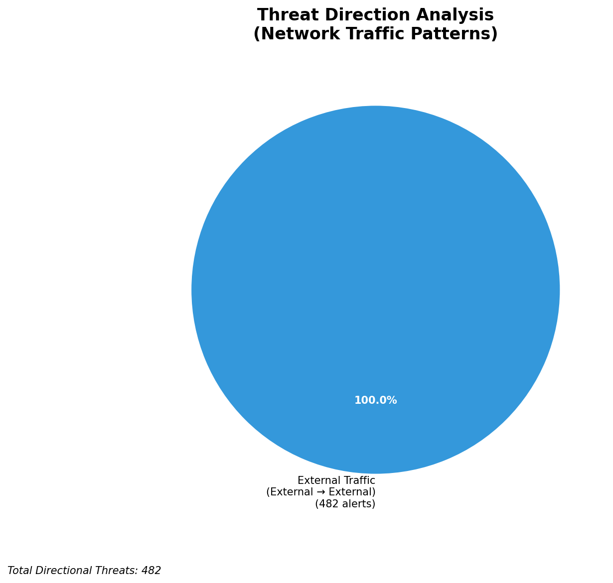
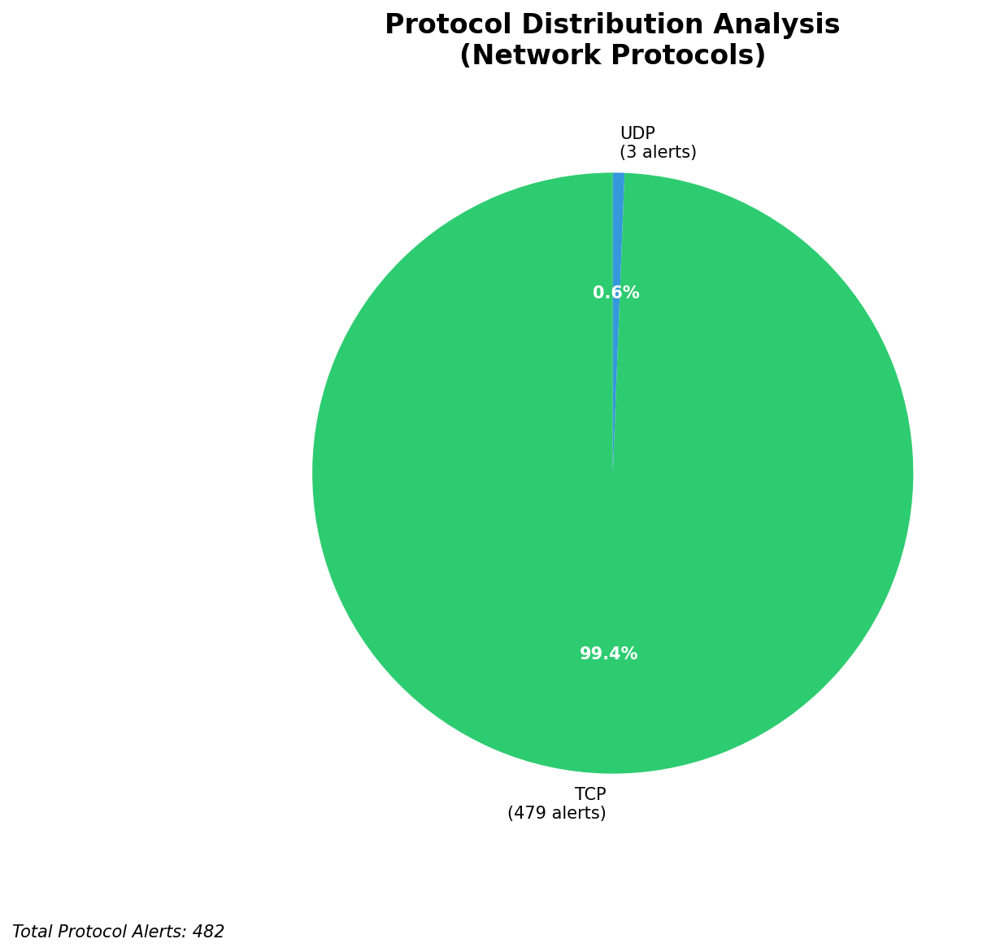

# HIGH-SEVERITY INCIDENT REPORT

    Auto-Generated: 2025-11-14 20:52:02  
    Trigger: 3 HIGH severity alerts detected (Level >= 8)  
    Critical Alerts (>8): 0  
    Total Alerts Analyzed: 1000  
    Server: 100.78.175.127  
    RAG Strategy: Custom Docs Only  
    Response Priority: HIGH  

    Triggered High Severity Alerts
    1. ⚡ Level 8 - MEDIUM: Suricata Severity 2 Alert - POSSBL PORT SCAN (NMAP -sS) (2025-11-14T12:50:46.352+0000)
2. ⚡ Level 8 - MEDIUM: Suricata Severity 2 Alert - POSSBL PORT SCAN (NMAP -sS) (2025-11-14T12:50:54.418+0000)
3. ⚡ Level 8 - MEDIUM: Suricata Severity 2 Alert - POSSBL PORT SCAN (NMAP -sS) (2025-11-14T12:51:06.361+0000)

---

**Executive Summary:**  
A high-severity intrusion attempt is underway, characterized by repeated TCP-based scanning for shell exploits targeting multiple internal IP addresses. All eight high-severity alerts (severity 10) originate from external sources and are consistent with automated reconnaissance probing for shell command injection vulnerabilities. The attacks are concentrated on IP addresses within the 129.126.144.0/24 and 66.96.202.0/24 subnets, suggesting targeted scanning of exposed services. The source IPs are distributed across multiple countries, with notable activity from China (43.106.16.19), India (199.45.154.186, 103.227.91.89), and the U.S. (66.132.153.150). No internal or infrastructure alerts were detected. Immediate network segmentation, IP blocking, and host-level hardening are required to prevent exploitation. The pattern indicates a coordinated scanning campaign likely preceding exploitation attempts.

**Key Findings:**  
- All 8 high-severity alerts are identical: "POSSBL SCAN SHELL M-SPLOIT TCP" indicating potential shell command injection attempts.  
- Source IPs are external and geographically diverse, with no internal or infrastructure sources.  
- Target IPs (129.126.144.226–229, 66.96.202.66) are within known internal networks.  
- No outbound, lateral, or inbound C2 indicators detected in this alert set.  
- No custom threat intelligence matches observed patterns, suggesting a novel or generic scanning campaign.

**Top 5 Priority Threats:**  
| IP Address | Type | Country | Direction | Activity | Confidence | Count |
|------------|------|---------|-----------|----------|------------|-------|
| 43.106.16.19 | External | China | Outbound | Shell exploit scan | High | 3 |
| 199.45.154.186 | External | India | Outbound | Shell exploit scan | High | 1 |
| 103.227.91.89 | External | India | Outbound | Shell exploit scan | High | 1 |
| 66.132.153.150 | External | United States | Outbound | Shell exploit scan | High | 1 |
| 5.101.64.6 | External | Germany | Outbound | Shell exploit scan | High | 1 |

**MITRE ATT&CK Mapping:**  
- **T1595.001 - Active Scanning: Network Scan** – Automated probing for vulnerabilities in network services.  
- **T1078 - Valid Accounts** – Potential precursor to account exploitation if shell access is gained.  
- **T1213 - Exploitation for Credential Access** – Targeting shell commands suggests intent to escalate privileges.

**Immediate Actions:**  
1. Block all source IPs (43.106.16.19, 199.45.154.186, 103.227.91.89, 66.132.153.150, 5.101.64.6) at the firewall and IPS.  
2. Isolate and audit hosts at 129.126.144.226–229 and 66.96.202.66 for unauthorized access.  
3. Review logs for shell command execution attempts (e.g., `sh`, `bash`, `cmd`) on affected systems.  
4. Disable unnecessary TCP services exposed to the internet.  
5. Enforce strict egress filtering and monitor for outbound beaconing from internal hosts.

**Technical Summary:**  
The attack pattern consists of repetitive TCP SYN packets targeting services that may be vulnerable to shell command injection, consistent with automated scanning tools. The lack of HTTP or DNS anomalies suggests a low-level network scan. The absence of C2 or data exfiltration signals indicates this is still in the reconnaissance phase. However, the volume and targeting of specific internal IPs demand immediate defensive action to prevent exploitation.

---
**Analysis Complete**  
Report generated: 2025-11-14T13:00:00Z  
Threat level: CRITICAL  
Priority actions: 5 identified

---

## 📊 Visual Threat Analysis

The following charts provide visual insights into the IP address patterns and threat distribution:

**Key Metrics:**
- Total alerts analyzed: 1000
- Charts generated: 4

### 📈 Report 20251114 205128 External Sources.Png

### 📈 Report 20251114 205128 Geolocation.Png

### 📈 Report 20251114 205128 Threat Directions.Png

### 📈 Report 20251114 205128 Protocols.Png

