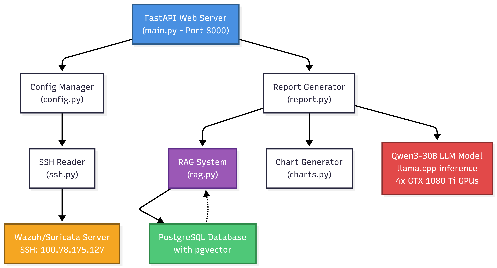
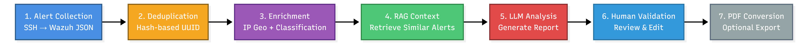
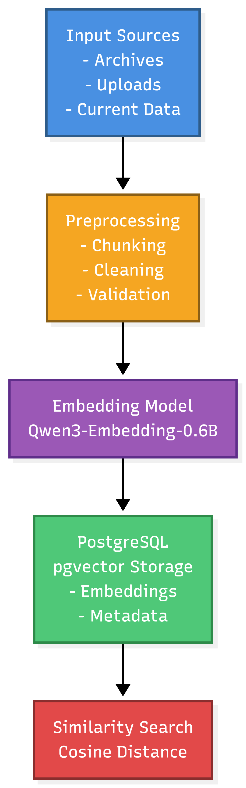
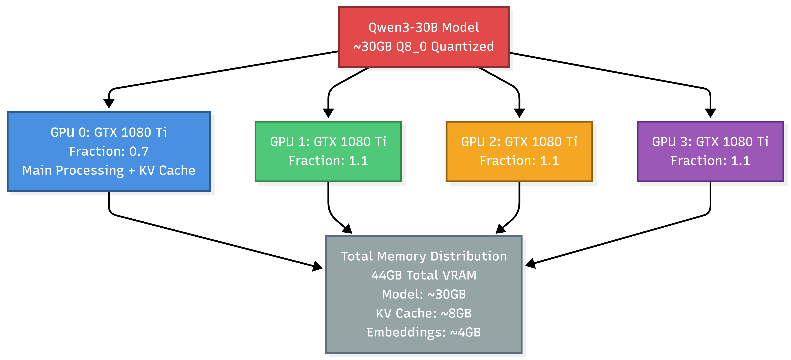

# Enhanced AI-Driven SOC Framework Configuration Guide

## Table of Contents
- [Overview](#overview)
- [System Architecture](#system-architecture)
- [Configuration Files](#configuration-files)
- [Core Components](#core-components)
- [Installation & Setup](#installation--setup)
- [Usage Guide](#usage-guide)
- [API Endpoints](#api-endpoints)
- [Troubleshooting](#troubleshooting)

## Overview

This repository contains the core components for the ICT2114 Team 5 AI-driven SOC framework. The application ingests Wazuh alerts over SSH, including Suricata alert fields where they are present inside Wazuh alert records, builds a persistent Retrieval-Augmented Generation (RAG) knowledge base in PostgreSQL with pgvector, retrieves relevant historical alerts and CTI documents, and uses a local Qwen model through llama.cpp to generate Cyber Threat Intelligence (CTI) reports.

### Key Features
- Local LLM inference through llama.cpp for data control.
- SSH-based collection of current Wazuh alerts and historical OSSEC/Wazuh archives.
- Persistent PostgreSQL and pgvector RAG storage.
- Hybrid retrieval that combines semantic vector search, full-text lexical search, and exact IoC/TTP matching.
- CTI document upload support for PDF, TXT, MD, and Markdown files.
- Automatic extraction of uploaded-document CTI artefacts such as IPs, domains, URLs, hashes, CVEs, MITRE technique IDs, and common actor labels.
- Human-in-the-loop report review, draft saving, approval, and attempted indexing of approved reports back into RAG.
- Optional chart generation and Markdown to PDF report conversion.
- Live alert viewer and high-severity monitoring workflow.

### Project Timeline
- Project: ICT2114 Team 5 school project.
- Intended runtime: remote Ubuntu server with PostgreSQL, pgvector, llama.cpp, and the Qwen model installed.
- This Windows workspace can be used for code review and static checks, but the full application depends on the remote Ubuntu environment.

## System Architecture


At a high level:
1. Wazuh alerts, including Suricata fields when available, are read from the remote server through SSH.
2. Archive alerts are converted into semantic chunks, uploaded CTI documents are extracted and chunked, and both sources are embedded and stored in PostgreSQL pgvector tables.
3. Incoming or selected alerts are enriched and converted into focused retrieval queries.
4. RAG retrieval returns relevant historical alerts and CTI document chunks.
5. The local Qwen model receives the current alert context plus cited RAG evidence and generates a report.
6. Analysts can review, edit, approve, export, and attempt to re-index final reports for future retrieval.

## Configuration Files

### 1. config.py
**Main configuration manager handling all system settings.**

#### Configuration Sections

##### SSHConfig
```python
host: str = "100.78.175.127"
username: str = "wazuh-user"
password: str = "wazuh"
port: int = 22
timeout: int = 30
```
Controls SSH access to the Wazuh server. Values can be overridden by environment variables.

##### WazuhConfig
```python
alerts_file_path: str = "/var/ossec/logs/alerts/alerts.json"
archives_base_path: str = "/var/ossec/logs/archives"
```
Defines where current alerts and archived logs are read on the remote Wazuh host.

##### LLMConfig
```python
model_path: str = "/home/student/Desktop/Qwen3-30B-A3B-Instruct-2507-Q8_0.gguf"
llama_cpp_path: str = "/home/student/Desktop/llama.cpp/build/bin/llama-cli"
model_type: str = "qwen"
temperature: float = 0.7
top_p: float = 0.8
top_k: int = 20
context_size: int = 8192
max_tokens: int = -2
gpu_layers: int = 99
tensor_split: Optional[str] = "0.7,1.1,1.1,1.1"
```

**Key Parameters:**
- `context_size`: llama.cpp context window.
- `max_tokens`: `-2` lets llama.cpp generate until the context is filled.
- `gpu_layers`: number of model layers offloaded to GPU.
- `tensor_split`: optional multi-GPU split passed to llama.cpp.
- `use_jinja`: enables llama.cpp Jinja chat template handling.
- `chat_template_file`: defaults to `qwen_chat.j2`.
- `system_prompt_file`: defaults to `cti.txt`.

##### DatabaseConfig
```python
host: str = "localhost"
port: int = 5432
database: str = "soc_rag"
user: str = "soc_user"
password: str = "StudentPass4721"
```
PostgreSQL connection settings used by the RAG manager. The code can create the configured database if the database user has permission, then creates the required tables and pgvector extension.

##### RAGConfig
```python
chunk_size: int = 500
chunk_overlap: int = 50
document_chunk_size: int = 1200
document_chunk_overlap: int = 120
embedding_model: str = "Qwen/Qwen3-Embedding-0.6B"
embedding_device: str = "cuda"
embedding_devices: List[str] = ["cuda:0", "cuda:1", "cuda:2", "cuda:3"]
embedding_dimensions: int = 1024
embedding_batch_size: int = 16
embedding_multi_gpu_min_chunks: int = 64
max_retrieval_docs: int = 10
normalize_embeddings: bool = False
similarity_threshold: float = 0.2
retrieval_candidate_multiplier: int = 4
```
Controls archive chunking, uploaded CTI document chunking, embedding generation, pgvector dimensions, and retrieval thresholds. `embedding_device` is used for single-query/small-batch encoding; `embedding_devices` is used only for large archive or uploaded-document chunk batches at or above `embedding_multi_gpu_min_chunks`.

##### WebConfig
```python
username: str = "admin"
password: str = "admin"
host: str = "0.0.0.0"
port: int = 8000
```
FastAPI dashboard binding and Basic Auth credentials.

##### PathConfig
```python
reports_dir: str = "/home/student/Desktop/ICT2114_Team5/Linux_LLM/reports"
templates_dir: str = "/home/student/Desktop/ICT2114_Team5/Linux_LLM/config/templates"
uploads_dir: str = "/home/student/Desktop/ICT2114_Team5/Linux_LLM/uploads"
geoip_db_path: str = "/home/student/Desktop/GeoLite2-City.mmdb"
```
Local filesystem paths used by the application on the Ubuntu server.

##### AssetInventoryConfig
```python
owned_cidrs: List[str] = ["66.96.0.0/16", "129.126.144.226/32"]
infrastructure_ips: List[str] = ["192.168.56.104", "192.168.56.1"]
internal_cidrs: List[str] = ["10.0.0.0/8", "172.16.0.0/12", "192.168.0.0/16", "127.0.0.0/8"]
```
Defines local assets used by `AlertAnalyzer` to classify traffic direction, owned infrastructure, and internal versus external IP context.

#### Environment Variable Support
Many runtime settings can be overridden from environment variables. Common examples:

```bash
# SSH Configuration
export SSH_HOST="100.78.175.127"
export SSH_USERNAME="wazuh-user"
export SSH_PASSWORD="wazuh"
export SSH_PORT="22"

# LLM Configuration
export LLM_MODEL_PATH="/home/student/Desktop/Qwen3-30B-A3B-Instruct-2507-Q8_0.gguf"
export LLM_BINARY_PATH="/home/student/Desktop/llama.cpp/build/bin/llama-cli"
export LLM_CONTEXT_SIZE="8192"

# Database Configuration
export DB_HOST="localhost"
export DB_PORT="5432"
export DB_NAME="soc_rag"
export DB_USER="soc_user"
export DB_PASSWORD="StudentPass4721"

# RAG Configuration
export RAG_EMBEDDING_MODEL="Qwen/Qwen3-Embedding-0.6B"
export RAG_EMBEDDING_DEVICE="cuda"
export RAG_EMBEDDING_DEVICES="cuda:0,cuda:1,cuda:2,cuda:3"
export RAG_EMBEDDING_BATCH_SIZE="16"
export RAG_EMBEDDING_MULTI_GPU_MIN_CHUNKS="64"
export RAG_DOCUMENT_CHUNK_SIZE="1200"
export RAG_DOCUMENT_CHUNK_OVERLAP="120"
export RAG_SIMILARITY_THRESHOLD="0.2"

# Asset Inventory Configuration
export ASSET_OWNED_CIDRS="66.96.0.0/16,129.126.144.226/32"
export ASSET_INFRASTRUCTURE_IPS="192.168.56.104,192.168.56.1"
export ASSET_INTERNAL_CIDRS="10.0.0.0/8,172.16.0.0/12,192.168.0.0/16,127.0.0.0/8"
```

#### Usage Examples

```python
from config import ConfigManager

# Load defaults plus environment overrides
config = ConfigManager()

# Load from JSON file plus environment overrides
config = ConfigManager("config.json")

# Validate configuration
is_valid, errors = config.validate_all()

# Update a section at runtime
config.update_config("llm", {"temperature": 0.5})

# Save configuration to a JSON file
config.save_to_file("config.json")

# Get a dashboard-friendly summary
summary = config.get_summary()
```

### 2. main.py
**FastAPI application entry point and route definitions.**

#### Core Features
- Basic Auth protected dashboard.
- WebSocket progress tracking for long-running tasks.
- RAG build and refresh workflow.
- Current-alert analysis and offline JSON alert-template analysis.
- Live alert viewer and selected-alert analysis.
- Human review, draft save, report approval, and approved-report RAG indexing.
- PDF conversion endpoints.
- System status and operational metrics endpoints.

#### Key Components

##### SOCApplication Class
Main application container that initializes configuration, the FastAPI app, RAG/reporting components, live monitoring, PDF conversion, routes, and lifespan cleanup.

##### Component Initialization
```python
def _init_components(self):
    ProgressTracker(...)
    DocumentProcessor(...)
    ReportGenerator(...)
    create_enhanced_live_monitoring_service(...)
    create_enhanced_pdf_converter(...)
    create_enhanced_pdf_api_handlers(...)
```

##### Route Categories

**Dashboard & Authentication**
- `GET /` - Dashboard with RAG controls, report list, alert analysis controls, and PDF controls.
- HTTP Basic Auth is required for dashboard and API routes.

**RAG Management**
- `POST /build-rag` - Build or refresh RAG from archives, uploaded documents, or existing database rows.
- `GET /rag-status` - Current RAG status and database counts.
- `POST /clear-rag-context` - Testing-only database reset.

**Alert Analysis**
- `POST /analyze-alerts` - Analyze current alerts or an uploaded JSON alert template.
- `POST /analyze-selected-alerts` - Analyze selected live-alert UUIDs or page IDs.
- `POST /generate-visual-report` - Generate a charts-only visual report from current alerts.
- `GET /api/live-alerts` - Fetch current alerts from Wazuh with pagination.
- `GET /alerts/viewer` - Live alert selection UI.

**Report Management**
- `GET /reports` - List generated Markdown, PDF, and HTML reports.
- `GET /reports/{filename}` - Download a report file.
- `GET /reports/{filename}/edit` - Parse an existing Markdown report into the editor.
- `GET /review-report/{report_id}` - Human review page for draft reports.
- `POST /api/save-draft/{report_id}` - Save draft report JSON.
- `POST /api/approve-report/{report_id}` - Validate, save, and index an approved report.
- `POST /api/preview-report` - Render edited report JSON to Markdown preview.
- `POST /api/validate-report` - Validate edited report JSON.
- `GET /api/check-analysis-result/{session_id}` - Poll whether analysis produced a review redirect.

**PDF Conversion**
- `POST /convert-to-pdf` - Convert one Markdown report to PDF.
- `POST /batch-convert-pdf` - Convert Markdown reports in the reports directory.
- `GET /pdf-status` - PDF conversion capabilities.
- `POST /set-auto-convert` - Enable or disable automatic PDF conversion for newly approved reports.
- `GET /auto-convert-status` - Current auto-convert state.

**System Status**
- `GET /system-status` - Configuration summary, component status, chart info, progress stats, monitoring stats, and PDF capabilities.
- `GET /test-connection` - SSH connectivity and remote alert-file access test.
- `GET /api/report-metrics` - Report generation timing and approval metrics.
- `POST /check-duplicates` - Check selected upload files against the document processor's duplicate cache.
- `GET /chart-capabilities` - Available chart types.
- `GET /api/mitre-techniques` - MITRE technique metadata.

**WebSocket Endpoints**
- `WS /ws/progress/{session_id}` - Real-time progress updates.

### 3. requirements.txt
**Python dependencies used by the application.**

#### Key Dependencies
```text
fastapi==0.118.2
uvicorn==0.37.0
websockets==15.0.1
python-multipart==0.0.20
paramiko==4.0.0
Jinja2==3.1.6
PyMuPDF==1.26.5
markdown>=3.0
weasyprint>=60.0
geoip2==5.1.0
psycopg2-binary==2.9.11
sentence-transformers==5.1.1
matplotlib==3.10.7
pandas==2.3.3
```

### 4. ssh.py
**SSH connection and alert/archive reading functionality.**

#### SmartSSHLogReader Class
Combines the connection manager, current-alert reader, and archive reader.

**Key Features:**
- Password-based Paramiko SSH connection.
- Current alert reading from `alerts.json`.
- Efficient current-alert reads using remote `tail -n`.
- Archive reading from uncompressed `.json` and compressed `.json.gz` files.
- Date-aware archive path construction for `/var/ossec/logs/archives/<year>/<Mon>/`.
- JSON-line parsing with bad-line skipping.

**Methods:**
```python
connect() -> bool
disconnect()
read_alerts(max_lines: int = None) -> List[Dict]
read_archives_smart(past_days: int = 7) -> List[Dict]
```

### 5. report.py
**Report generation, alert enrichment, RAG management, and chart integration.**

#### ReportGenerator Class
Main orchestrator for LLM report generation.

**Features:**
- Initializes `RAGContextManager`, `AlertAnalyzer`, and `EnhancedReportFormatter`.
- Builds and queries the persistent pgvector RAG store.
- Cleans and enriches alert data.
- Performs GeoIP lookup when the configured GeoLite2 database exists.
- Generates manual and automatic reports.
- Tracks report generation metrics.
- Indexes analyst-approved reports back into RAG.

**Key Methods:**
```python
generate_report_with_rag(current_alerts, server_host="unknown", is_automatic=False, trigger_info=None)
build_rag_context(archive_logs=None, custom_docs=None)
add_custom_documents(docs)
get_rag_status() -> Dict[str, Any]
clear_rag_database() -> Dict[str, Any]
index_approved_report(markdown: str, filename: str) -> bool
generate_visual_report(alerts: List[Dict], output_path: str) -> Optional[str]
```

### 6. llm_client.py
**Local llama.cpp client and chat-template handling.**

#### Classes
- `ChatTemplateManager`: loads the configured Jinja chat template and formats prompts when llama.cpp is not handling Jinja directly.
- `LlamaModelClient`: writes the generated prompt to a temporary file, builds the llama.cpp command from `LLMConfig`, runs `llama-cli`, captures stdout/stderr, applies timeout handling, and removes temporary files.

**Key Methods:**
```python
ChatTemplateManager.format_user_message(user_message: str) -> str
ChatTemplateManager.get_template_path() -> str
LlamaModelClient.generate_response(user_message: str) -> str
```

**Important Runtime Notes:**
- The current implementation invokes `llama-cli` as a subprocess for each generation.
- `LLMConfig.get_llama_args(...)` supplies model path, context size, sampling settings, GPU settings, cache settings, system prompt file, and chat-template options.
- If llama.cpp returns a non-zero code or times out, the method returns an error string rather than raising an exception.

### 7. rag.py
**Uploaded document processing for RAG integration.**

#### Features
- Validates uploaded file extension, size, and basic suspicious executable signatures.
- Supports `.pdf`, `.txt`, `.md`, and `.markdown`.
- Extracts PDF text with PyMuPDF, including text blocks, detected tables, detected links, and image-presence markers.
- Extracts uploaded CTI artefacts such as IPs, domains, URLs, hashes, CVEs, MITRE technique IDs, and common actor labels.
- Tracks processed uploaded-file hashes in memory and from saved processed-file metadata.
- Optionally saves processed text and metadata to disk.

**DocumentProcessor Class:**
```python
process_upload(file_content: bytes, filename: str, save_to_disk: bool = True) -> Tuple[str, Dict[str, Any]]
check_duplicate(file_content: bytes, filename: str) -> Tuple[bool, str]
get_processed_files() -> List[Dict[str, Any]]
cleanup_old_files(max_age_days: int = 7) -> int
```

**RAG Storage Path:**
```text
Uploaded file bytes
-> DocumentProcessor text extraction and metadata
-> ReportGenerator.build_rag_context(...)
-> RAGContextManager._add_custom_docs(...)
-> paragraph-aware chunks
-> custom_documents table with pgvector embeddings
```

### 8. cti_artifacts.py
**CTI artefact extraction helpers for uploaded documents and alert context.**

#### CTIArtifactExtractor Class
Extracts common security artefacts from unstructured text so uploaded CTI reports can be matched by both semantic retrieval and exact IoC/TTP matching.

**Artefact Types:**
- IPv4 addresses.
- Domains and hostnames.
- HTTP/HTTPS URLs.
- Email addresses.
- MD5, SHA-1, and SHA-256 hashes.
- CVE identifiers.
- MITRE ATT&CK technique IDs such as `T1059` and `T1059.001`.
- APT/G/TA/FIN-style labels such as `APT29`, `TA0002`, `G0016`, and `FIN7`.

**Key Methods:**
```python
extract(text: Any, max_items_per_type: int = 100) -> Dict[str, List[str]]
format_for_context(artefacts: Dict[str, Iterable[Any]], max_items_per_type: int = 20) -> str
count_by_type(artefacts: Dict[str, Iterable[Any]]) -> Dict[str, int]
```

**How It Is Used:**
- `rag.py` adds extracted artefacts and counts to upload metadata.
- `report.py` prepends a compact artefact summary to stored custom-document chunks before embedding.
- This improves exact matching for IoCs while still preserving semantic retrieval.

### 9. charts.py
**Visual analytics generation.**

#### ChartGenerator Class
The implementation class is `SOCChartGenerator`.

**Chart Types:**
- `external_sources_pie`
- `geolocation_pie`
- `threat_directions_pie`
- `protocols_pie`
- `severity_timeline`

**Integration:**
- Uses Matplotlib and Pandas.
- Saves PNG files under the reports chart directory.
- Embeds generated chart image references into Markdown reports when chart generation is enabled.
- Cleans up old chart files during formatter initialization.

### 10. pdf_converter.py
**Enhanced PDF conversion system.**

#### PDFConverter Class
The implementation class is `EnhancedPDFConverter`.

**Methods and Behavior:**
- Converts Markdown reports to PDF with WeasyPrint.
- Uses the Python `markdown` package with tables, fenced code, and table-of-contents extensions.
- Applies built-in CSS for report readability and print layout.
- Provides single-file and batch conversion handlers through `EnhancedPDFAPIHandlers`.
- Reports missing optional WeasyPrint/Markdown dependencies through `/pdf-status`.

### 11. progress.py
**Progress tracking and WebSocket management.**

#### ProgressTracker Class
Real-time progress updates for RAG builds, alert analysis, and report generation.

**Features:**
- WebSocket session tracking.
- Progress messages with percentage, status, timestamp, and optional extra data.
- Task progress helper.
- Automatic cleanup of expired sessions.
- JSON-safe status output for dashboards.

### 12. live_monitoring.py
**Live alert monitoring system.**

#### EnhancedLiveMonitoringService
Monitors current alerts and triggers automatic reporting for new high-severity alerts.

**Configuration:**
```python
high_severity_threshold: int = 8
critical_severity_threshold: int = 12
polling_interval: int = 10
batch_wait_seconds: int = 5
max_queue_size: int = 5
```

**Features:**
- Persistent SSH connection helper.
- Hash-based alert deduplication.
- High-severity filtering based on cleaned `rule_level`.
- Automatic report generation with concurrency control.
- Optional batching while the LLM is already running.
- Monitoring statistics and alert trend snapshots.

### 13. report_parser.py
**Report parsing and serialization.**

#### ReportParser Class
Converts generated Markdown reports to editable JSON-like structures and serializes edited data back to Markdown.

**Methods:**
```python
parse_report(markdown_text: str) -> Dict[str, Any]
serialize_to_markdown(report_data: Dict[str, Any]) -> str
validate_report(report_data: Dict[str, Any]) -> tuple[bool, List[str]]
```

**Use Cases:**
- Loading generated reports into the review editor.
- Preserving RAG source appendices during editing.
- Validating executive summary, findings, threats, recommendations, and metadata before approval.

### 14. mitre_techniques.json
**MITRE ATT&CK technique database.**

Contains local MITRE ATT&CK technique metadata used by the dashboard/editor route `/api/mitre-techniques`.

**Structure:**
```json
[
  {
    "id": "T1003",
    "name": "OS Credential Dumping",
    "tactic": "Credential Access",
    "deprecated": false
  }
]
```

## Core Components

### Alert Processing Pipeline

**Pipeline Steps:**


1. **Alert Collection**: read current alerts or archives from the Wazuh server through SSH.
2. **Normalization**: clean Wazuh/Suricata alert shape into compact fields.
3. **Enrichment**: add IP ownership context, GeoIP data, direction, severity, observed IoCs, and MITRE context where present.
4. **RAG Retrieval**: retrieve matching archive alerts and uploaded CTI chunks.
5. **LLM Analysis**: generate a CTI report through llama.cpp and the configured Qwen model.
6. **Human Validation**: review and edit generated report content.
7. **Approval and Indexing**: save approved reports and attempt to add them to RAG as human-validated CTI.
8. **PDF Conversion**: optionally convert Markdown reports to PDF.

### RAG System Architecture


The RAG system stores two categories of context:
- `alert_embeddings`: historical archive alerts, transformed into semantic alert chunks with metadata.
- `custom_documents`: uploaded CTI documents and approved reports, split into paragraph-aware chunks.

Retrieval is hybrid:
- **Semantic**: Qwen embedding model encodes the alert query and compares it with pgvector cosine distance.
- **Lexical**: PostgreSQL full-text search uses `to_tsvector` and `plainto_tsquery`.
- **Exact**: metadata/content matching boosts exact IoC, rule ID, signature ID, IP, domain, URL, hash, keyword, and signature matches.
- **Reranking**: retrieved candidates are merged, deduplicated, diversified, and reranked before being placed into the LLM prompt.

Embedding execution is workload-aware:
- Single alert queries and small batches use `embedding_device` to avoid multi-process startup overhead.
- Large archive or uploaded CTI document embedding batches use `embedding_devices` through SentenceTransformers multi-process encoding when the chunk count reaches `embedding_multi_gpu_min_chunks`.

The LLM does not read raw embedding vectors. Embeddings are used to retrieve text evidence; the Qwen model interprets the retrieved passages and current alert context in the final prompt.

### Multi-GPU Setup


The default configuration is prepared for llama.cpp GPU offload:

```python
gpu_layers = 99
main_gpu = 0
tensor_split = "0.7,1.1,1.1,1.1"
```

This split only makes sense on the intended multi-GPU Ubuntu server. On another machine, update `LLMConfig` or environment variables to match the available GPU and VRAM.

**Memory Notes:**
- The configured model path points to a Qwen3-30B Q8_0 GGUF file.
- Actual VRAM and RAM usage depends on the specific GGUF, context size, KV cache type, batch size, and llama.cpp build.
- The embedding model is configured for CUDA in the current code to speed up RAG embedding computation.

## Installation & Setup

### Prerequisites

1. **Hardware Requirements:**
   - Ubuntu server with enough RAM and storage for the Qwen GGUF model, PostgreSQL data, reports, and embeddings.
   - NVIDIA GPU support if using llama.cpp CUDA offload.
   - Network access to the Wazuh server over SSH.

2. **Software Requirements:**
   - Ubuntu 22.04 or 24.04 LTS.
   - Python 3.10 or newer.
   - PostgreSQL with pgvector extension.
   - llama.cpp compiled for the available hardware.
   - Optional: GeoLite2 City database for GeoIP enrichment.
   - Optional: WeasyPrint native dependencies for PDF conversion.

### Installation Steps

#### 1. Clone Repository
```bash
cd /home/student/Desktop
git clone <repository_url> ICT2114_Team5
cd ICT2114_Team5/Linux_LLM/config
```

#### 2. Install Python Dependencies
Using a virtual environment is recommended:
```bash
python3 -m venv .venv
source .venv/bin/activate
pip install --upgrade pip
pip install -r requirements.txt
```

If the school server intentionally uses system Python, the original lab-style command can also work:
```bash
pip install -r requirements.txt --break-system-packages
```

#### 3. Setup PostgreSQL with pgvector
Package names vary by Ubuntu/PostgreSQL version. Example:
```bash
sudo apt update
sudo apt install postgresql postgresql-contrib
sudo apt install postgresql-16-pgvector || sudo apt install postgresql-15-pgvector || sudo apt install postgresql-14-pgvector
```

Create the database and user:
```bash
sudo -u postgres psql
CREATE DATABASE soc_rag;
CREATE USER soc_user WITH PASSWORD 'StudentPass4721';
GRANT ALL PRIVILEGES ON DATABASE soc_rag TO soc_user;
\c soc_rag
CREATE EXTENSION IF NOT EXISTS vector;
\q
```

If the configured PostgreSQL user has database creation permissions, the application can bootstrap the database and schema automatically.

#### 4. Download Model
Place the GGUF file at the configured path or override `LLM_MODEL_PATH`:
```bash
# Example target path expected by config.py
ls -lh /home/student/Desktop/Qwen3-30B-A3B-Instruct-2507-Q8_0.gguf
```

Download the exact model file from the Hugging Face repository used by your team, then ensure the filename matches `LLMConfig.model_path`.

#### 5. Compile llama.cpp with GPU Support
```bash
cd /home/student/Desktop
git clone https://github.com/ggml-org/llama.cpp
cd llama.cpp

cmake -B build -DGGML_CUDA=ON
cmake --build build --config Release

./build/bin/llama-cli --version
```

If the server is CPU-only, compile llama.cpp without CUDA and adjust `gpu_layers`.

#### 6. Configure System
There is no `config.example.json` in this repository. Configuration is loaded from defaults in `config.py`, optional JSON passed to `main.py`, and environment variables.

Example environment override:
```bash
export SSH_HOST="100.78.175.127"
export SSH_USERNAME="wazuh-user"
export SSH_PASSWORD="wazuh"
export DB_HOST="localhost"
export DB_NAME="soc_rag"
export DB_USER="soc_user"
export DB_PASSWORD="StudentPass4721"
export LLM_MODEL_PATH="/home/student/Desktop/Qwen3-30B-A3B-Instruct-2507-Q8_0.gguf"
export LLM_BINARY_PATH="/home/student/Desktop/llama.cpp/build/bin/llama-cli"
```

Optional JSON configuration:
```bash
python3 main.py /path/to/config.json
```

#### 7. Verify Setup
```bash
# Test SSH connection
python3 -c "
from ssh import SmartSSHLogReader
reader = SmartSSHLogReader('100.78.175.127', 'wazuh-user', 'wazuh')
print('Connected!' if reader.connect() else 'Failed')
reader.disconnect()
"

# Test database connection
python3 -c "
import psycopg2
conn = psycopg2.connect(host='localhost', port=5432, database='soc_rag', user='soc_user', password='StudentPass4721')
print('Database OK!')
conn.close()
"

# Test llama.cpp binary
/home/student/Desktop/llama.cpp/build/bin/llama-cli --version
```

## Usage Guide

### Starting the System

```bash
cd /home/student/Desktop/ICT2114_Team5/Linux_LLM/config
python3 main.py
```

The system will:
1. Validate Python packages and configured paths.
2. Validate model and llama.cpp paths.
3. Initialize PostgreSQL pgvector schema.
4. Initialize RAG, live monitoring, chart, and PDF components.
5. Start FastAPI through Uvicorn on the configured host and port.

Dashboard URL by default:
```text
http://<server-ip>:8000
```

### Initial RAG Build

1. Open the dashboard.
2. Login with `WebConfig` credentials, default `admin/admin`.
3. Select one or more RAG sources:
   - Add archive data from Wazuh/OSSEC archives.
   - Upload CTI documents in PDF, TXT, MD, or Markdown format.
   - Leave both unchecked only if persistent database data already exists and you want to refresh readiness.
4. Click **Build/Update RAG Context**.
5. Watch WebSocket progress until RAG status is ready.

### Manual Alert Analysis

1. Ensure RAG status is ready.
2. Either analyze current Wazuh alerts or upload an offline JSON alert template.
3. Optionally include charts.
4. Wait for report generation to finish.
5. Review the generated report in the editor.
6. Save draft changes if needed.
7. Approve the report to save it under the reports directory and index it into RAG.

### Automatic Alert Monitoring

The application attempts to start monitoring after RAG becomes ready.

Current defaults:
1. Polls current alerts every 10 seconds in interval mode.
2. Treats rule level `>= 8` as high severity.
3. Treats rule level `>= 12` as critical.
4. Deduplicates alerts by hash.
5. Generates automatic reports for new high-severity alerts.

### Working with Reports

#### Viewing Reports
```bash
# List reports
curl -u admin:admin "http://localhost:8000/reports?page=1&page_size=10"

# Download a report
curl -u admin:admin \
  "http://localhost:8000/reports/APPROVED_Threat_analysis_20251115_143022.md" \
  -o report.md
```

#### Converting to PDF
```bash
# Convert one Markdown report
curl -u admin:admin -X POST http://localhost:8000/convert-to-pdf \
  -F "filename=APPROVED_Threat_analysis_20251115_143022.md"

# Batch convert Markdown reports
curl -u admin:admin -X POST http://localhost:8000/batch-convert-pdf
```

### Chart Generation

Charts are generated when report generation is called with chart support enabled. Current chart capabilities are:

1. External source IP pie chart.
2. Geolocation pie chart.
3. Threat direction pie chart.
4. Protocol distribution pie chart.
5. Severity timeline chart.

Generated chart files are PNG images stored under the reports chart directory and referenced from Markdown reports.

## API Endpoints

### Authentication
Most HTTP routes require Basic Auth:
```bash
curl -u admin:admin http://localhost:8000/rag-status
```

### Dashboard & Status

#### GET /
Main dashboard interface with RAG controls, alert analysis, report listing, and PDF conversion controls.

**Query Parameters:**
- `existing_page` (int): page number for existing dashboard reports.
- `existing_page_size` (int): reports per page, clamped from 1 to 50.

#### GET /system-status
Comprehensive system information including configuration summary, environment validation, component status, chart info, progress stats, monitoring stats, PDF capabilities, and automatic feature flags.

**Response includes:**
```json
{
  "config": {},
  "environment": {"valid": true, "issues": []},
  "components": {
    "rag_ready": true,
    "auto_monitoring_enabled": true,
    "pdf_available": true,
    "charts_available": true,
    "progress_sessions": 0,
    "document_processor": "ready"
  },
  "chart_info": {},
  "stats": {},
  "monitoring_stats": null,
  "pdf_capabilities": {},
  "automatic_features": {}
}
```

#### GET /test-connection
Tests SSH connectivity and access to the configured Wazuh alerts file.

**Response includes:**
```json
{
  "status": "success",
  "message": "Connected successfully to 100.78.175.127",
  "alerts_count": 123,
  "alerts_path": "/var/ossec/logs/alerts/alerts.json"
}
```

On failure, the route returns `"status": "error"` with a message describing the connection or file-access problem.

#### GET /api/report-metrics
Returns in-memory report generation and approval metrics tracked by `ReportGenerator`.

**Response includes:**
```json
{
  "reports_generated": 0,
  "reports_approved": 0,
  "avg_generation_time": 0.0,
  "report_history": []
}
```

#### GET /chart-capabilities
Returns chart generation support reported by `ReportGenerator.get_chart_capabilities()`.

**Response includes:**
```json
{
  "charts_available": true,
  "chart_types": [
    "external_sources_pie",
    "geolocation_pie",
    "threat_directions_pie",
    "protocols_pie",
    "severity_timeline"
  ],
  "supported_formats": ["PNG"],
  "auto_cleanup": "48 hours"
}
```

### RAG Management

#### POST /build-rag
Build or refresh RAG context.

**Form Parameters:**
- `use_archives` (bool): read historical archive logs.
- `use_uploads` (bool): process uploaded CTI documents.
- `ragDays` (int, optional): number of archive days to read.
- `customFiles` (files): uploaded `.pdf`, `.txt`, `.md`, or `.markdown` files.

**Response:**
```json
{
  "session_id": "generated-session-id",
  "message": "RAG context refresh started"
}
```

#### GET /rag-status
Current RAG database and embedding status.

**Response includes:**
```json
{
  "ready": true,
  "storage": "persistent_postgresql",
  "total_alerts": 0,
  "alerts_with_embeddings": 0,
  "total_uploaded_documents": 0,
  "uploaded_documents_with_embeddings": 0,
  "total_custom_doc_chunks": 0,
  "custom_doc_chunks_with_embeddings": 0,
  "embedding_model": "Qwen/Qwen3-Embedding-0.6B",
  "embedding_device": "cuda",
  "embedding_devices": ["cuda:0", "cuda:1", "cuda:2", "cuda:3"],
  "embedding_batch_size": 16,
  "embedding_multi_gpu_min_chunks": 64,
  "vector_dimensions": 1024,
  "similarity_threshold": 0.2
}
```

#### POST /clear-rag-context
Testing-only endpoint that drops and recreates the configured RAG database through `ReportGenerator.clear_rag_database()`.

**Response includes:**
```json
{
  "success": true,
  "ready": false,
  "database": "soc_rag",
  "message": "Database 'soc_rag' was dropped and recreated."
}
```

#### POST /check-duplicates
Checks uploaded files against the current `DocumentProcessor` duplicate cache before RAG ingestion.

**Form Parameters:**
- `files` (files): candidate upload files.

**Response:**
```json
{
  "duplicates": [],
  "total_checked": 2,
  "duplicate_count": 0
}
```

### Alert Analysis

#### POST /analyze-alerts
Analyze current Wazuh alerts, or analyze an uploaded offline JSON alert template.

**Form Parameters:**
- `include_charts` (bool): defaults to `true`.
- `alertTemplate` (file, optional): JSON alert object, JSON array, object with `alerts`, or newline-delimited JSON.

**Response:**
```json
{
  "session_id": "generated-session-id",
  "message": "Alert analysis started"
}
```

#### POST /generate-visual-report
Starts a charts-only visual report generation task using current alerts from SSH.

**Response:**
```json
{
  "session_id": "generated-session-id",
  "message": "Visual report generation started"
}
```

#### POST /analyze-selected-alerts
Analyze selected live alerts by UUID or current page ID.

**Request Body:**
```json
{
  "selected_uuids": ["alert-uuid-1", "alert-uuid-2"]
}
```

or:
```json
{
  "selected_ids": [0, 5, 12]
}
```

#### GET /api/live-alerts
Fetch current alerts with pagination and optional severity filtering.

**Query Parameters:**
- `page` (int): page number.
- `page_size` (int): clamped from 1 to 500.
- `min_severity` (int): minimum Wazuh rule level.

**Response includes:**
```json
{
  "success": true,
  "total_alerts": 150,
  "page": 1,
  "page_size": 50,
  "total_pages": 3,
  "alerts": [
    {
      "alert_id": 0,
      "alert_uuid": "stable-hash",
      "timestamp": "2026-06-05T10:15:00.000+0000",
      "rule_level": 12,
      "rule_description": "Example alert",
      "src_ip": "203.0.113.45",
      "dest_ip": "192.168.56.10",
      "agent_name": "test-web-server",
      "threat_classification": {},
      "raw_alert": {}
    }
  ],
  "timestamp": "2026-06-22T00:00:00",
  "is_live": true
}
```

### Report Management

#### GET /reports
List generated report files with pagination.

**Query Parameters:**
- `page` (int): page number.
- `page_size` (int): reports per page, 1 to 100.
- `include_all_markdown` (bool): include all Markdown filenames for the PDF selector.

**Response:**
```json
{
  "items": [
    {
      "filename": "APPROVED_Threat_analysis_20251115_143022.md",
      "created": "2025-11-15 14:30:22",
      "size": "45.2 KB",
      "type": "markdown"
    }
  ],
  "page": 1,
  "page_size": 10,
  "total_items": 25,
  "total_pages": 3,
  "markdown_reports": ["APPROVED_Threat_analysis_20251115_143022.md"]
}
```

#### GET /reports/{filename}
Download a Markdown, PDF, or HTML report from the reports directory. The route validates the filename to prevent directory traversal.

#### GET /reports/{filename}/edit
Parse an existing Markdown report and redirect to the report editor.

#### POST /api/approve-report/{report_id}
Validate edited report JSON, serialize it to Markdown, save it as `APPROVED_Threat_analysis_<timestamp>.md`, record approval metrics, and attempt to add the approved Markdown to RAG. If indexing fails, the approved report is still saved and the failure is logged.

#### POST /api/save-draft/{report_id}
Save draft report JSON in memory for the current application process.

#### GET /review-report/{report_id}
Renders the report editor for an in-memory draft report.

#### POST /api/preview-report
Serializes edited report JSON into Markdown preview text.

**Response:**
```json
{
  "markdown": "# Security Operations Center - Threat Analysis Report\n..."
}
```

#### POST /api/validate-report
Validates edited report JSON before approval.

**Response:**
```json
{
  "valid": true,
  "errors": []
}
```

#### GET /api/check-analysis-result/{session_id}
Polls whether a background analysis task produced a report-review redirect.

**Response:**
```json
{
  "redirect": true,
  "report_id": "generated-report-id"
}
```

When the result is not ready or does not require redirect, it returns:
```json
{
  "redirect": false,
  "report_id": null
}
```

#### GET /api/mitre-techniques
Returns `mitre_techniques.json`. If the file cannot be read, the route returns a small fallback list.

### PDF Conversion

#### POST /convert-to-pdf
Convert one Markdown report to PDF.

**Form Parameters:**
- `filename` (str): Markdown report filename inside the reports directory.

**Response:**
```json
{
  "pdf_filename": "report.pdf",
  "message": "PDF conversion successful: report.pdf",
  "method": "weasyprint"
}
```

#### POST /batch-convert-pdf
Convert Markdown reports in the reports directory.

**Response:**
```json
{
  "converted": ["report.pdf"],
  "failed": [],
  "skipped": [],
  "total_processed": 1,
  "conversion_method": "weasyprint",
  "errors": []
}
```

#### GET /pdf-status
PDF conversion capability status.

**Response includes:**
```json
{
  "method": "weasyprint",
  "available": true,
  "capabilities": {
    "weasyprint": true,
    "markdown": true
  },
  "recommendations": []
}
```

#### POST /set-auto-convert
Enables or disables automatic PDF conversion after report approval.

**Request Body:**
```json
{
  "enabled": true
}
```

**Response:**
```json
{
  "success": true,
  "enabled": true,
  "message": "Auto-convert enabled"
}
```

#### GET /auto-convert-status
Returns the in-memory automatic PDF conversion flag and whether PDF conversion is available.

**Response:**
```json
{
  "enabled": false,
  "pdf_available": true
}
```

### WebSocket Endpoints

#### WS /ws/progress/{session_id}
Real-time progress updates for RAG builds, alert analysis, and report generation.

**Messages Received:**
```json
{
  "message": "Processing alerts...",
  "progress": 45,
  "status": "info",
  "timestamp": "14:30:22",
  "extra_data": {}
}
```

**Connection Flow:**
1. Client connects with a `session_id`.
2. Server accepts and registers the WebSocket.
3. Background tasks send progress updates.
4. Client can send `ping` and receive `pong`.
5. Connection closes on timeout, disconnect, or page navigation.

## Troubleshooting

### Common Issues

#### 1. SSH Connection Failures

**Symptom:** Unable to connect to Wazuh server.

**Solutions:**
```bash
ping 100.78.175.127
ssh wazuh-user@100.78.175.127
sudo ufw status
```

Check `SSH_HOST`, `SSH_USERNAME`, `SSH_PASSWORD`, and `SSH_PORT` environment variables or the corresponding values in `config.py`.

#### 2. CUDA Out of Memory

**Symptom:** llama.cpp fails while loading or generating.

**Solutions:**
```python
config.llm.context_size = 4096
config.llm.batch_size = 256
config.llm.ubatch_size = 128
config.llm.tensor_split = "0.5,1.0,1.0,1.0"
config.llm.gpu_layers = 50
```

#### 3. PostgreSQL Connection Errors

**Symptom:** `psycopg2.OperationalError` or pgvector extension error.

**Solutions:**
```bash
sudo systemctl status postgresql
sudo systemctl restart postgresql
sudo -u postgres psql -l | grep soc_rag
sudo -u postgres psql -d soc_rag -c "CREATE EXTENSION IF NOT EXISTS vector;"
```

If permissions fail:
```sql
ALTER USER soc_user WITH PASSWORD 'StudentPass4721';
GRANT ALL PRIVILEGES ON DATABASE soc_rag TO soc_user;
```

#### 4. llama.cpp Not Found

**Symptom:** model validation fails because `llama-cli` does not exist.

**Solutions:**
```bash
ls -l /home/student/Desktop/llama.cpp/build/bin/llama-cli
cd /home/student/Desktop/llama.cpp
cmake -B build -DGGML_CUDA=ON
cmake --build build --config Release
./build/bin/llama-cli --version
```

Update `LLM_BINARY_PATH` or `LLMConfig.llama_cpp_path` if the binary is elsewhere.

#### 5. Port 8000 Already in Use

**Symptom:** Uvicorn reports address already in use.

**Solutions:**
```bash
sudo lsof -i :8000
sudo kill -9 <PID>
```

Or override the configured web port with `WEB_PORT`.

#### 6. Model Loading Too Slow

**Symptom:** model load takes too long.

**Solutions:**
```python
config.llm.use_mmap = True
config.llm.use_mlock = False
config.llm.context_size = 4096
```

The current code calls `llama-cli` per generation, so model startup time is part of each report generation unless llama.cpp is replaced with a persistent server process.

#### 7. RAG Not Finding Relevant Documents

**Symptom:** retrieved RAG sources do not match the current alert.

**Solutions:**
```python
config.rag.chunk_size = 800
config.rag.chunk_overlap = 100
config.rag.max_retrieval_docs = 15
config.rag.similarity_threshold = 0.15
config.rag.retrieval_candidate_multiplier = 6
```

Also upload higher-quality CTI documents with explicit IoCs, TTPs, CVEs, actor names, and incident summaries.

#### 8. High False Positive Rate

**Symptom:** reports overstate benign or infrastructure alerts.

**Solutions:**
```python
config.llm.temperature = 0.4
config.llm.top_p = 0.8
```

Also tune `templates/cti.txt`, improve asset inventory (`ASSET_OWNED_CIDRS`, `ASSET_INFRASTRUCTURE_IPS`, `ASSET_INTERNAL_CIDRS`), and add approved benign/false-positive reports into RAG.

#### 9. Chart Generation Failures

**Symptom:** charts do not appear in reports.

**Solutions:**
```bash
python3 -c "import matplotlib; print(matplotlib.get_backend())"
pip install matplotlib pandas
mkdir -p /home/student/Desktop/ICT2114_Team5/Linux_LLM/reports/charts
chmod 755 /home/student/Desktop/ICT2114_Team5/Linux_LLM/reports/charts
```

#### 10. PDF Conversion Issues

**Symptom:** WeasyPrint conversion fails.

**Solutions:**
```bash
sudo apt install libpango-1.0-0 libpangocairo-1.0-0 libgdk-pixbuf-2.0-0
pip install weasyprint markdown
python3 -c "
from pdf_converter import EnhancedPDFConverter
converter = EnhancedPDFConverter()
print('Available:', converter.conversion_available)
print(converter.get_conversion_status())
"
```

### Performance Optimization

#### Inference Speed
```python
config.llm.flash_attention = True  # only if supported by the llama.cpp build and GPU
config.llm.batch_size = 512
config.llm.ubatch_size = 256
config.rag.embedding_device = "cuda"
config.rag.embedding_devices = ["cuda:0", "cuda:1", "cuda:2", "cuda:3"]
config.rag.embedding_batch_size = 16
config.rag.embedding_multi_gpu_min_chunks = 64
config.rag.document_chunk_size = 1200
```

#### Memory Usage
```python
config.llm.context_size = 4096
config.llm.cache_type_k = "q8_0"
config.llm.cache_type_v = "q8_0"
```

The live monitoring code already prevents concurrent LLM report generation with an async lock and small queue.

#### Database Performance
The application creates these indexes automatically:
```sql
CREATE INDEX IF NOT EXISTS alert_embedding_idx ON alert_embeddings USING ivfflat (embedding vector_cosine_ops);
CREATE INDEX IF NOT EXISTS doc_embedding_idx ON custom_documents USING ivfflat (embedding vector_cosine_ops);
CREATE INDEX IF NOT EXISTS alert_metadata_idx ON alert_embeddings USING gin (metadata);
CREATE INDEX IF NOT EXISTS alert_event_timestamp_idx ON alert_embeddings (event_timestamp);
CREATE INDEX IF NOT EXISTS alert_content_fts_idx ON alert_embeddings USING gin (to_tsvector('simple', coalesce(content, '') || ' ' || coalesce(metadata::text, '')));
CREATE INDEX IF NOT EXISTS doc_content_fts_idx ON custom_documents USING gin (to_tsvector('simple', coalesce(content, '') || ' ' || coalesce(metadata::text, '')));
```

Maintenance commands:
```sql
VACUUM ANALYZE alert_embeddings;
VACUUM ANALYZE custom_documents;
```

### Debugging Tips

#### Enable Verbose Logging
```python
import logging
logging.basicConfig(level=logging.DEBUG)
```

Uvicorn is started in `SOCApplication.run()` with `log_level="info"`. Change that to `debug` only when needed.

#### Test Components Individually
```python
# Test SSH
from ssh import SmartSSHLogReader
reader = SmartSSHLogReader("100.78.175.127", "wazuh-user", "wazuh")
if reader.connect():
    alerts = reader.read_alerts(10)
    print(f"Retrieved {len(alerts)} alerts")
    reader.disconnect()

# Test RAG status through ReportGenerator after config is valid
from config import ConfigManager
from report import ReportGenerator
config = ConfigManager()
generator = ReportGenerator(
    llm_config=config.llm,
    templates_dir=config.paths.templates_dir,
    reports_dir=config.paths.reports_dir,
    db_config=config.database.get_dict(),
    rag_config=config.rag,
    geoip_db_path=config.paths.geoip_db_path,
    asset_config=config.asset_inventory
)
print(generator.get_rag_status())
```

#### Monitor System Resources
```bash
watch -n 1 nvidia-smi
htop
iotop
```

Install `nethogs` only if network monitoring is needed:
```bash
sudo apt install nethogs
sudo nethogs
```

### Getting Help

#### Log Files
The current app writes most runtime output to stdout/stderr. If using systemd, inspect the service journal:
```bash
journalctl -u soc-framework -f
```

PostgreSQL logs depend on the installed version:
```bash
sudo ls /var/log/postgresql/
sudo tail -f /var/log/postgresql/postgresql-*-main.log
```

#### Debug Information to Collect
1. `GET /system-status` output.
2. `GET /rag-status` output.
3. `config.get_summary()` output.
4. `nvidia-smi` output.
5. PostgreSQL table list: `psql -U soc_user -d soc_rag -c "\dt"`.
6. Recent terminal or systemd logs.
7. Steps to reproduce the issue.

## Appendix

### Project Structure
```text
ICT2114_Team5/
|-- README.md
|-- alert_template_format.md
|-- config_files_documentation.md
|-- suricata_custom.xml
|-- images/
|   |-- main.png
|   |-- pipeline.png
|   |-- rag.png
|   |-- setup.png
|-- Linux_LLM/
|   |-- config/
|       |-- main.py
|       |-- config.py
|       |-- ssh.py
|       |-- report.py
|       |-- rag.py
|       |-- cti_artifacts.py
|       |-- charts.py
|       |-- pdf_converter.py
|       |-- progress.py
|       |-- live_monitoring.py
|       |-- report_parser.py
|       |-- llm_client.py
|       |-- requirements.txt
|       |-- mitre_techniques.json
|       |-- templates/
|       |   |-- dashboard.html
|       |   |-- alert_viewer.html
|       |   |-- report_editor.html
|       |   |-- cti.txt
|       |   |-- qwen_chat.j2
|       |-- static/
|           |-- js/
|               |-- script.js
```

### Key Metrics & Performance Targets

#### Success Criteria (from Project Plan)
- Improve analyst speed when triaging high-severity Wazuh/Suricata alerts.
- Improve consistency of CTI report structure and MITRE ATT&CK mapping.
- Preserve human review before final report approval.
- Keep sensitive alert data local by using a local model.

#### Current Performance Benchmarks
Performance depends on server hardware, GGUF size, llama.cpp build flags, alert volume, and RAG database size. Measure on the target Ubuntu server using:
- `/api/report-metrics` for report generation timings.
- `/rag-status` for vector-store size.
- `nvidia-smi` for GPU utilization.
- PostgreSQL `EXPLAIN ANALYZE` for slow retrieval queries.

### Future Enhancements

1. Add OCR for image-heavy or scanned CTI PDFs.
2. Add persistent user/session storage for draft reports.
3. Add a formal evaluation set for MITRE mapping and retrieval accuracy.
4. Add a reranker model for RAG results after pgvector retrieval.
5. Add STIX/TAXII export for structured CTI sharing.
6. Replace per-call `llama-cli` execution with a persistent llama.cpp server for lower latency.

### References

1. llama.cpp Documentation: https://github.com/ggml-org/llama.cpp
2. MITRE ATT&CK Framework: https://attack.mitre.org/
3. Wazuh Documentation: https://documentation.wazuh.com/
4. pgvector Documentation: https://github.com/pgvector/pgvector
5. Sentence Transformers Documentation: https://www.sbert.net/
6. WeasyPrint Documentation: https://doc.courtbouillon.org/weasyprint/stable/

---

**Last Updated:** June 2026
