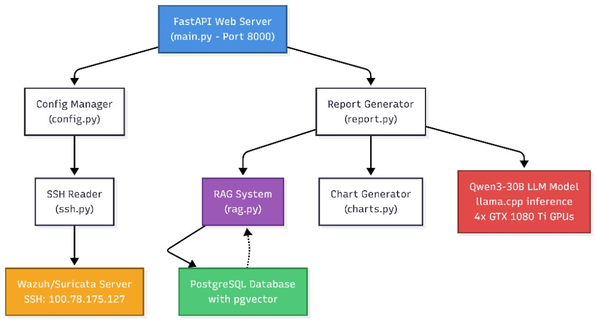
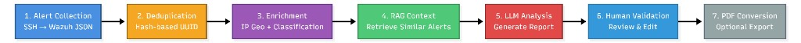
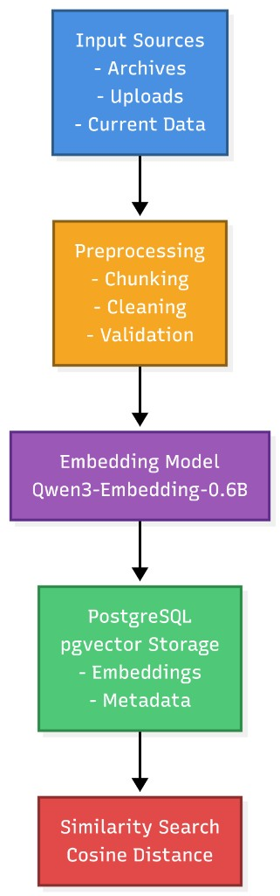
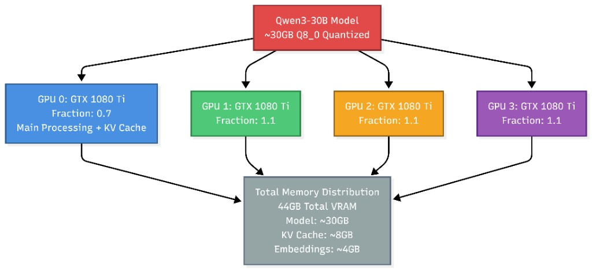

# Wazuh Telemetry Analyser

Local SOC analyser that ingests cyber threat intelligence (CTI), retrieves related context from PostgreSQL with pgvector, and uses a local Qwen3-30B GGUF model (llama.cpp) to produce Markdown threat reports from Wazuh alerts.

The FastAPI application is titled **SOC Threat Analysis with Enhanced Monitoring**, version **3.1.0**. The operator dashboard is the **Wazuh Telemetry Analyser**.

---

## Table of Contents

1. [Overview](#overview)
2. [Features](#features)
3. [System Architecture](#system-architecture)
4. [Processing Pipeline](#processing-pipeline)
5. [RAG Knowledge Base](#rag-knowledge-base)
6. [GPU Memory Distribution](#gpu-memory-distribution)
7. [Dashboard](#dashboard)
8. [Requirements](#requirements)
9. [Installation](#installation)
10. [Configuration](#configuration)
11. [Usage](#usage)
12. [Testing](#testing)
13. [Project Structure](#project-structure)
14. [Further Documentation](#further-documentation)
15. [Notes on the diagrams](#notes-on-the-diagrams)

---

## Overview

The analyser is a **local, operator-driven** web application. It does not call cloud LLM or CTI APIs. Operators authenticate with HTTP Basic Auth, build a CTI corpus, analyse Wazuh alerts (live SSH pull or uploaded JSON), review generated Markdown, and download reports as Markdown or PDF.

Typical flow:

1. Load CTI into PostgreSQL (chunk, embed, index IoCs and full text).
2. Collect alerts from Wazuh over SSH, or upload Wazuh JSON.
3. Retrieve focused hybrid RAG context (exact IoC match, lexical search, semantic search).
4. Generate a Markdown report with the local llama.cpp model.
5. Review, approve or reject, and download Markdown or PDF.

Runtime files (reports, uploads, RAG cache) are stored under the process state root, defaulting to `~/.local/state/soc-rag` (or `$XDG_STATE_HOME/soc-rag`).

---

## Features

- **Five-page dashboard** — Overview, Knowledge, Analysis, Alert viewer, Reports (`/`, `/knowledge`, `/analysis`, `/alerts/viewer`, `/library`).
- **HTTP Basic Auth** — username and password from `WEB_USERNAME` / `WEB_PASSWORD`. Browser pages and API routes require credentials. Health checks (`/health`, `/ready`) are unauthenticated.
- **Optional Wazuh SSH** — when `SSH_HOST`, `SSH_USERNAME`, and `SSH_PASSWORD` are set, the app can read `/var/ossec/logs/alerts/alerts.json` and archives under `/var/ossec/logs/archives`. Empty SSH settings run in **upload-only** mode.
- **Live high-severity monitoring** — after the RAG corpus is ready, live monitoring can flag alerts at **rule level ≥ 8** (Wazuh scale 1–16).
- **CTI ingestion** — uploads and archive imports for `.pdf`, `.docx`, `.txt`, `.md`, `.html`, `.csv`, `.tsv`, `.json`, `.stix`, `.yaml`/`.yml`, `.xml`. Content is chunked, SHA-256 hashed for reuse, embedded, and stored with metadata.
- **Hybrid RAG** — exact IoC lookup (`document_iocs`), PostgreSQL `tsvector` lexical search, and cosine similarity on 1024-d embeddings. Results are merged and gated before they are sent to the LLM. Retrieval index version: `hybrid-canonical-v4`.
- **Local inference** — Qwen3-30B GGUF through a configured llama.cpp binary. Default generation settings include temperature `0.2`, context size `16384`, and `max_tokens` `2048`.
- **Embeddings** — `Qwen/Qwen3-Embedding-0.6B` via SentenceTransformer, 1024 dimensions, stored as `vector(1024)`.
- **Progress over WebSocket** — `GET /ws/progress/{session_id}` streams RAG and analysis status. RAG progress follows backend work. Uploaded-alert analysis shows a client-side crawl of **1% every 10 seconds** up to 99% until the job finishes.
- **Human validation** — Reports can be previewed, approved, or rejected. Approved Markdown can be downloaded, and PDF conversion uses WeasyPrint (`POST /convert-to-pdf`) from each report’s **Download PDF** control.
- **Charts** — matplotlib figures can be attached to reports when the chart generator is available.
- **Hardening** — same-origin checks on state-changing HTTP methods, `Cache-Control: no-store`, CSP, frame denial, and related browser headers. Prompt and log sanitisation reduce credential leakage.

---

## System Architecture



The process starts with `python Linux_LLM/config/main.py`. That entry point validates the environment, constructs `SOCApplication`, and serves FastAPI with Uvicorn on `WEB_HOST`:`WEB_PORT` (default `127.0.0.1:8000`).

| Component | Module | Role |
| --- | --- | --- |
| FastAPI app | `Linux_LLM/config/main.py` | Routes, auth, sessions, WebSocket progress, HTML dashboard |
| Config | `Linux_LLM/config/config.py` | Environment and optional JSON overlay; `.env` via python-dotenv |
| SSH reader | `Linux_LLM/config/ssh.py` | Optional Paramiko access to Wazuh alert and archive files |
| RAG / report store | `Linux_LLM/config/report.py` | PostgreSQL schema, hybrid retrieval, report persistence |
| CTI loaders | `Linux_LLM/config/rag.py` | File-type extraction into chunks |
| LLM client | `Linux_LLM/config/llm_client.py` | llama.cpp subprocess, GPU flags, prompt file |
| Live monitoring | `Linux_LLM/config/live_monitoring.py` | High-severity alert watch after RAG is ready |
| Charts | `Linux_LLM/config/charts.py` | Optional matplotlib report figures |
| PDF | `Linux_LLM/config/pdf_converter.py` | WeasyPrint Markdown → PDF |
| Progress bus | `Linux_LLM/config/progress.py` | In-memory session progress; pending replay on reconnect |

PostgreSQL holds CTI chunks, embeddings, IoC rows, full-text vectors, and archived alert context. The LLM is a **separate local process**, not an HTTP model server.

---

## Processing Pipeline



End-to-end analysis, as implemented:

1. **Alert collection** — SSH read of Wazuh `alerts.json` / archives, or a browser upload of Wazuh JSON. Payloads are normalised in `alert_normalizer.py`.
2. **Deduplication** — CTI chunks use SHA-256 content hashes so unchanged files are not re-embedded. Analysis and report records use UUID session and report identifiers.
3. **Enrichment** — optional GeoIP (`GEOIP_DB_PATH`), asset-inventory CIDRs (`OWNED_CIDRS`, `INFRASTRUCTURE_IPS`), and alert classification for prompt grounding.
4. **RAG context** — hybrid retrieval over CTI **and** archived alerts (not “similar alerts” alone). Arms run in SAVEPOINT-isolated SQL so one failure does not abort the transaction.
5. **LLM analysis** — llama.cpp generates Markdown using the retrieved context and a bounded prompt (context and output reservations in `LLMConfig`).
6. **Human validation** — operators preview, edit constraints as implemented on the Reports page, then approve or reject.
7. **Export** — Markdown download always; PDF when WeasyPrint and its system libraries are installed.

---

## RAG Knowledge Base



**Indexing**

1. Sources: CTI archives, operator uploads, and (when SSH is enabled) Wazuh archives used as retrieval context.
2. Preprocessing: type-specific loaders, cleaning, chunking (`RAG_CHUNK_SIZE` default 1000 characters, `RAG_CHUNK_OVERLAP` default 150).
3. Embedding: `Qwen/Qwen3-Embedding-0.6B` → 1024-d vectors (`RAG_EMBEDDING_DEVICE` default `auto`).
4. Storage: PostgreSQL tables for chunks, embeddings (`vector(1024)`), `tsvector` lexical columns, and `document_iocs`.

**Retrieval**

Search is **hybrid**, not cosine-only:

- Exact IoC match on canonicalised indicators.
- Lexical rank with PostgreSQL full-text search.
- Semantic rank with cosine distance on embeddings.

Candidates are merged and passed through a precision gate before the LLM prompt is built. A vector index is considered once the corpus is large enough (`RAG_VECTOR_INDEX_MIN_ROWS`, default 1000 rows).

---

## GPU Memory Distribution



Inference uses llama.cpp. Relevant defaults:

| Setting | Environment | Default |
| --- | --- | --- |
| GPU layers | `LLM_N_GPU_LAYERS` | `-1` (all layers on GPU when the binary supports it) |
| Tensor split | `LLM_TENSOR_SPLIT` | empty — llama.cpp **equal split** across visible devices |
| Context | `LLM_CONTEXT_SIZE` | `16384` |
| Predict | `LLM_MAX_TOKENS` | `2048` |
| Temperature | `LLM_TEMPERATURE` | `0.2` |

The figure is an **example lab overlay** (Qwen3-30B Q8_0, four GTX 1080 Ti cards, fractions `0.7,1.1,1.1,1.1`). The application does **not** hard-code that split. To reproduce it, set `LLM_TENSOR_SPLIT=0.7,1.1,1.1,1.1`. Model path, quantisation, and VRAM breakdown depend on the GGUF you configure in `LLM_MODEL_PATH`.

---

## Dashboard

Jinja templates under `Linux_LLM/config/templates/` with shared chrome in `_base.html` and `_nav.html`.

| Page | Path | Purpose |
| --- | --- | --- |
| Overview | `/` | Knowledge-base metrics, workspace links, JSON diagnostics (`/system-status`, `/test-connection`) |
| Knowledge | `/knowledge` | Build or extend the CTI corpus; RAG progress from the backend |
| Analysis | `/analysis` | Analyse live or uploaded alerts |
| Alert viewer | `/alerts/viewer` | Inspect and select live telemetry when SSH monitoring is enabled |
| Reports | `/library` | Preview Markdown, approve/reject, download `.md` or PDF |

There is no separate “PDF conversion” panel. Conversion is per report via **Download PDF**.

Unauthenticated JSON:

- `GET /health` — liveness
- `GET /ready` — readiness (configuration and database)

---

## Requirements

- **Python 3.10+**
- **PostgreSQL** with the **pgvector** extension; database and role as in `.env` (`DB_NAME` default `soc_rag`, `DB_USER` default `soc_user`)
- **llama.cpp** binary (`LLM_LLAMA_CPP_PATH`) and a **Qwen3-30B GGUF** (`LLM_MODEL_PATH`)
- Python packages in `Linux_LLM/requirements.txt` (FastAPI `0.118.2`, Uvicorn, psycopg2-binary, pgvector, sentence-transformers, PyTorch CPU wheel as pinned, Paramiko, WeasyPrint, matplotlib, and related libraries)
- Optional: GeoLite2 `.mmdb` at `GEOIP_DB_PATH`
- Optional: WeasyPrint system libraries for PDF export
- NVIDIA GPU stack only if you run GPU llama.cpp; the analyser also supports CPU inference if the binary allows it

---

## Installation

From the repository root:

```bash
python3 -m venv .venv
source .venv/bin/activate
pip install -r Linux_LLM/requirements.txt
```

1. Install PostgreSQL and pgvector. Create the database and user matching `DB_*`.
2. Copy `Linux_LLM/.env.example` to `Linux_LLM/.env` (or export the same variables in the environment). Fill in secrets; do not commit `.env`.
3. Point `LLM_LLAMA_CPP_PATH` at the llama.cpp executable and `LLM_MODEL_PATH` at the GGUF file.
4. Leave `SSH_*` empty for upload-only analysis, or set host, user, password, and known_hosts policy for live Wazuh access.

Start the server:

```bash
python Linux_LLM/config/main.py
```

The process binds to `WEB_HOST`:`WEB_PORT`. Open that URL in a browser and sign in with `WEB_USERNAME` / `WEB_PASSWORD`.

---

## Configuration

All settings are documented in `Linux_LLM/.env.example`. `SOCConfig` loads environment variables (and an optional JSON overlay passed as `python Linux_LLM/config/main.py /path/to/config.json`).

### Web

| Variable | Default | Purpose |
| --- | --- | --- |
| `WEB_HOST` | `127.0.0.1` | Bind address |
| `WEB_PORT` | `8000` | Bind port |
| `WEB_USERNAME` | *(required)* | HTTP Basic user |
| `WEB_PASSWORD` | *(required)* | HTTP Basic password |

### Database

| Variable | Default | Purpose |
| --- | --- | --- |
| `DB_HOST` | `localhost` | PostgreSQL host |
| `DB_PORT` | `5432` | PostgreSQL port |
| `DB_NAME` | `soc_rag` | Database name |
| `DB_USER` | `soc_user` | Role |
| `DB_PASSWORD` | *(required)* | Role password |
| `DB_AUTO_CREATE` | `false` | Create the database if missing |

### SSH / Wazuh (optional)

| Variable | Default | Purpose |
| --- | --- | --- |
| `SSH_HOST` | empty | Wazuh host; empty disables SSH |
| `SSH_USERNAME` / `SSH_PASSWORD` | empty | SSH credentials |
| `SSH_PORT` | `22` | SSH port |
| `SSH_TIMEOUT` | `30` | Seconds |
| `SSH_ALLOW_UNKNOWN_HOST` | `false` | Lab-only host-key bypass |
| `SSH_KNOWN_HOSTS` | empty | Known-hosts file when strict checking is used |
| `WAZUH_ALERTS_PATH` | `/var/ossec/logs/alerts/alerts.json` | Live alerts file |
| `WAZUH_ARCHIVES_PATH` | `/var/ossec/logs/archives` | Archive directory |

### LLM

| Variable | Default | Purpose |
| --- | --- | --- |
| `LLM_MODEL_PATH` | *(required for analysis)* | GGUF path |
| `LLM_LLAMA_CPP_PATH` | *(required for analysis)* | llama.cpp binary |
| `LLM_N_GPU_LAYERS` | `-1` | Layers on GPU |
| `LLM_TENSOR_SPLIT` | empty | Optional per-GPU fractions |
| `LLM_CONTEXT_SIZE` | `16384` | Context window |
| `LLM_MAX_TOKENS` | `2048` | Generation cap |
| `LLM_TEMPERATURE` | `0.2` | Sampling temperature |
| `LLM_TIMEOUT` | `1200` | Subprocess timeout (seconds) |

### RAG

| Variable | Default | Purpose |
| --- | --- | --- |
| `RAG_EMBEDDING_MODEL` | `Qwen/Qwen3-Embedding-0.6B` | SentenceTransformer id |
| `RAG_EMBEDDING_DIMENSIONS` | `1024` | Vector width |
| `RAG_EMBEDDING_DEVICE` | `auto` | `cpu`, `cuda`, or auto |
| `RAG_CHUNK_SIZE` | `1000` | Chunk size (characters) |
| `RAG_CHUNK_OVERLAP` | `150` | Chunk overlap |
| `RAG_VECTOR_INDEX_MIN_ROWS` | `1000` | Minimum rows before a vector index is used |

### Paths

| Variable | Default | Purpose |
| --- | --- | --- |
| `REPORTS_DIR` | `$XDG_STATE_HOME/soc-rag/reports` | Generated reports |
| `UPLOADS_DIR` | `$XDG_STATE_HOME/soc-rag/uploads` | Incoming uploads |
| `GEOIP_DB_PATH` | empty | Optional MaxMind DB |

Set `SOC_PRODUCTION=true` to enable extra production-readiness checks surfaced on Overview.

---

## Usage

1. Sign in at the bind address with HTTP Basic credentials.
2. Open **Knowledge** and build or extend the CTI corpus. Wait until Overview shows the knowledge base as ready.
3. If SSH is configured, use **Alert viewer** and **Analysis** against live Wazuh data. Otherwise upload Wazuh alert JSON on **Analysis**.
4. Watch the progress bar. RAG indexing reports backend percentages. Uploaded-alert analysis crawls to 99% in 1% steps every 10 seconds, then jumps to 100% on success.
5. Open **Reports** to preview Markdown, approve or reject, and download `.md` or PDF.

SSH hostnames and credentials are **not** rendered in the dashboard; Overview only shows whether SSH is configured.

---

## Testing

From `Linux_LLM/`:

```bash
python -m unittest discover -s tests -p 'test_*.py'
```

Hygiene (forbidden production paths, debug leftovers, personal filesystem strings in production Python):

```bash
python check_repository.py
```

Do not point tests at production `REPORTS_DIR` / `UPLOADS_DIR`.

---

## Project Structure

```
.
├── README.md
├── images/
│   ├── main.png          # Application component diagram
│   ├── pipeline.png      # Alert → report pipeline
│   ├── rag.png           # Embedding and storage flow
│   └── setup.png         # Example GPU memory layout
├── check_repository.py   # Repository hygiene checker
├── docs/
│   ├── operations.md
│   └── engineering-handover.md
└── Linux_LLM/
    ├── .env.example
    ├── requirements.txt
    ├── config/
    │   ├── main.py               # FastAPI application
    │   ├── config.py             # Configuration
    │   ├── ssh.py                # Optional Wazuh SSH
    │   ├── rag.py                # CTI loaders
    │   ├── report.py             # DB, hybrid RAG, reports
    │   ├── llm_client.py         # llama.cpp runner
    │   ├── live_monitoring.py    # High-severity watch
    │   ├── progress.py           # WebSocket progress bus
    │   ├── charts.py
    │   ├── pdf_converter.py
    │   ├── alert_normalizer.py
    │   ├── ioc_normalizer.py
    │   ├── cti_artifacts.py
    │   ├── prompt_safety.py
    │   ├── report_parser.py
    │   ├── runtime_preflight.py
    │   ├── runtime_utils.py
    │   ├── static/               # soc.css, js/script.js
    │   └── templates/            # Jinja dashboard
    └── tests/
```

---

## Further Documentation

- `Linux_LLM/.env.example` — full environment reference
- `docs/operations.md` — runbook (start, corpus, analysis, PDF, troubleshooting)
- `docs/engineering-handover.md` — module map and behaviour notes

---

## Notes on the diagrams

The four figures are restored from the previous README. They still describe the system, with these code-backed differences:

- **Architecture (`images/main.png`)** — Wazuh SSH is optional and configured with `SSH_HOST`, not a hard-coded address. The diagram’s host is a lab example only.
- **Pipeline (`images/pipeline.png`)** — step 2 uses content hashes for CTI and UUIDs for sessions/reports. Step 4 retrieves **CTI plus archived alerts** via hybrid search. PDF export is a per-report download, not a separate Reports-page conversion panel.
- **RAG (`images/rag.png`)** — cosine similarity is one arm of hybrid retrieval, alongside exact IoC match and lexical `tsvector` search.
- **GPU (`images/setup.png`)** — fractions `0.7,1.1,1.1,1.1` are an example `LLM_TENSOR_SPLIT`. The default empty split is equal distribution across devices.
