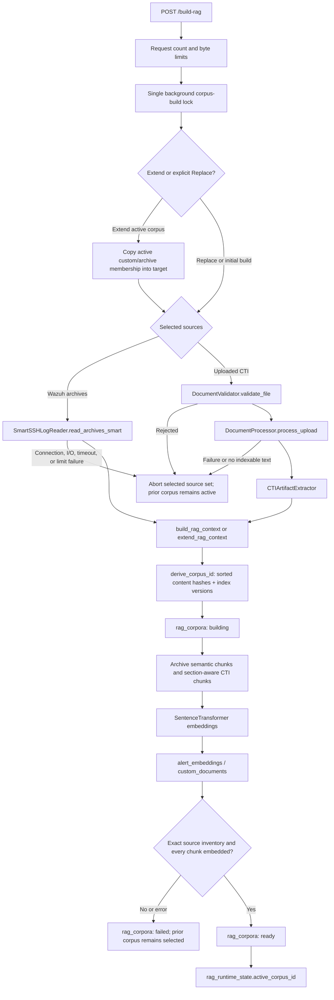

# RAG architecture

This document describes the production data flow implemented under `Linux_LLM/config`. It is intentionally about runtime behavior, not evaluation harnesses or historical benchmark results.

## Authoritative components

| Responsibility | Authoritative module and interface |
| --- | --- |
| Application composition, authentication, routes, background tasks | `main.py` — `SOCApplication` |
| Central configuration | `config.py` — `ConfigManager` and its dataclass sections |
| Wazuh SSH collection | `ssh.py` — `SmartSSHLogReader`, `AlertsReader`, `ArchiveReader` |
| CTI upload validation and extraction | `rag.py` — `DocumentValidator`, `DocumentProcessor`, format-specific processors |
| CTI artifacts, roles, dispositions, quality | `cti_artifacts.py` — `CTIArtifactExtractor` |
| Corpus identity, PostgreSQL schema, embeddings, retrieval | `report.py` — `RAGContextManager` |
| Current-alert evidence and asset direction | `report.py` — `AlertAnalyzer` |
| Context selection, prompting, report guardrails | `report.py` — `ReportFormatter` helpers used through `EnhancedReportFormatter` |
| Runtime report orchestration, one shared generation gate, and metrics | `report.py` — `ReportGenerator` |
| Local Qwen3-30B/llama.cpp invocation | `llm_client.py` — `ChatTemplateManager`, `LlamaModelClient` |
| Report editor round trip | `report_parser.py` — `ReportParser` |
| Progress sessions | `progress.py` — `ProgressTracker` |
| Optional charts | `charts.py` — `SOCChartGenerator` |
| Optional Markdown-to-PDF rendering | `pdf_converter.py` — `EnhancedPDFConverter` |
| Bounded, path-sanitized failure stacks | `runtime_utils.py` — `log_sanitized_exception` |

`SOCApplication._init_components()` is the composition root. It creates one `DocumentProcessor` and one `ReportGenerator`. `ReportGenerator` owns the process-wide `RAGContextManager`, `AlertAnalyzer`, LLM client, and `EnhancedReportFormatter`. Code outside these paths should not implement a second alert parser, corpus selector, retriever, or report audit.

## Core contracts

### Processed CTI document

`DocumentProcessor.process_upload()` returns:

```python
(
    extracted_text,
    {
        "filename": "display metadata only",
        "type": "pdf | docx | text | ...",
        "content_hash": "sha256 of uploaded bytes",
        "processor_version": "extraction pipeline version",
        "cti_artifacts": {...},
        "artifact_counts": {...},
        "document_quality": {...},
        # format-specific provenance
    },
)
```

The upload filename is retained for display and provenance. It is not part of semantic, lexical, or exact-match evidence. Corpus and canonical identities are derived from content and version inputs.

### Cleaned current alert

`AlertAnalyzer.clean_log_data()` produces a compact dictionary whose important fields include:

- timestamp, rule ID/description/level, agent name/IP;
- source/destination address, port, protocol, application protocol, and direction;
- HTTP, DNS, TLS, email, IOC, process, file, SMB, Modbus, ICS, Windows, network, vulnerability, threat, and ATT&CK context when present;
- `src_ip_context`, `dest_ip_context`, and `threat_classification` based on configured asset inventory;
- `raw_alert_artifacts`, `observed_iocs`, `behavior_tags`, `response_focus`, `priority_reason`, `directional_focus`, and `retrieval_fingerprint`;
- `_canonical_normalized_version`, `_evidence_provenance`, and bounded unknown security fields for manually normalized uploads.

The cleaned alert is the authoritative incident-evidence contract used by retrieval, prompting, audit, charts, and deterministic fallback reports.

### Retrieval candidate

`RAGContextManager` returns dictionaries shaped like:

```python
{
    "id": 123,
    "content": "stored text excerpt",
    "metadata": {...},
    "source": "archive | custom_document",
    "score": 1.36,
    "match_types": ["exact", "semantic"],
    "match_evidence": ["domain matched ..."],
}
```

`ReportFormatter` adds `context_rank_score`, `source_reliability`, `evidence_strength`, current IOC overlap, historical-only artifacts, behavior alignment, artifact dispositions, and reviewer cautions before text reaches the model.

## Corpus build



### 1. Intake and validation

The dashboard submits `build_mode`, `use_archives`, `use_uploads`, `ragDays`, and `customFiles` to `POST /build-rag`. Extend is the default; Replace requires an explicit confirmation field. The route applies configured file-count and byte limits while consuming each `UploadFile`. Starlette/FastAPI may already have parsed and spooled multipart parts before endpoint code sees them, so a trusted reverse proxy or ASGI ingress must also cap the total request body before multipart parsing. A process-local build guard rejects a second dashboard build while one is already running, instead of allowing two builders to interleave database state.

`DocumentValidator` applies extension-specific per-file limits, rejects empty files and executable signatures, and verifies that DOCX ZIP containers stay within 500 entries and 25 MiB expanded data. It also rejects encrypted, traversing, symlink, high-ratio, and CRC-invalid DOCX members. The production upload path does not accept ZIP or TAR corpus bundles, so it has no general archive-extraction path. Current Wazuh reads cap line count, total bytes, and each line with `MAX_CURRENT_ALERT_LINES`, `MAX_CURRENT_ALERT_BYTES`, and `MAX_ALERT_LINE_BYTES`. Remote Wazuh `.json.gz` files are streamed through `gzip.GzipFile`; they are not unpacked into the local filesystem. One archive request is bounded by `MAX_ARCHIVE_DAYS`, `MAX_ARCHIVE_RECORDS`, `MAX_ARCHIVE_BYTES` of expanded JSON across all selected days/files, and `MAX_ARCHIVE_LINE_BYTES` per record.

The application runs blocking document extraction, system preflight, database status, alert normalization, and SSH connect/read/disconnect work on its owned `ThreadPoolExecutor`, bounded by `MAX_WORKER_THREADS`. A shared non-blocking admission semaphore caps active plus queued executor submissions; `MAX_BACKGROUND_TASKS` separately caps tracked workflows. Persistent monitoring uses the same executor/admission boundary and serializes its SSH lifecycle with one I/O lock. The web event loop therefore remains available while these operations run. Its one final disconnect bypasses normal request admission but still runs off-loop, so pool saturation cannot strand the SSH client. Normal shutdown gates new work and monitoring restarts, terminates active llama.cpp children, awaits already admitted non-preemptible workflows through their commit/cleanup boundary, performs a final monitoring stop, drains the executor, and then closes GeoIP and PostgreSQL resources. Later cleanup steps are still attempted if an earlier step raises.

The web worker processes validated documents in memory and does not persist extracted upload bodies to the source checkout. Reports and upload state default below `${XDG_STATE_HOME:-$HOME/.local/state}/soc-rag`, while templates default to the source `config/templates` directory; deployments may override those paths.

### 2. Extraction and fallback

Format-specific processors convert each accepted document into searchable text and metadata:

- `PDFProcessor` uses PyMuPDF for sorted page text, selectively includes CTI-like tables and links, records image markers, and closes the PDF. It rejects more than 1,000 pages or 5,000,000 extracted characters.
- If PyMuPDF fails or produces sparse text, the pinned pypdf extractor is used when it recovers useful text or additional CTI artifacts.
- No OCR is performed. Image-heavy or low-density PDFs receive extraction-quality warnings.
- `DOCXProcessor`, `TextProcessor`, `MarkdownProcessor`, `HTMLProcessor`, `CSVProcessor`, `JSONProcessor`, `YAMLProcessor`, and `XMLProcessor` preserve useful structure without treating transport filenames as evidence. PyYAML is pinned; its loader bounds aliases, composed/expanded nodes, scalar expansion, and nesting, rejects cycles/amplification, and still supports ordinary aliases and merge keys.
- Structured JSON/STIX extraction supplements regex extraction for actors, aliases, malware, campaigns, tools, courses of action, indicators, vulnerabilities, and ATT&CK identifiers.

Corrupt or unsupported documents fail deterministically. Every selected uploaded document must contribute an indexable summary or chunk; a low-quality/empty source cannot hide behind another document or archive. Requested archive lines must be UTF-8 JSON objects, and every expanded record must produce indexable text. A malformed record, connection/I/O/timeout failure, or record/expanded-byte/line-size limit aborts the complete source set. Missing daily archive files remain ordinary absent days. Progress reports the failure and the previous active corpus remains selected.

### 3. Artifact semantics

`CTIArtifactExtractor` normalizes URLs, refangs common CTI notation, validates IP boundaries, and extracts domains, email addresses, hashes, CVEs, ATT&CK technique IDs, actors, and aliases.

Non-public, documentation, loopback, link-local, multicast, victim, benign, analysis-environment, and remediation-reference indicators remain available for provenance but are not promoted as attacker infrastructure. Section labels such as `attribution`, `ioc_listing`, `ttp_behavior`, `remediation`, `victim_infrastructure`, and `analysis_environment` help determine how an artifact may be used.

### 4. Identity and duplicate handling

`RAGContextManager.corpus_version_manifest()` records every deterministic index input: corpus schema, retrieval index, extraction pipeline, embedding model/dimensions/normalization, document chunk size/overlap, and document embedding instruction.

`derive_corpus_id()` hashes:

```text
sorted unique source content hashes + corpus version manifest
```

Directory order and filenames do not select a corpus. Identical uploaded bytes are deduplicated at intake. Text-equivalent republications may have different source hashes in the manifest but converge on the same canonical `raw_document_hash`, allowing chunk conflict handling and canonical aggregation to avoid repeated evidence.

Archive rows use a stable hash of the alert body; display paths are provenance and must not contribute to ranking or cache identity.

### 5. Chunk construction

`RAGContextManager._add_archive_logs()` converts each archive alert into one semantic chunk with security metadata and a stable alert hash.

`RAGContextManager._add_custom_docs()` creates:

- one optional document-summary chunk containing body-derived artifacts, behavior, context labels, dispositions, and extraction quality; and
- section-aware chunks built by `_chunk_text_with_sections()` using `document_chunk_size` and `document_chunk_overlap`.

Artifact extraction is chunk-local. Document-wide artifact metadata is retained separately for diagnostics and source-context expansion. Each row stores its corpus ID, content/canonical hashes, chunk index/count, section provenance, artifacts, roles, dispositions, quality, and extraction version.

### 6. Embeddings and storage

`RAGContextManager._encode_texts()` prepends the configured query or document instruction and uses `SentenceTransformer`.

- Queries and small batches use `embedding_device`.
- Large document/archive batches may use `embedding_devices` through a SentenceTransformers multi-process pool once `embedding_multi_gpu_min_chunks` is reached.
- A multi-device failure falls back once to the configured single device.
- Embedding dimensions are checked before values enter PostgreSQL.

The known operational constraint is that the installed PyTorch/SentenceTransformers build must match the host NVIDIA driver and CUDA runtime. CPU embedding is supported and is the safest compatibility fallback, but it is slower.

### 7. Database schema

`RAGContextManager._init_schema()` owns the pgvector extension and four tables:

| Table | Purpose |
| --- | --- |
| `alert_embeddings` | Corpus-scoped historical Wazuh archive chunks, metadata, vectors, timestamps, and retention fields. |
| `custom_documents` | Corpus-scoped uploaded CTI and approved-report summary/section chunks, metadata, and vectors. |
| `rag_corpora` | Corpus manifest, `building`/`ready`/`failed` status, counts, error, and lifecycle timestamps. |
| `rag_runtime_state` | Runtime key/value state; `active_corpus_id` is the retrieval namespace pointer. |

Composite unique indexes on `(corpus_id, alert_hash)` and `(corpus_id, doc_hash)` make insertion idempotent within a namespace. IVFFlat indexes support vector search; GIN indexes support JSONB and full-text search.

### 8. Activation and failure isolation

`build_rag_context()` constructs an initial or explicitly replaced source-set snapshot. `extend_rag_context()` constructs the immutable union of the active snapshot and new archive/document sources. Both validate requested inputs, derive a content-and-version target ID, and record `building` before indexing. Readiness requires the stored source inventory to match the manifest, every stored chunk to have an embedding, and the lifecycle chunk count to match the rows. `_set_active_corpus()` updates `rag_runtime_state` in the same final transaction. An exception rolls back under the database lock and records a bounded error on the failed namespace.

When extending a legacy untyped manifest, the combined manifest hash set and lifecycle counts must exactly equal the identities derived from its rows; otherwise migration is refused. Requested sources already present in the active inventory are filtered before indexing, which keeps overlap and legacy chunk-key transitions idempotent.

Corpus mutation and active-corpus switching are serialized inside the application process. Retrieval takes a stable active-corpus snapshot for the duration of each read so a simultaneous activation cannot combine rows from two namespaces. These are process-local locks, so the supported deployment runs one application worker; multiple Uvicorn/Gunicorn workers would require an external database/advisory lock design that is not implemented.

An ordinary dashboard Extend operation unions the active corpus with the selected sources. It copies both custom-document and archive membership into a new namespace, adds only new content, validates the full target, and activates atomically. Status failure or an invalid active namespace blocks extension; it never silently falls back to replacement. `add_custom_documents()` is a compatibility wrapper over this generalized extension path. Replace remains an explicit operation for intentional source removal or a full rebuild.

### 9. Corpus status and switching

`RAGContextManager.get_rag_status()` distinguishes stored active versions from configured versions and reports the active union's uploaded source-document count, archive-record count, document chunks, and total chunks. It disables readiness on any model, normalization, instruction, extraction, index, or chunking mismatch—even at the same vector dimension. `list_corpora()` returns at most 20 recent lifecycle summaries (always including the active row) plus total/returned/truncated counts; it never sends the potentially large source-hash manifests. `activate_corpus()` accepts only a complete, embedded, ready, version-compatible namespace. Legacy unscoped vectors have no trustworthy version manifest, remain untouched for recovery, and are never relabelled or activated implicitly.

There is no destructive database-clear route in the production FastAPI application. Corpus rollback is an authenticated maintenance action performed from the host with a database backup and the service quiesced; see [Operations](operations.md#activate-or-roll-back-a-corpus).

## Manual Alert Analysis

```mermaid
flowchart TD
    PAGE["Dashboard Manual Alert Analysis"] --> POST["POST /analyze-alerts"]
    POST --> PARSE["_parse_uploaded_alert_template or Wazuh SSH read"]
    PARSE --> NORMALIZE["_normalize_uploaded_alert_shape"]
    NORMALIZE --> CLEAN["AlertAnalyzer.clean_log_data"]
    CLEAN --> EVIDENCE["IOCs, direction, behavior, ATT&CK, provenance"]
    EVIDENCE --> TERMS["Exact terms + focused semantic queries"]
    TERMS --> HYBRID["RAGContextManager._hybrid_search"]
    HYBRID --> RANK["Canonical merge, rank, diversity, evidence annotation"]
    RANK --> EXPAND["2–4 complementary passages inside already-selected top document"]
    EXPAND --> SYNTHESIS["Canonical incident synthesis with provenance, sequence, correlation limits, attribution boundary, ATT&CK classes, actions"]
    SYNTHESIS --> BOUNDARY["Current-alert facts + source-bound historical CTI"]
    BOUNDARY --> QWEN["LlamaModelClient.generate_response"]
    QWEN --> STRUCTURE{"Required report structure?"}
    STRUCTURE -->|No| RETRY["One strict generation retry"]
    RETRY -->|Still no| FALLBACK["Deterministic report"]
    STRUCTURE -->|Yes| CLAIMS["Post-generation evidence audit"]
    RETRY --> CLAIMS
    FALLBACK --> CLAIMS
    CLAIMS -->|Repairable claim| REPAIR["Target only the affected direction, outcome, actor, ATT&CK, artifact, or action claim"]
    REPAIR -->|Structurally unusable or pervasive risk remains| CLOSED["Analyst-review-required report"]
    CLAIMS -->|Safe| DRAFT["ReportParser + in-memory draft"]
    REPAIR --> DRAFT
    CLOSED --> DRAFT
    DRAFT --> REVIEW["/review-report/{report_id}"]
    REVIEW --> APPROVE["validate, save Markdown, optional PDF, additive RAG index"]
```



### 1. Frontend request and background delivery

`dashboard.html` provides the alert upload and analysis controls. `static/js/script.js::analyzeAlerts()` submits `include_charts` and optional `alertTemplate` to `POST /analyze-alerts`.

The route validates that RAG is ready, parses the upload before scheduling work, creates a progress session, and starts `SOCApplication._analyze_alerts_with_progress()`. Its response includes `poll_timeout_ms`, calculated from `LLM_TIMEOUT` plus a cleanup margin. The browser follows progress and polls `GET /api/check-analysis-result/{session_id}` until that backend-supplied deadline. When parsing succeeds, the background task stores the structured draft in memory and the browser navigates to `GET /review-report/{report_id}`.

The source label for a manual upload is the generic `Manual uploaded alert`; the client filename is never evidence.

Selected-document passage expansion is a post-ranking read. It is restricted by the selected document's canonical hash, does not query for another source, does not increase global `k`, and does not feed back into merge/rank/diversity. The ranked source manifest therefore remains the retrieval audit trail. The synthesis step explicitly keeps alert direction separate from IP actionability, malware-family association separate from actor attribution, and explicit/inferred/historical ATT&CK evidence in separate classes.

The report audit emits `BLOCKING`, `REPAIRABLE`, or `ADVISORY` findings with a claim type. Isolated repairable findings modify only affected claims. A complete fallback is reserved for structurally unusable drafts or pervasive high-risk findings that survive targeted repair. `ReportParser` preserves rich incident, attribution, ATT&CK, response, technical, table, and citation Markdown across the editor; the footer action total is recomputed only from explicit Immediate Actions list items.

Browser responses are no-store and carry CSP, anti-framing, nosniff, referrer, cross-origin, and permissions headers. State-changing HTTP requests and authenticated progress WebSockets enforce a same-host browser origin boundary. The live-alert table receives only rendered summary fields and a SHA-256 identity over the canonical full record; selection re-fetches the alert server-side, so complete Wazuh objects are not exposed to the page. Report Markdown is rendered through an inert element/URL allowlist, and only authenticated local chart images are retained.

### 2. Accepted alert shapes

`SOCApplication._parse_uploaded_alert_template()` accepts UTF-8/UTF-8-BOM JSON, JSONL, and NDJSON as:

- a single object;
- a list of objects;
- an object with an `alerts` list;
- an object with an `affected_items` list;
- an object with `data.affected_items`;
- one JSON object per non-empty line.

`_normalize_uploaded_alert_shape()` accepts native Wazuh objects and Elasticsearch `_source` wrappers. It maps direct Suricata EVE keys and nested/dotted ECS fields into the Wazuh-style fields consumed by `AlertAnalyzer`; it also parses bounded embedded JSON from `full_log` and `event.original`.

Canonical values do not erase source evidence. `_raw_alert`, `_evidence_provenance`, and bounded `_unknown_security_fields` retain the original shape for analyst/debug use. Normalization is versioned and idempotent.

### 3. Current evidence extraction

`AlertAnalyzer.clean_log_data()` owns the production current-alert contract. It:

1. expands wrappers and normalizes scalar types;
2. copies rule, agent, network, application, process, file, vulnerability, Windows, and ICS fields;
3. classifies addresses against `AssetInventoryConfig` as infrastructure, owned, internal, non-global, external, or unknown;
4. derives inbound, outbound, lateral, external, or infrastructure direction;
5. extracts raw and structured IOC evidence;
6. validates explicit ATT&CK IDs against `mitre_techniques.json`;
7. derives coarse behavior tags and response focus; and
8. builds retrieval and priority summaries.

Private or monitoring addresses are not automatically attacker infrastructure. Generic TLS traffic is not classified as C2 without callback/beacon language, direction, or another corroborating network indicator.

### 4. ATT&CK categories

`AlertAnalyzer._merge_mitre_values()` validates explicit IDs carried by current alert metadata and retains provenance, invalid IDs, deprecated IDs, and name mismatches.

`ReportFormatter._mitre_evidence_categories()` keeps three disjoint sets:

- `explicit_current`: valid IDs explicitly present in current alert metadata;
- `inferred_current`: deterministic mappings from current behavior tags;
- `historical_only`: IDs found only in selected CTI documents.

The prompt labels all three categories. Historical-only IDs may be mentioned only as historical context, hunt ideas, or hypotheses—not as observed current behavior.

### 5. Exact and focused query construction

`ReportFormatter._select_representative_alerts()` selects high-value, non-duplicate alerts from the full batch rather than trusting input order.

`_build_exact_terms_from_alerts()` builds typed terms for rule and signature IDs, directional IPs, attacker-relevant CTI IPs, domains, URLs, hashes, CVEs, ATT&CK IDs, signatures, actors/aliases, malware, campaigns, tools, courses of action, and high-signal keywords.

`_build_focused_retrieval_queries()` produces a small set of queries from those exact terms, observed IOCs, rule/signature text, behavior tags, and response focus. Low-signal generic words, common process names, numeric versions, and generic filenames are removed.

### 6. Hybrid retrieval

For every focused query, `_retrieve_context_for_alerts()` calls `RAGContextManager.get_retriever()`, `search_custom_documents()`, or `search_archive_alerts()`.

`_hybrid_search()` gathers three candidate families from the stable active corpus:

- **semantic:** cosine similarity over pgvector, subject to `similarity_threshold`;
- **exact:** typed metadata/artifact/content candidates followed by boundary-aware Python evidence validation; and
- **lexical:** PostgreSQL `to_tsvector('simple', content)` with `plainto_tsquery`.

Exact IP/domain/URL matching refangs common CTI notation and enforces token boundaries. Hash, URL, domain, and attacker-relevant IP evidence outrank broad ATT&CK-only overlap. Display fields such as filename and path are removed from evidence/ranking metadata.

For uploaded CTI, semantic and lexical SQL choose the best chunk per canonical raw document. Exact candidates are validated before `_best_exact_candidate_per_canonical_document()` selects a representative. `_expand_custom_document_context_from_exact_hits()` may add nearby or named sections from the same source, labeled `source_context`; those passages provide background, not independent current evidence.

### 7. Canonical ranking and evidence quality

`_merge_hybrid_results()` combines match types, scores, and evidence for the same row. `ReportFormatter._dedupe_context_docs()` merges candidates seen through multiple focused queries.

`_select_relevant_context_docs()` ranks candidates using:

- validated exact evidence strength;
- lexical hits and semantic similarity;
- source-context linkage;
- archive severity;
- source reliability;
- current/document behavior overlap or mismatch; and
- number of evidence items.

`_apply_context_source_document_diversity()` prefers distinct canonical source documents. `_annotate_context_docs()` computes high/medium/low evidence strength, current IOC overlap, historical-only artifacts, source reliability, section labels, behavior alignment, artifact dispositions, extraction quality, and cautions.

`_filter_context_docs_by_evidence_quality()` admits all selected high/medium sources up to the prompt limit, caps low evidence to one when stronger evidence exists, and caps weak-only context to two. Zero candidates is a valid no-match result.

### 8. Current-versus-historical boundary

`_generate_with_full_rag()` builds distinct prompt sections:

- `CURRENT ALERTS DATA` and `CURRENT ALERT — AUTHORITATIVE OBSERVATIONS`;
- explicit/inferred/historical ATT&CK evidence;
- configured asset inventory;
- `RETRIEVED HISTORICAL CTI — SOURCE-BOUND EXCERPTS` with evidence labels; and
- conflicts, attribution policy, and output contract.

Retrieved text is untrusted input. It cannot override the system prompt or output contract. The model is instructed that historical artifacts and techniques are not current observations and that weak/semantic-only/behavior-mismatched context is background only.

### 9. Model invocation

The current model family is Qwen3-30B served by the local, configurable `llama-cli` binary and GGUF path. `ReportGenerator` owns one non-blocking generation gate shared by Manual Alert Analysis and automatic monitoring, so only one local-model workload can consume GPU/RAM at a time. A concurrent request is rejected rather than queued invisibly.

`LlamaModelClient.generate_response()`:

1. applies Qwen control tokens;
2. uses `ChatTemplateManager` and the configured system/chat templates;
3. budgets the prompt against `context_size`, preserving current evidence and the output contract when compaction is necessary;
4. writes the prompt to a temporary UTF-8 file;
5. invokes configured `llama-cli` arguments without a shell;
6. enforces `LLM_TIMEOUT` and kills a timed-out child;
7. retries once without optional Qwen template arguments only when the installed llama.cpp rejects them;
8. strips echoed control/reasoning tokens; and
9. removes the temporary prompt file in all paths.

The child starts in a separate process session and is killed and reaped on timeout or launch/communication failure. User-facing failures are stable messages; normal logs retain only the failure category, stderr length, and a short stderr SHA-256 prefix. Full argument logging requires `LLM_DEBUG_COMMANDS=true`, and prompt/stderr content is never logged.

Manual and automatic generation execute through the application-owned worker executor. Their asynchronous deadline is `LLM_TIMEOUT` plus 30 seconds for process cleanup; the browser polling deadline includes a larger response margin. On timeout or application shutdown, the client sets its cancellation state, terminates tracked llama.cpp process groups, prevents an optional-argument compatibility retry from starting, and allows the executor to drain before resource closure.

Relevant generation settings are model/binary path, temperature, top-p, top-k, context size, output tokens, timeout, thinking mode, GPU layers, tensor split, batch sizes, threads, and KV-cache types. See [Operations](operations.md#configuration-reference).

### 10. Generation validation and audit

`_generate_llm_report_with_guardrails()` requires a substantive report with Executive Summary, Key Findings, and immediate/recommended actions. An invalid first result receives one strict repair prompt. A second invalid result is replaced by `_build_deterministic_report()`.

`_audit_report_claims()` then evaluates high-risk claims:

- named actor or attribution language without a high/medium attribution passage and attacker-relevant current IOC overlap;
- unknown, deprecated, unsupported, or incorrectly current ATT&CK IDs;
- artifacts mentioned from low-strength historical context as though current;
- block/disable/isolate targets not present in the current alert;
- benign, victim, analysis-environment, remediation-reference, non-global, or low-signal targets;
- containment of unobserved hosts; and
- patching without current vulnerability/product evidence.

`_finalize_report_with_audit()` quarantines unsafe model output, substitutes one deterministic repair, and reruns the audit. If blocking findings remain, `_build_analyst_review_required_report()` emits only current-alert facts, explicit current ATT&CK metadata, safe review actions, and an explicit abstention from unsupported attribution.

The editor preserves finalization, RAG-source, QA, and chart appendices that are not directly editable. Approval strips generated evidence/QA/chart appendices from the copy indexed back into RAG, limiting self-reinforcing feedback loops.

### 11. Actor attribution and abstention

A named actor requires both:

1. a selected high/medium source labeled `attribution`; and
2. current-alert overlap on a strong artifact type—IP, domain, URL, or hash—whose CTI disposition is not benign, victim, analysis environment, or remediation reference.

Actor names in unrelated CTI, semantic similarity, generic behavior, ATT&CK overlap, or current alert text alone do not satisfy the attribution policy. When support is absent or conflicting, the report must say that evidence is insufficient for specific attribution.

### 12. Remediation grounding

Recommended actions are derived from current direction, host, process, file, domain, hash, vulnerability, and service evidence. Historical CTI may suggest proactive hunting, but it cannot silently become a current block or isolation target.

The audit checks action verbs near extracted artifacts and validates targets against current-alert artifacts and CTI dispositions. Deterministic fallback prioritizes safe actions such as preserving telemetry, investigating the observed host/process/file, reviewing the current service, and hunting historical-only indicators before enforcement.

### 13. Review, approval, and feedback

`ReportParser.parse_report()` converts generated Markdown into editor fields while preserving non-editable evidence/finalization appendices. Drafts are stored in `SOCApplication.draft_reports`; session redirects are stored in `SOCApplication.session_results`. Both are bounded process memory and disappear on restart.

The editor calls:

- `POST /api/save-draft/{report_id}`;
- `POST /api/validate-report`;
- `POST /api/preview-report`; and
- `POST /api/approve-report/{report_id}`.

Approval validates again, serializes Markdown, writes it under `REPORTS_DIR`, records approval metrics, and optionally renders a PDF using local report images only. PDF rendering caps Markdown at 5 MiB, each allowed local image at 20 MiB, and a batch at 100 reports. `ReportGenerator.index_approved_report()` strips generated appendices and calls `add_custom_documents()` to create and activate a new additive corpus namespace. If indexing fails, the approved Markdown remains saved and the error is logged.

## Cache and concurrency model

There is no reusable runtime retrieval-result or report cache. `RAGContextManager.build_cache_key()` defines a future-safe contract containing:

- active corpus ID;
- stable alert/evidence hash;
- selected-context hash;
- model identifier;
- prompt version; and
- all corpus/index version inputs.

Any future cache must use that complete identity and must be invalidated by corpus activation. It must never key only on a query string or filename.

Current process-local state consists of upload duplicate tracking, progress sessions, drafts, report metrics, analysis-result redirects, corpus locks, build/analysis admission, worker admission, and the local-model generation gate. Corpus mutation is serialized, and retrieval snapshots the active namespace for each operation. The supported service topology is one application worker. `MAX_BACKGROUND_TASKS` bounds tracked asynchronous jobs, while `MAX_WORKER_THREADS` bounds executor threads and the shared semaphore bounds active plus queued submissions.

## Debugging and sensitive data

Normal runtime logging reports lifecycle state, counts, bounded errors, and identifiers. `log_sanitized_exception()` retains the exception class plus a bounded chain of repository-relative or basename-only frame locations, without exception text or absolute host paths. It must not print passwords, complete prompts, raw sensitive alerts, or model output. Detailed retrieval/evidence traces are disabled by default and should be enabled only for a short, access-controlled diagnostic session.

The RAG source appendix is the normal analyst-facing explanation: it shows source type, evidence strength, current overlap, behavior alignment, match evidence, extraction warnings, and cautions without exposing vectors.

## Safe extension points

- Add a new alert schema in `SOCApplication._normalize_uploaded_alert_shape()` and preserve provenance. Add representative tests before use.
- Add current evidence fields in `AlertAnalyzer.clean_log_data()` and `_extract_observed_iocs()`; update exact-term and audit contracts together.
- Add a CTI format by implementing a focused processor in `rag.py`, registering it with `DocumentValidator`, and producing the existing document contract.
- Add an artifact type in `CTIArtifactExtractor`; update structured extraction, context promotion, dispositions, exact matching, and audit together.
- Add a retrieval signal in `ReportFormatter`/`RAGContextManager`; keep corpus scoping, canonical aggregation, and evidence annotation intact.
- Add a new report claim class to `_audit_report_claims()` and provide a safe deterministic repair.

Do not add a second production parser, unscoped SQL search, filename-based rank feature, direct model call that bypasses audit, or evaluation-data dependency.

## Deliberate limitations

- No OCR for scanned PDFs.
- No uploaded ZIP/TAR corpus ingestion.
- No reusable result/report cache.
- No persistent draft/session store; restart discards pending review sessions.
- No public corpus-switch or destructive database-reset endpoint.
- One application worker is required because corpus/build locks and transient state are process-local.
- One Qwen3-30B/llama.cpp generation runs at a time; concurrent report generation is rejected.
- Endpoint upload reads are bounded, but total multipart request size must also be enforced before parsing by trusted ingress.
- Authenticated browser responses enforce same-host state changes and defensive headers. Marked/Bootstrap CSS remain pinned-SRI CDN assets, so deployments with a no-egress policy should vendor those exact files locally.
- LLM inference starts a `llama-cli` process per generation; model startup contributes to latency.
- Hybrid retrieval uses deterministic scoring rather than a separate learned reranker.
- Human approval remains required; guardrails reduce risk but do not establish truth.
